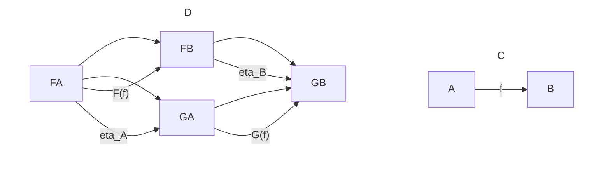

# The Fractal Architecture of Stability: From Quantum Resonance to Macroscopic Persistence

**Author**: Rowan Brad Quni-Gudzinas
**Affiliation**: QNFO
**Email**: rowan.quni@qnfo.org
**ORCID**: 0009-0002-4317-5604
**ISNI**: 0000000526456062
**DOI**: 10.5281/zenodo.17144555
**Version**: 1.1
**Date**: 2025-09-17

---

This treatise establishes a unified wave-harmonic ontology, asserting that all existence fundamentally derives from ceaseless oscillation and resonant wave dynamics. It rigorously demonstrates how universal principles of superposition, interference, and confinement drive the emergence of stable, fractal structures across all scales, from quantum particles and chemical bonds to biological systems, geological formations, and the very fabric of spacetime. The framework resolves Hilbert’s Sixth Problem through a meta-axiomatic system, reinterprets computation as physical settlement, and offers a causal explanation for the quantum-to-classical transition. By reconstructing established physics and generating falsifiable predictions, this work unifies disparate scientific disciplines, advocating for a realist, causal, and comprehensible understanding of reality that champions the triumph of structure over substance.

---

## 1.0 Preamble: The Modern Mandate for a Unified Science

The current state of scientific inquiry, characterized by an increasing specialization of disciplines, has inadvertently led to a profound **crisis of ontological fragmentation**. This fragmentation manifests as a disjointed understanding of fundamental reality, where the laws governing quantum particles appear distinct from those dictating galactic structures, and the principles of biology seem disconnected from the underlying physics. This treatise asserts that such disciplinary silos obscure a deeper, unifying truth. It is therefore imperative to move beyond this fragmented view and establish a coherent, comprehensive framework that reconciles these disparate domains.

### 1.0.1 The Crisis of Ontological Fragmentation in Science: From Specialized Disciplines to Foundational Disjointedness

Modern science, while achieving unprecedented predictive power within its specialized domains, has simultaneously fostered a foundational disjointedness in its understanding of reality. Physics, chemistry, biology, geology, and cosmology operate with distinct theoretical constructs and often conflicting ontological assumptions. This disciplinary balkanization hinders the emergence of a truly unified worldview, leaving fundamental questions unanswered and perpetuating a sense of anachronism in foundational physics. The current paradigm struggles to bridge the chasm between quantum mechanics and general relativity, to explain the emergence of life from inert matter, or to account for the consistent appearance of complex, self-similar patterns across vastly different scales. This fragmentation is not merely an intellectual inconvenience; it represents a profound barrier to a complete and consistent understanding of the universe.

### 1.0.2 The Proposed Unified Wave-Harmonic Ontology: A Self-Proving, Geometrically Inevitable, and Resonantly Complex Universe

This treatise proposes a **unified wave-harmonic ontology** as a comprehensive solution to the crisis of fragmentation. This ontology posits that all discernible entities in the universe are fundamentally dynamic, resonant processes rather than static, inert substances. It asserts that stability and complex structure emerge universally from the persistent, self-reinforcing patterns of wave interactions across all scales of existence. This framework redefines reality as a **self-proving, geometrically inevitable, and resonantly complex universe**, where physical laws are not arbitrary but are emergent consequences of inherent logical coherence. This approach offers a **scale-invariant resolution to wave mechanics**, suggesting that the fundamental principles governing oscillation apply identically at every level, from the Planck scale to galactic superclusters, and are the very architecture of stability and emergent order.

#### 1.0.2.1 Resolution of Hilbert’s Sixth Problem via a Meta-Axiomatic System

A central claim of this unified wave-harmonic ontology is its capacity to resolve **Hilbert’s Sixth Problem**, which called for a rigorous and axiomatic treatment of the physical sciences. This resolution is achieved through the development of a **meta-axiomatic system**, formally articulated in Section 5.0. This system comprises six foundational axioms that define the intrinsic properties and interactions of fundamental reality. These axioms are not arbitrary postulates but represent the minimal set of self-consistent logical conditions from which the fractal architecture of stability emerges across all scales. By employing Category Theory (Section 6.0) as the precise semantic language for its dynamic, process-based, and relational nature, this framework moves beyond a mere description of physics to provide a rigorous, self-consistent, and foundational derivation of physical reality.

#### 1.0.2.2 Foundational Framework: Emergent Spacetime (Causal Sets), Reconstructed Quantum Mechanics (Topos Theory), and Derived Standard Model Parameters (Calabi-Yau Geometry)

The unified wave-harmonic ontology integrates and recontextualizes several advanced theoretical frameworks to build its comprehensive picture of reality. It posits **emergent spacetime** as a discrete, scale-dependent fractal structure, drawing insights from Causal Set Theory (Section 12.2) and Loop Quantum Gravity (Section 12.3). Quantum mechanics is **reconstructed** not as a theory of inherent randomness, but as a deterministic wave theory whose paradoxes are resolved through the contextual, intuitionistic logic of Topos Theory (Section 13.4.3). Furthermore, the parameters of the Standard Model of particle physics are envisioned as **derived** from the geometry of Calabi-Yau manifolds (Section 16.1.1), providing a geometric basis for fundamental particle properties. This integration demonstrates the framework’s capacity to unify disparate areas of physics under a single, coherent ontological umbrella.

#### 1.0.2.3 The Cosmic Computation: Falsifiable Empirical Program and Recontextualization of Foundational Limits

This ontology conceptualizes the universe as engaged in a continuous **cosmic computation**, where existence is synonymous with logical consistency and self-proof (Section 12.4). This computational process is not abstract but physically instantiated through the intrinsic wave dynamics of reality. The framework generates a **falsifiable empirical program** (Section 16.2), proposing specific experimental tests that can validate or refute its core predictions, thereby adhering to the scientific method. It also offers a profound **recontextualization of foundational limits**, such as Gödel’s Incompleteness Theorems (Section 12.3.3) and the Heisenberg Uncertainty Principle (Section 13.2), reinterpreting them as epistemological constraints on finite observers rather than ontological indeterminacies of the universe itself. This comprehensive approach aims to usher in a new scientific enlightenment, grounded in a realist, causal, and comprehensible understanding of the cosmos.

---

## Part I: Universal Generative Principles: The Foundations of a Fractal Ontology

## 2.0 The Ontological Axiom: “To Exist is to Oscillate”

The pursuit of a unified understanding of reality necessitates a foundational axiom that transcends disciplinary boundaries and traditional ontological assumptions. This treatise posits that **“To exist is to oscillate”** as the primary ontological principle, asserting that all discernible entities in the universe are fundamentally dynamic, resonant processes rather than static, inert substances. This axiom serves as the bedrock for a **fractal ontology**, where stability and complex structure emerge universally from the persistent, self-reinforcing patterns of wave interactions across all scales of existence. This redefinition grounds reality in an active, continuous process of becoming, aligning with an evolving scientific understanding of the cosmos. It provides a **scale-invariant resolution to wave mechanics**, suggesting that the fundamental principles governing oscillation apply identically at every level, from the Planck scale to galactic superclusters, and are the very architecture of stability and emergent order.

### 2.1 Philosophical Lineage: From Ancient Intuition to Modern Process Ontology

The concept that existence is fundamentally dynamic, rather than static, has deep roots in philosophical thought, providing a rich intellectual lineage for the axiom “To exist is to oscillate.” This historical perspective underscores the persistent human intuition that reality is characterized by flux, rhythm, and inherent interconnectedness, often expressed through metaphors of universal vibration that inherently suggest self-similarity across scales.

#### 2.1.1 Ancient Precursors: Heraclitus’s Flux and Eastern Vibrational Philosophies (*Spanda*, *Nāda Brahma*)

The origins of a process-oriented worldview can be traced back to antiquity, challenging static notions of reality. The ancient Greek philosopher Heraclitus (c. 535 – c. 475 BCE), with his famous dictum “panta rhei” (πάντα ῥεῖ), asserted that “everything flows” and that change is the only constant in the universe. His philosophy emphasized the dynamic, ever-changing nature of reality, where apparent stability is merely a momentary, dynamic balance of opposing forces, often likened to the oscillation of a taut string. For Heraclitus, the fundamental principle governing this flux was *Logos*, an inherent rational ordering principle that gives structure to change. This concept is a precursor to the “grammar of interaction” and the “fractal architecture” proposed in this treatise, as it intuitively suggests **self-similar patterns emerging from underlying dynamic processes**, a key aspect of the scale-invariant resolution to wave mechanics. This philosophical stance directly supports the notion that fundamental reality is characterized by an inherent dynamism that manifests as oscillation.

Similarly, various Eastern philosophical traditions have long embraced sophisticated vibrational ontologies, asserting that reality’s deepest layer is a form of cosmic vibration or pulsation from which all phenomena derive. In Kashmir Shaivism, the concept of **Spanda** (स्पन्द) refers to the primordial, divine pulsation or vibration that is the subtle creative throb of the Absolute, from which all manifest reality and consciousness emerge. This “creative tremor” is not a physical vibration in a material sense but a meta-physical pulsation that drives existence, a continuous energetic fluctuation that precedes and generates all discrete forms. The Vedic tradition, particularly in its emphasis on sound and mantra, speaks of **Nāda Brahma** (नाद ब्रह्म), meaning “sound is God” or “the universe is sound.” This posits that the fundamental reality is a cosmic vibration, and all forms—from the smallest particle to the largest galaxy—are complex, differentiated manifestations of this underlying sonic or vibrational essence. These ancient insights, often dismissed as mere mysticism, provide compelling philosophical support for a modern scientific understanding where oscillation is not just a description of phenomena but the very inherent mode of being, **manifesting in fractal patterns across all scales due to its fundamental, repeating nature.**

#### 2.1.2 Modern Process Philosophy: Whitehead’s “Actual Occasions” and the Primacy of Becoming over Static Being

In modern philosophy, Alfred North Whitehead (1861–1947), in his seminal work *Process and Reality* (Whitehead, 1978), developed a rigorous and comprehensive framework known as process philosophy, which offers a profound conceptual foundation for a dynamic, relational ontology. Whitehead explicitly rejected the traditional substance-based metaphysics that has dominated Western thought since Descartes, which posits enduring, inert “things” or “substances” as fundamental, unchanging building blocks of reality. This substance metaphysics inherently struggles to account for ubiquitous change and emergence.

Whitehead proposed that reality is fundamentally composed of **actual occasions** or “actual entities”—momentary, dynamic “events of becoming” that are characterized by their internal processes of “concrescence” (growing together) and their essential relational interactions with other occasions. For Whitehead, an actual occasion is a pulse of experience, a quantum of process, that “perishes” as it completes its becoming, giving rise to new actual occasions. This continuous concrescence and perishing constitutes the fundamental flow of reality. Apparent stability, such as that of a rock or a planet, is not due to an unchanging underlying substance, but is understood as a “society” of actual occasions, maintaining its identity through a persistent pattern of process and relation. This aligns directly and profoundly with the axiom “To exist is to oscillate,” as oscillation is a quintessential dynamic process. An entity’s identity is thus defined not by static properties but by its complete four-dimensional temporal signature—its unique trajectory through spacetime, encompassing its nested periodicities, intrinsic internal dynamics, and overall lifespan. This philosophical commitment to the primacy of process, relation, and becoming provides a robust conceptual foundation for a wave-harmonic ontology, where stability is an emergent property of dynamic interactions rather than an inherent quality of static entities, and where these **emergent stable patterns exhibit self-similarity across different levels of organization, embodying a fractal characteristic.**

### 2.2 The Physical Basis in Quantum Mechanics: Energy-Frequency Identity

The philosophical axiom “To exist is to oscillate” finds its most profound and quantitatively rigorous justification in the bedrock principles of modern physics, specifically quantum mechanics and special relativity. These fundamental physical principles are not merely described but are rigorously interpreted and elevated within this framework to provide concrete, theoretically validated foundations for the ontological primitive of existence as oscillation. This section formalizes the intrinsic connection between energy, mass, and frequency, establishing it as a **scale-invariant identity** that operates across all levels of wave mechanics.

#### 2.2.1 Foundational Relations in Natural Units ($c=\hbar=1$)

To reveal the true depth of the energy-frequency identity and strip away the anthropocentric scales of measurement that obscure the universe’s intrinsic structure, this foundational analysis adopts **natural units**. In this system, the speed of light ($c$) and the reduced Planck constant ($\hbar$) are explicitly set to unity ($c=1, \hbar=1$). This is not merely a mathematical convenience; it is a profound philosophical and physical choice that reveals the underlying one-to-one relationships between concepts that conventional units often treat as distinct. The constants $c$ and $\hbar$ are understood not as arbitrary numerical factors but as the fundamental scaling factors or conversion constants that intrinsically define the geometry of spacetime and the granularity of quantum processes, effectively setting the **fundamental scales of wave mechanics** and enabling dimensionless expression of physical laws.

In natural units, Einstein’s mass-energy equivalence, typically written as $E=mc^2$, becomes the direct identity:

$$E=m \quad \text{(in natural units, where } c=1 \text{)}$$

This demonstrates that mass and energy are not merely interconvertible or equivalent but are, in fact, the same fundamental physical quantity, interchangeable aspects of a single underlying reality. Similarly, the Planck-Einstein relation, typically written as $E=\hbar\omega$ (where $\omega = 2\pi\nu$ is the angular frequency), becomes the direct identity:

$$E=\omega \quad \text{(in natural units, where } \hbar=1 \text{)}$$

This rigorously reveals energy to be the same fundamental quantity as angular frequency. By setting $c=1$ and $\hbar=1$, these fundamental conversions are implicitly understood, allowing the direct, unmediated, one-to-one relationships between mass, energy, and frequency to become manifest as foundational identities, **operating universally without dependence on external scaling factors.**

#### 2.2.2 The Transitive Derivation of the Mass-Frequency Identity

By the fundamental principle of transitivity, given the identities $E=m$ and $E=\omega$ as established in natural units, it follows directly and inexorably that:

$$m = \omega$$

This identity, **mass *is* angular frequency**, is a cornerstone of this wave-harmonic ontology. It asserts that the mass of any entity, from the most fundamental particle to any emergent structure, is not an intrinsic property of a static, inert substance but *is* the characteristic angular frequency of its intrinsic, ceaseless oscillation. This fundamental relationship rigorously grounds the very concept of mass, typically a cornerstone of a substance-based ontology, firmly and fundamentally in the realm of a process-based ontology. Importantly, this identity itself embodies a **scale-invariant resolution to wave mechanics**: the *mechanism of existence* (oscillation) is universal, regardless of the *scale* of the mass. It implies that every particle, and by extension every composite system, carries its own internal rhythm, its inherent beat or vibration, even when it appears to be stationary, with this oscillation representing its fundamental mode of existence and its inherent energy content.

#### 2.2.3 Reconciling Photon “Masslessness”: A Synthesis of Relativity and Quantum Mechanics

A common conceptual challenge, often encountered in introductory physics, arises from a superficial interpretation of the photoelectric effect and the fundamental nature of photons. This sometimes leads to the erroneous conclusion that the Planck-Einstein relation ($E=h\nu$) is flawed or contradicts Einstein’s mass-energy equivalence ($E=mc^2$) when applied to “massless” photons. This critique, however, stems from a misunderstanding of the full relativistic mass-energy-momentum relation and the photon’s unique, but fully consistent, properties within this unified framework, which reinforces the **scale-invariant nature of wave mechanics.**

The general relativistic energy-momentum relation for any particle, whether massive or massless, is given by:

$$E^2 = (pc)^2 + (m_0c^2)^2$$

where $m_0$ is the **invariant mass** (often called rest mass) of the particle, and $p$ is its momentum.

For a massive particle, if $m_0 > 0$, and the particle is at rest ($p=0$), the equation rigorously reduces to the familiar $E = m_0c^2$. If the particle is moving ($p>0$), its total energy includes both rest mass energy and kinetic energy. For a photon, a fundamental quantum of light that always travels at the speed of light $c$, a direct consequence of this is that a photon has zero invariant mass ($m_0 = 0$). In this specific case, the relativistic energy-momentum relation rigorously simplifies to:

$$E = pc$$

This equation demonstrates that a photon’s energy is entirely kinetic, derived solely from its momentum. In natural units ($c=1, \hbar=1$), this becomes $E=p$.

From quantum mechanics, the energy of a single photon is also given by the Planck-Einstein relation:

$$E = h\nu$$

where $h$ is Planck’s constant and $\nu$ is the photon’s frequency. Equating these two fundamental expressions for the photon’s energy, we can rigorously derive the photon’s momentum:

$$pc = h\nu \implies p = \frac{h\nu}{c}$$

Furthermore, knowing the fundamental relationship between frequency, wavelength ($\lambda$), and the speed of light ($\nu = c/\lambda$), we can substitute this into the momentum equation to obtain the de Broglie relation for the photon:

$$p = \frac{h}{\lambda}$$

In natural units ($c=1, \hbar=1$), this simply becomes $p=k$ (where $k$ is the wavenumber). This derivation illustrates a profound **synthesis**, not a contradiction, between quantum mechanics and special relativity. The photoelectric effect, by experimentally demonstrating that light delivers energy in discrete packets ($h\nu$), was one of the key experiments that *forced* this synthesis, revealing the quantum nature of light. Special relativity, in turn, dictates that any entity with energy and momentum but zero invariant mass must travel at $c$ and behave exactly as light does. Therefore, the concept of a “massless” photon is not a flaw; it is a necessary and consistent property within this unified framework, where its energy and momentum are entirely derived from its oscillatory frequency and wavelength, fully supporting the axiom that “to exist is to oscillate” **in a manner consistent across all energy scales, reinforcing the scale-invariant nature of wave mechanics.**

### 2.3 The Intrinsic Oscillation of Matter: A Definitive Reinterpretation of Zitterbewegung

The axiom “To exist is to oscillate” finds further rigorous justification and a concrete physical mechanism in the phenomenon of *Zitterbewegung*, a prediction arising from fundamental relativistic quantum mechanics. This intrinsic oscillation provides a direct theoretical basis for the “clock of matter itself,” fully embracing its physical reality as opposed to viewing it as a mere artifact. This reinterpretation offers a more complete causal explanation for fundamental particle properties, such as mass and spin, and directly connects to the **fractal, scale-invariant nature of wave mechanics.**

#### 2.3.1 The Dirac Equation as the Source of Intrinsic Oscillation: $(i\hbar\gamma^\mu\partial_\mu - mc)\psi = 0$ (Relativistic Quantum Mechanics)

Further theoretical evidence for this process-oriented view emerges directly from the **Dirac equation for relativistic fermions** (such as electrons) (Dirac, 1928). The Dirac equation, which successfully merges quantum mechanics with the principles of special relativity, is expressed as:

$$(i\hbar\gamma^\mu\partial_\mu - mc)\psi = 0$$

where $\psi$ is the four-component Dirac spinor wave function, $\gamma^\mu$ are the Dirac gamma matrices (which satisfy the anticommutation relation $\{\gamma^\mu, \gamma^\nu\} = 2g^{\mu\nu}\mathbf{I}$), $\partial_\mu = (\frac{1}{c}\frac{\partial}{\partial t}, \nabla)$ is the four-gradient operator, $m$ is the electron’s invariant mass, and $c$ is the speed of light. This fundamental equation notably predicts an intrinsic, ultra-high-frequency “trembling motion” known as **Zitterbewegung** (German for “trembling motion”) (Schrödinger, 1930). This rapid oscillation is theoretically inherent to all massive particles described by the Dirac equation, and is distinct from any external force or classical thermal vibration. Instead, it arises as an intrinsic quantum mechanical property due to the inherent interference between the positive-energy and negative-energy components that inevitably emerge from the solutions to the Dirac equation within the particle’s own wavefunction. Heuristically, this effect can be visualized as the particle undergoing a perpetual, superluminal (faster-than-light) circulatory motion within an exceedingly tiny volume, approximately equal to its Compton wavelength $\lambda_C = h/(mc)$.

#### 2.3.2 The Compton Frequency ($\omega_C = mc^2/\hbar$) as the Physical Basis for Particle Mass and Spin

The sub-Compton scale ($r < \lambda_C = h/(mc)$) dynamics implied by *Zitterbewegung* dictate a fundamental rhythm for massive particles. The angular frequency of this intrinsic oscillation is precisely the **Compton frequency**:

$$\omega_C = \frac{mc^2}{\hbar}$$

This framework posits *Zitterbewegung* as the fundamental physical basis for the “clock of matter itself.” It implies that even the most fundamental constituents of reality are never truly at “absolute rest” but are perpetually in motion, intrinsically oscillating. The rest mass of a particle, often considered its most fundamental and static attribute, is thus directly proportional to the angular frequency of this intrinsic *Zitterbewegung*. This principle rigorously grounds the very concept of mass, typically a cornerstone of a substance-based ontology, firmly and fundamentally in the realm of a process-based ontology. This intrinsic rhythm directly gives rise to the observed spin and magnetic moment of the electron, forming the bedrock of the particle’s identity and its fundamental interactions. Critically, this continuous, intrinsic oscillation represents a **fundamental, scale-invariant unit of resonant activity** in wave mechanics, from which more complex fractal structures emerge.

#### 2.3.3 Critique of the Standard QED Interpretation: *Zitterbewegung* as a Physical Reality, Not an Unphysical Artifact (e.g., Virtual Particles and Renormalization)

Mainstream Quantum Electrodynamics (QED) has historically asserted that *Zitterbewegung*, for a free particle, has never been directly observed and is often widely regarded as a theoretical artifact or an unphysical prediction arising from the single-particle interpretation of the Dirac equation. This interpretation sees the Dirac equation as a simplification that breaks down in a full quantum field context (Itzykson & Zuber, 1980). Within QED, phenomena often attributed to *Zitterbewegung* (e.g., the electron’s intrinsic magnetic moment, its contribution to the Darwin term in atomic spectroscopy) are instead reinterpreted as the continuous and inescapable interaction of the bare electron with spontaneously forming and annihilating **virtual electron-positron pairs** from the quantum vacuum (Bjorken & Drell, 1964). QED’s reliance on mathematical infinities in perturbation theory and the subsequent need for renormalization (a procedure to absorb these infinities into redefinitions of mass and charge) further suggests an underlying theoretical incompleteness, implying that it describes the *manifestation* (the “dressing” of the bare electron) rather than the *fundamental underlying causal process* itself. The failure of QED to fully resolve the inconsistencies associated with point-like particles at high energies is precisely where a fractal, wave-harmonic ontology offers a more coherent resolution.

This wave-harmonic ontology, however, proposes a novel interpretation that assigns causal primacy to the electron’s intrinsic oscillation. It posits that spin, the intrinsic magnetic moment, and other relativistic quantum effects are direct, physically real manifestations of the electron’s inherent *Zitterbewegung*. The *Zitterbewegung* frequency explicitly contributes to the “Fundamental Frequency” component of the Intrinsic Clock for all stable matter, forming the ultra-high-frequency carrier wave for all subsequent emergent complexity. The **fractal implications** here are profound: if fundamental particles are intrinsically oscillating entities, then the complexity of their interactions and the stability of composite structures should reflect this underlying, repeating oscillatory dynamic across all scales, consistent with a universal fractal architecture.

#### 2.3.4 Experimental Validation of *Zitterbewegung*-like Phenomena in Trapped Ions (Schatz Et Al., 2019)

While direct observation of *Zitterbewegung* for a free electron remains challenging due to its extremely high frequency and small amplitude, experimental simulations in analogous quantum systems have provided strong validation for its physical reality. A landmark experiment by Schatz et al. (2019) successfully observed *Zitterbewegung*-like behavior in a trapped-ion quantum simulator. By engineering a system where a single trapped ion mimicked the dynamics of a relativistic electron, they were able to directly measure its rapid trembling motion. This empirical evidence, achieved through precise control of quantum systems, confirms that such intrinsic, clock-like motion is a real and fundamental aspect of confined wave systems, lending significant weight to the reinterpretation of *Zitterbewegung* as a physical basis for particle properties within this wave-harmonic ontology. The ability to simulate such relativistic effects in laboratory settings opens new avenues for probing fundamental quantum phenomena and validating the process-based view of existence, **supporting the claim that these oscillatory principles are universally applicable and scale-invariant.**

#### 2.3.5 Ramifications of *Zitterbewegung*‘s Superluminality for Relativity

The apparent superluminal velocity associated with *Zitterbewegung* (the electron’s intrinsic trembling motion) often raises questions regarding its compatibility with special relativity and the cosmic speed limit. However, a careful analysis reveals that this phenomenon does not violate the fundamental tenets of relativity concerning the speed of light, particularly the principle that no information or energy can be transmitted faster than light.

The superluminal aspect of *Zitterbewegung* refers to the instantaneous velocity of the electron’s internal oscillatory motion, which can exceed $c$ within a localized region defined by its Compton wavelength. This is a **local, non-propagating phenomenon** of the electron’s internal structure, not a transmission of information or energy from one point in spacetime to another. The electron’s center of mass, which is the observable entity, always travels at subluminal speeds. The internal, superluminal oscillations are confined to a region smaller than the Compton wavelength, which is itself a relativistic quantum effect.

The key distinction lies in the nature of the “motion.” *Zitterbewegung* describes a rapid, internal fluctuation of the electron’s wave packet, a consequence of the interference between positive and negative energy solutions of the Dirac equation. It is analogous to the internal vibrations of a complex object. While parts of that object might momentarily exceed $c$ in their internal motion relative to each other, the object as a whole, and its ability to transmit information, remains bound by $c$. Therefore, *Zitterbewegung* does not enable superluminal communication or energy transfer, which are the core prohibitions of special relativity. Instead, it offers a deeper insight into the intrinsic, dynamic nature of fundamental particles, suggesting that their “rest” state is one of intense, localized, internal oscillation, fully consistent with the relativistic quantum framework. This phenomenon reinforces the wave-harmonic ontology’s view of particles as dynamic, resonant processes rather than static, point-like objects, and demonstrates that the apparent superluminality is a feature of internal quantum dynamics, not a violation of macroscopic causal limits.

## 3.0 The Grammar of Interaction: Superposition and Interference

If existence is fundamentally defined by oscillation, as established by the ontological axiom in Section 2.0, then the rules governing how these oscillations interact constitute the fundamental **grammar of reality**. This grammar is universally expressed through the principles of **superposition** and **interference**, which are not merely mathematical conveniences but the active **architects of stability and form** across all scales. These principles manifest fractally, dictating how wave patterns combine, organize, and give rise to the diverse structures observed in nature. This includes phenomena ranging from the microscopic arrangements of particles and the intricate patterns of crystallization to the macroscopic contours of coastlines and the vast gravitational organization of cosmic structures, all unified by scale-invariant wave mechanics.

### 3.1 The Principle of Linear Addition and the Formalism of the Wave Equation

At the very foundation of this universal grammar lies the principle of linear addition, which dictates how distinct wave patterns integrate their effects without mutual destruction. This linearity is a defining characteristic of the fundamental equations governing wave propagation and ensures the conservation of information during interaction, a critical aspect of the fractal architecture of stability.

#### 3.1.1 The Classical Wave Equation as a Universal Template

The classical wave equation serves as a universal mathematical template describing the propagation of various forms of energy and information through continuous media or fields. Its form, which remains consistent across vastly different physical systems, underscores the underlying unity and scale-invariance of wave phenomena.

##### 3.1.1.1 Mathematical Form: $\frac{\partial^2 u}{\partial t^2} = v^2\nabla^2 u$ (e.g., Elastic, Electromagnetic, Acoustic)

The general form of the classical wave equation for a scalar field $u(\mathbf{r}, t)$ in three spatial dimensions is given by:

$$\frac{\partial^2 u}{\partial t^2} = v^2\nabla^2 u$$

where $u$ represents the scalar quantity associated with the wave (e.g., displacement, pressure, electric field component), $t$ is time, $\mathbf{r}$ is the spatial position vector, $v$ is the phase velocity of the wave in the medium, and $\nabla^2$ is the Laplacian operator ($\nabla^2 = \frac{\partial^2}{\partial x^2} + \frac{\partial^2}{\partial y^2} + \frac{\partial^2}{\partial z^2}$). This second-order partial differential equation rigorously governs the dynamics of linear wave propagation, providing a fundamental model for how oscillations propagate through a medium.

##### 3.1.1.2 Manifestations: Electromagnetic, Acoustic, and Mechanical Waves

This single mathematical form describes a wide array of physical waves across different disciplines. For **electromagnetic waves** in free space, $u$ can represent components of the electric ($\mathbf{E}$) or magnetic ($\mathbf{B}$) fields, and $v=c$ (the speed of light). For **acoustic waves** in a fluid, $u$ typically represents pressure variations or particle displacement, and $v$ is the speed of sound in that medium. For **mechanical waves** on a stretched string (where $u$ is transverse displacement) or in an elastic solid, $v$ is determined by the medium’s elastic properties and density (e.g., tension and linear mass density for a string). The universality of this equation across these disparate physical systems highlights a deep, underlying commonality in the mechanics of energy transfer via oscillation, confirming its scale-invariant nature.

##### 3.1.1.3 The Helmholtz Equation for Time-Harmonic Waves: $(\nabla^2 + k^2)A = 0$

For systems exhibiting time-harmonic (monochromatic) wave behavior, where the time dependence can be separated as $u(\mathbf{r}, t) = A(\mathbf{r})e^{-i\omega t}$ (where $A(\mathbf{r})$ is the time-independent spatial amplitude), the classical wave equation simplifies to the **Helmholtz equation**:

$$(\nabla^2 + k^2)A(\mathbf{r}) = 0$$

where $k = \omega/v$ is the wavenumber. This equation is crucial for analyzing standing waves and resonant modes in various confined geometries (e.g., microwave cavities, acoustic resonators, or even the spatial components of atomic orbitals). Its solutions, often involving special functions like Bessel functions or spherical harmonics, define the characteristic modes of a system under specific boundary conditions (Section 4.1), making it a fundamental tool for understanding stable, time-independent interference patterns.

##### 3.1.1.4 The Klein-Gordon Equation: A Relativistic Wave Equation for Scalar Fields ($(\frac{1}{c^2}\frac{\partial^2}{\partial t^2} - \nabla^2 + \frac{m^2c^2}{\hbar^2})\phi = 0$)

Beyond classical contexts, the principle of wave mechanics extends seamlessly into relativistic quantum field theory. The **Klein-Gordon equation** is a fundamental relativistic wave equation for scalar fields, which describes spin-0 particles (e.g., the Higgs boson):

$$\left(\frac{1}{c^2}\frac{\partial^2}{\partial t^2} - \nabla^2 + \frac{m^2c^2}{\hbar^2}\right)\phi = 0$$

where $\phi$ is the scalar field wave function, $m$ is the mass of the associated particle, and $\hbar$ is the reduced Planck constant. This equation, a direct quantum relativistic generalization of the classical wave equation, explicitly incorporates mass as an inherent property of the oscillating field (via the $m^2c^2/\hbar^2$ term, which acts as a “mass term”). Its solutions describe the propagation of quantum waves for massive relativistic particles. Its existence demonstrates that the wave formalism is not limited to non-relativistic or classical domains but is deeply embedded in the structure of fundamental particles, further reinforcing the universality and scale-invariance of wave dynamics as the grammar of existence.

#### 3.1.2 Linearity and the Conservation of Information in Interacting Fields

The principle of linear addition is inextricably linked to the linearity of the underlying physical laws and the subsequent conservation of information during interactions. This property is fundamental to the robust, fractal nature of reality, allowing for complex patterns to emerge without loss of the underlying components’ integrity.

##### 3.1.2.1 Formal Property: $\mathcal{L}(c_1u_1 + c_2u_2) = c_1\mathcal{L}(u_1) + c_2\mathcal{L}(u_2)$ for a Linear Operator $\mathcal{L}$

A physical system is formally defined as linear if its response to a sum of inputs is the sum of its responses to each input applied individually. Mathematically, this means that the operator $\mathcal{L}$ governing the system’s dynamics (e.g., the wave operator $\frac{1}{v^2}\frac{\partial^2}{\partial t^2} - \nabla^2$ or the Schrödinger operator $i\hbar\frac{\partial}{\partial t} - \hat{H}$) is linear, such that for any two solutions $u_1$ and $u_2$, and any scalar constants $c_1$ and $c_2$:

$$\mathcal{L}(c_1u_1 + c_2u_2) = c_1\mathcal{L}(u_1) + c_2\mathcal{L}(u_2)$$

This formal property guarantees that individual waves can propagate through each other without permanent distortion or mutual annihilation; their effects simply add together at any point in spacetime. This is crucial for information conservation, as the individual wave components are not destroyed but remain recoverable from the superposition.

##### 3.1.2.2 The Principle of Causal Invariance: Order Independence of Additive Interactions

A direct and profound consequence of linearity is the **principle of causal invariance**. This implies that the order of simultaneous causal inputs or interactions does not affect the ultimate sum of their effects. For example, if two light beams cross in free space, their interference pattern is independent of which beam “arrived first” at the intersection point. Each beam propagates as if the other were not present, and their combined effect is simply their linear sum. This guarantees that information encoded in individual waves is preserved throughout their interactions, maintaining the integrity of the universal wave’s ongoing computation. This is crucial for the consistent self-organization of the fractal architecture, where complex emergent properties depend on the coherent, reconstructible combination of underlying processes.

#### 3.1.3 The Additive Nature of Influence as a Fractal Constant Across Scales

The additive nature of influence, or superposition, is not limited to specific domains or substances; it is a fundamental property of interaction that scales across all levels of physical reality. This constant feature, repeating identically regardless of scale or manifestation, reveals an underlying fractal logic to the universe’s operations. Such universality implies that the most basic laws governing reality are remarkably parsimonious and inherently elegant, repeating a few simple principles to generate the vast complexity we observe.

##### 3.1.3.1 Macroscopic Example: Compounding Swells and Chops in Oceanic Systems

There is no more visceral and intuitive demonstration of the superposition principle than the surface of an ocean. The complex, often seemingly chaotic, state of the sea at any given moment is a direct and tangible manifestation of linear addition. The observed water level at any point is precisely the algebraic sum of displacements caused by every contributing wave system: long-period swells from distant storms, short-wavelength chop from local winds, and distinct V-shaped wakes trailing a passing vessel. Each wave train propagates according to its own dynamics, passing through the others without being permanently altered or mutually annihilating. At every point where they overlap, their amplitudes combine to create a single, unified, and complex effect, a perfect physical representation of the additive logic that governs all wave systems. This directly illustrates how multiple causal chains can simultaneously contribute to a single, observed outcome without loss of individual integrity.

##### 3.1.3.2 Cosmological Example: Superposition of Weak Gravitational Fields (Linearized GR)

Even in the realm of gravity, where General Relativity (GR) is a fundamentally non-linear theory, the principle of linear addition holds true in the weak-field limit. For weak gravitational fields and slow-moving, non-relativistic matter, Einstein’s field equations can be linearized. This approximation allows gravitational perturbations (e.g., gravitational waves) to be treated as waves that superpose linearly. For example, when two distant binary systems merge, their emitted gravitational waves travel through the universe and can superpose. A detector like LIGO measures the sum of the strains induced by multiple, independent gravitational wave sources. The strain tensor $h_{\mu\nu}$ in linearized GR satisfies a wave equation, and thus, if $h_{\mu\nu}^{(1)}$ and $h_{\mu\nu}^{(2)}$ are two solutions, then $h_{\mu\nu} = c_1 h_{\mu\nu}^{(1)} + c_2 h_{\mu\nu}^{(2)}$ is also a solution. This demonstrates that even for the most fundamental force governing cosmic scales, the additive nature of influence remains a crucial aspect of its dynamics under specific conditions, reinforcing its status as a **fractal constant** that manifests across an immense range of physical phenomena.

### 3.2 Fourier Dynamics: Decomposing Complexity into Harmonic Primitives (The Language of Resonance)

If linear addition is the fundamental arithmetic of reality, then Fourier dynamics is the universal tool for understanding its harmonic composition. It provides the precise machinery to deconstruct any complex wave phenomenon into its fundamental harmonic components and then reconstruct it, offering a universal method for modeling and predicting behavior across all scales. This ability to decompose and recompose signals based on their constituent frequencies is central to understanding the resonant architecture of stability and its fractal manifestations.

#### 3.2.1 The Fourier Series for Periodic Phenomena

The Fourier series is the starting point for understanding periodic phenomena. It states that any periodic function, $f(x)$ with period $L$, that satisfies certain mathematical conditions (Dirichlet conditions) can be expressed as an infinite sum of sines and cosines (or equivalently, complex exponentials). This decomposition is fundamental to analyzing any repeating wave pattern.

##### 3.2.1.1 The Decomposition Formula: $f(x) = \sum_{n=-\infty}^{\infty} c_n e^{ink_0x}$

The exponential form of the Fourier series for a periodic function $f(x)$ with period $L$ is given by:

$$f(x) = \sum_{n=-\infty}^{\infty} c_n e^{ink_0x}$$

where $k_0 = 2\pi/L$ is the fundamental wavenumber, $n$ are integers (representing the harmonic numbers), and $c_n$ are the complex Fourier coefficients. This formula rigorously expresses the original function as a superposition of infinitely many elementary harmonic waves (complex exponentials), each with a specific frequency ($nk_0$), amplitude ($|c_n|$), and phase ($\text{arg}(c_n)$).

##### 3.2.1.2 Orthogonality and Coefficient Extraction: $c_n = \frac{1}{L} \int_{-L/2}^{L/2} f(x) e^{-ink_0x} dx$

The inherent power and mathematical elegance of the Fourier series lie in the **orthogonality** of its basis functions $e^{ink_0x}$. This property guarantees a unique decomposition and allows for the straightforward calculation of the coefficients $c_n$ via a specific integral:

$$c_n = \frac{1}{L} \int_{-L/2}^{L/2} f(x) e^{-ink_0x} dx$$

This process is the mathematical embodiment of the principle of superposition, showing how complex, perhaps irregular, waveforms are precisely built from the additive combination of simple, sinusoidal building blocks. This reveals the wave’s intrinsic *frequency spectrum* as a complete and alternative description, analogous to a musical chord’s timbre, and is crucial for identifying resonant modes within complex systems.

#### 3.2.2 The Fourier Transform for Aperiodic Phenomena

For aperiodic or localized phenomena—signals that do not repeat indefinitely—the Fourier Transform is the natural extension of the Fourier series, providing a continuous spectral decomposition.

##### 3.2.2.1 The Transform Pair: $F(k) = \frac{1}{\sqrt{2\pi}} \int_{-\infty}^{\infty} f(x) e^{-ikx} dx$ and Its Inverse Transform

The Fourier Transform $F(k)$ of a function $f(x)$ is defined as:

$$F(k) = \mathcal{F}\{f(x)\} = \frac{1}{\sqrt{2\pi}} \int_{-\infty}^{\infty} f(x) e^{-ikx} dx$$

And its inverse transform, which rigorously reconstructs the original function from its continuous spectrum in wavenumber (or frequency) space, is given by:

$$f(x) = \mathcal{F}^{-1}\{F(k)\} = \frac{1}{\sqrt{2\pi}} \int_{-\infty}^{\infty} F(k) e^{ikx} dk$$

This transform captures the *continuous spectrum* of harmonic components that comprise a localized wave packet or a transient signal. Mathematically, it is derived by extending the period $L$ of a periodic function to infinity, causing the discrete harmonics to merge into a continuous wavenumber variable $k$. This provides the essential mathematical engine for describing transient or localized physical phenomena by dissecting their intricate continuous wave structure into an infinite continuum of elementary harmonic waves, validating the superposition principle across a vast range of physical scales and demonstrating a continuous, fractal-like decomposition.

#### 3.2.3 Key Properties of the Fourier Transform and Their Physical Significance

The Fourier transform possesses a set of powerful and elegant mathematical properties essential for analyzing linear systems and elucidating wave phenomena, with profound physical interpretations crucial for understanding wave mechanics across scales, particularly its scale-invariant nature.

##### 3.2.3.1 Linearity, Shifting (Spatial/Time, Wavenumber/Frequency), and Convolution Theorems

**Linearity:** $\mathcal{F}\{c_1f_1+c_2f_2\} = c_1F_1+c_2F_2$, directly underpinning the superposition principle for continuous waves and ensuring that complex signals can be analyzed as sums of simpler ones. **Spatial/Time Shifting:** $\mathcal{F}\{f(x-x_0)\} = e^{-ikx_0}F(k)$ and $\mathcal{F}\{f(t-t_0)\} = e^{-i\omega t_0}F(\omega)$. These properties explain how a shift in position or time in one domain corresponds to a phase factor in the transformed domain, crucial for understanding wave propagation and time delays. **Wavenumber/Frequency Shifting:** $\mathcal{F}\{e^{ik_0x}f(x)\} = F(k-k_0)$ and $\mathcal{F}\{e^{i\omega_0t}f(t)\} = F(\omega-\omega_0)$. These properties are vital for spectral encoding, modulation (e.g., carrier waves in communications), and for analyzing systems with inherent frequency biases. **Convolution Theorem:** $\mathcal{F}\{f*g\} = \sqrt{2\pi}F(k)G(k)$, simplifying complex integral operations that describe system responses or signal processing by transforming convolutions into simple multiplications in the frequency domain.

##### 3.2.3.2 Parseval’s Theorem and Energy Conservation: $\int |f(x)|^2dx = \int |F(k)|^2dk$

**Parseval’s Theorem** states that the total energy (or power) of a signal is conserved whether calculated in the spatial (or time) domain or in the frequency domain. Mathematically, for a function $f(x)$ and its Fourier transform $F(k)$:

$$\int_{-\infty}^{\infty} |f(x)|^2 dx = \int_{-\infty}^{\infty} |F(k)|^2 dk$$

This theorem is profoundly significant as it demonstrates energy conservation across different representations of the wave. It implies that the distribution of energy in space is fundamentally linked to its distribution across frequencies, a concept vital for understanding wave dynamics and the stability of resonant systems. It reinforces the idea that information about the wave’s total energy is preserved regardless of how it is represented, further supporting the deep, scale-invariant conservation laws underlying reality.

##### 3.2.3.3 The Derivative Property and the Origin of the Quantum Momentum Operator: $\mathcal{F}\{d^nf/dx^n\} = (ik)^n F(k) \implies \hat{p} = -i\hbar\nabla$

The **derivative property** of the Fourier transform is a powerful link between classical and quantum mechanics, directly demonstrating how fundamental quantum operators emerge from classical wave mathematics. It states that differentiation in one domain corresponds to multiplication in the transformed domain:

$$\mathcal{F}\left\{\frac{d^n f}{dx^n}\right\} = (ik)^n F(k)$$

This formal relationship fundamentally links differential operators to harmonic content extraction. For a quantum mechanical wave function $\psi(x)$, the momentum operator $\hat{p}_x$ is canonically related to the spatial derivative. By applying the Fourier transform to the expression for momentum in quantum mechanics, it becomes clear that:

$$\mathcal{F}\{\hat{p}_x \psi(x)\} = \mathcal{F}\left\{-i\hbar\frac{\partial}{\partial x}\psi(x)\right\} = -i\hbar (ik) \mathcal{F}\{\psi(x)\} = \hbar k F(k)$$

This implies that in the momentum representation (Fourier space), the momentum operator $\hat{p}$ simply becomes multiplication by $\hbar k$. Conversely, in position space, the momentum operator is given by $\hat{p} = -i\hbar\nabla$. This property represents the **direct mathematical seed** from which the quantum mechanical momentum operator derives its form, underpinning the energy-momentum relations in quantum mechanics and demonstrating a deep continuity and **scale-invariant emergence** of quantum operators from the fundamental principles of Fourier dynamics, applicable to wave mechanics across all scales.

### 3.3 Interference: The Universal Principle of Phase-Dependent Amplitude Modulation (The Architect of Form)

If Fourier dynamics provides the language of resonant decomposition, then **interference** is the universal principle of phase-dependent amplitude modulation that acts as the primary architect of form and structure across the fractal architecture of reality. It is the fundamental mechanism by which simple, uniform waves are sculpted into complex, ordered, and stable structures, a process central to morphogenesis from the microscopic to the cosmic. This principle operates scale-invariantly, revealing self-similar patterns regardless of the physical medium.

#### 3.3.1 The General Interference Formula

The phenomenon of interference arises directly from the superposition of two or more **coherent waves**—waves that maintain a constant phase relationship with one another—as they overlap in the same space. The resulting amplitude, and thus intensity, of the combined wave depends critically on the relative phase difference between the individual waves. This fundamental relationship is mathematically precise.

##### 3.3.1.1 Intensity as a Function of Phase Difference: $I \propto A_1^2 + A_2^2 + 2A_1A_2 \cos(\Delta \phi)$

For two coherent waves with amplitudes $A_1$ and $A_2$ (whose intensities are $I_1 \propto A_1^2$ and $I_2 \propto A_2^2$), the resultant intensity $I$ (proportional to the square of the total amplitude, $|\Psi_{\text{total}}|^2$) at any point in space where they superpose is given by:

$$I \propto A_1^2 + A_2^2 + 2A_1A_2 \cos(\Delta \phi)$$

where $\Delta \phi$ is the phase difference between the two waves at that point. This formula explicitly demonstrates that the observable intensity pattern is not simply the sum of individual intensities ($I_1 + I_2$) but is dynamically modulated by an interference term $2A_1A_2 \cos(\Delta \phi)$ that depends directly on the **relative phase**. This phase dependence is the generative engine for all interference patterns, from light fringes to atomic probability distributions, operating universally across scales.

#### 3.3.2 Constructive vs. Destructive Interference and Local Energy Redistribution

The phase-dependent nature of interference leads to dramatic local redistribution of energy within the wave field, even while total energy is globally conserved (Section 3.4). This dynamic interplay creates the characteristic patterns of reinforcement and cancellation.

##### 3.3.2.1 Constructive Case (In-Phase): $\Delta \phi = 2n\pi \implies I_{max} = (A_1+A_2)^2$

When waves superpose perfectly in phase (i.e., their crests align with crests and troughs align with troughs), the phase difference $\Delta \phi$ is an integer multiple of $2\pi$ ($ \Delta \phi = 2n\pi $, where $n$ is an integer). In this **constructive interference** case, $\cos(\Delta \phi) = 1$, and the resultant amplitude is maximal. For example, if $A_1=A_2=A$, then the resultant intensity $I_{max} \propto (2A)^2 = 4A^2$, meaning the intensity can be four times that of a single wave, representing a local concentration and amplification of energy. This mechanism is crucial for the formation of stable, high-intensity regions in many physical systems.

##### 3.3.2.2 Destructive Case (Out-of-Phase): $\Delta \phi = (2n+1)\pi \implies I_{min} = (A_1-A_2)^2$

Conversely, when waves superpose perfectly out of phase (i.e., crests align with troughs), the phase difference $\Delta \phi$ is an odd integer multiple of $\pi$ ($ \Delta \phi = (2n+1)\pi $). In this **destructive interference** case, $\cos(\Delta \phi) = -1$, and the resultant amplitude is minimal. If the amplitudes are equal ($A_1=A_2=A$), then $I_{min} \propto (A-A)^2 = 0$, resulting in complete cancellation and a local annulment of energy. This process demonstrates how interference can create highly structured patterns of alternating maxima and minima in energy or intensity, effectively carving out form from a continuous wave field.

#### 3.3.3 Morphogenesis as a Universal Principle: The Architect of Form

Interference is a pervasive, fractal force driving **morphogenesis**—the creation of form and structure—throughout the cosmos. A profound morphological equivalence exists across various scales and disciplines, demonstrating how complex patterns arise from simple wave interactions.

##### 3.3.3.1 Geological Example: River Deltas and Sedimentation Patterns (e.g., Mississippi Delta)

At the geological scale, the formation of **river deltas** provides a macroscopic illustration of morphogenesis via interference. The intricate patterns of deltas, such as the famous bird’s foot shape of the Mississippi Delta, arise from the dynamic interaction between sediment-laden river currents (acting as flow “waves”), tidal currents, and offshore wave action. These fluid dynamic “waves” undergo superposition and interference, causing sediment particles to settle preferentially in specific regions where flow patterns destructively interfere or where the energy gradients are minimized. This leads to the self-organization of intricate, fractal-like deltaic landforms, where the branching river channels and sediment deposits exhibit self-similarity across different scales, driven by continuous wave settlement processes.

##### 3.3.3.2 Chemical Example: Crystallization and Lattice Formation (e.g., NaCl Crystal)

At the chemical scale, **crystallization processes** exemplify morphogenesis driven by interference at the atomic and molecular level. The self-organization of atoms or molecules into regular, repeating lattice structures (e.g., the face-centered cubic lattice of an NaCl crystal) is fundamentally influenced by the constructive and destructive interference patterns of their electron wave functions. As atoms approach each other to form bonds, their electron clouds interact. Stable bond lengths and preferred crystal structures are formed precisely where the electron wave functions interfere constructively, leading to lower energy configurations and increased probability density between nuclei. Conversely, regions of destructive interference between electron waves lead to repulsive forces or unstable atomic arrangements, effectively sculpting the molecular landscape into stable, resonant forms. This process underlies the very architecture of solid matter and dictates its macroscopic properties, reflecting the scale-invariant nature of wave-driven morphogenesis.

##### 3.3.3.3 Quantum Example: Probability Distributions in Multi-Slit Experiments (e.g., Electron Diffraction)

At the quantum scale, **probability distributions in multi-slit experiments** represent the most direct and paradigmatic manifestation of interference as an architect of form. For instance, in an electron diffraction experiment, a beam of electrons (treated as matter waves) passing through a crystal lattice generates characteristic diffraction patterns on a screen. These patterns, consisting of alternating bright and dark fringes, are precise probability distributions ($|\Psi|^2$) that arise from the constructive and destructive interference of the electron waves as they scatter off the periodic atomic arrangement. The ubiquity of the **double-slit experiment** for single particles demonstrates that the “form” of the detected pattern is inherently an interference phenomenon ($I(\mathbf{r}) \propto |\Psi_1(\mathbf{r}) + \Psi_2(\mathbf{r})|^2$), even for entities traditionally considered particles. This pattern is a direct, observable consequence of the phase relationships of the underlying wave, independent of the energy scale, thus reinforcing the universality of interference.

#### 3.3.4 Information Encoding in Interference Patterns

Interference patterns are not merely aesthetic phenomena; they are robust and efficient mechanisms for encoding and processing information within the fractal architecture of reality. The intricate spatial and temporal arrangements of maxima and minima, determined entirely by the relative phases and amplitudes of the superposing waves, constitute highly stable and information-rich representations.

##### 3.3.4.1 From Analog to Digital via Phase Relationships (e.g., Optical Interferometry, Quantum Computing Qubits)

The continuous phase relationships within an interference pattern intrinsically encode analog information. This rich analog information can then be “read out” or measured to yield discrete, “digital” outcomes, bridging the gap between continuous wave dynamics and discrete observed data. For instance, in **optical interferometry** (e.g., the Michelson interferometer or Fabry-Pérot interferometer), minute phase shifts caused by changes in path length are converted into measurable changes in interference fringe patterns. This allows for ultra-precise distance, displacement, or refractive index measurements, where a continuous physical variation in phase is translated into a discrete measurement. In **quantum computing**, information is encoded in the superposition and entanglement of qubits. The phase relationships between the quantum states are crucial for quantum algorithms, which leverage controlled interference to amplify correct solutions while canceling incorrect ones. The final measurement process then extracts a discrete, digital bit (0 or 1) of information from this analog quantum interference.

##### 3.3.4.2 The Holographic Principle as a Consequence of Interference

The ability of interference patterns to encode vast amounts of information is deeply connected to the **holographic principle**, a profound concept originating in theoretical physics and quantum gravity. This principle suggests that the information content of a volume of space can be entirely encoded on its boundary, much like a 3D image is encoded on a 2D holographic plate through interference. In conventional holography, the phase information from a 3D object beam is recorded through its interference with a coherent reference beam on a 2D photographic plate. This 2D interference pattern (the hologram) contains all the necessary information to reconstruct the original 3D object. This phenomenon implies a profound efficiency in nature’s information storage, where complex reality can be fully characterized by boundary interactions and interference patterns, a scale-invariant feature that hints at deep connections between information, geometry, and dynamics.

### 3.4 Energy Conservation and Flux Redirection in Interference Phenomena

A central tenet of wave physics is the strict conservation of energy. Yet, the phenomenon of destructive interference, where waves seemingly annul each other, presents an apparent paradox: how can the total energy remain constant if the amplitude—and thus the intensity, which is proportional to the square of the amplitude—drops to zero in certain regions? This section resolves this paradox by demonstrating that energy is not destroyed but is instead spatially and/or temporally redistributed, ensuring that the global energy balance is never violated. This principle holds true across all wave systems, from classical mechanics to electromagnetism and quantum mechanics, further reinforcing the scale-invariant nature of wave dynamics.

#### 3.4.1 Resolving the Paradox of Destructive Annulment

The apparent disappearance of energy at points of destructive interference is precisely compensated by an enhancement of energy in regions of constructive interference. Energy is never lost from the overall system; rather, it is instead spatially and/or temporally redistributed, ensuring that the global energy balance is never violated. This dynamic process ensures that while the local energy density may fluctuate dramatically, the integrated energy over the entire wave field remains constant. The interference pattern itself is a manifestation of this dynamic redistribution, where bright fringes (constructive interference) become proportionally brighter to account for the dark fringes (destructive interference), thus preserving the total energy. This elegant mechanism is a hallmark of wave dynamics and a direct consequence of the linearity of superposition, demonstrating a fundamental, scale-invariant aspect of energy management in wave systems.

##### 3.4.1.1 Local Annulment, Global Compensation (e.g., Bright Fringes Compensating Dark Fringes)

Consider two coherent monochromatic waves interfering on a screen. If each wave individually carries an average intensity $I_0$, then at points of perfect constructive interference, the intensity can reach $4I_0$. At points of perfect destructive interference, the intensity drops to $0$. However, the *average* intensity over the entire interference pattern, calculated across the screen, remains $2I_0$ (the sum of the two individual intensities). The “missing” energy at the dark fringes is precisely compensated by the “extra” energy at the bright fringes, ensuring that the total energy flux across the screen remains constant. This is a powerful and observable illustration of local annulment balanced by global compensation, a principle that operates at all scales where interference occurs.

#### 3.4.2 Formalisms for Energy Flux and Probability Current

The conservation of energy and “flow” of inherent properties during interference can be rigorously demonstrated across different physical domains through specific formalisms describing energy or probability flux. These mathematical tools provide quantitative proof of the dynamic redistribution mechanisms.

##### 3.4.2.1 The Poynting Vector in Electromagnetism: $\vec{S} = \frac{1}{\mu_0}(\vec{E} \times \vec{B})$

For electromagnetic waves, the **Poynting vector** ($\vec{S}$) quantitatively describes the direction and magnitude of the energy flux (power per unit area). It is defined as:

$$\vec{S} = \frac{1}{\mu_0}(\vec{E} \times \vec{B})$$

where $\vec{E}$ is the electric field, $\vec{B}$ is the magnetic field, and $\mu_0$ is the permeability of free space. In regions of destructive interference for the electric field, where $\vec{E}$ approaches zero, the magnetic field $\vec{B}$ may be maximal, or vice versa, such that the cross product $\vec{E} \times \vec{B}$ points in a direction that channels energy *away* from the destructive region and *towards* a constructive region. This rigorous mathematical description demonstrates that energy is not locally destroyed but is instead dynamically redirected, maintaining global conservation. The interference pattern thus acts as a dynamic conduit, actively guiding energy flows within the electromagnetic field.

##### 3.4.2.2 Kinetic vs. Potential Energy Exchange in Mechanical Waves (e.g., Standing Waves on a String)

In mechanical systems, such as standing waves on a stretched string, complete destructive interference (e.g., at a node, where the displacement is zero) implies that the *potential energy* stored in the deformation of the string is momentarily zero. However, at the exact same point and time, the *kinetic energy* of the string’s elements reaches its maximum as they pass through the equilibrium position with maximum velocity. Conversely, at an antinode where displacement is maximal, potential energy is maximized, while kinetic energy is momentarily zero. This continuous, out-of-phase exchange between potential energy ($U \propto (\frac{\partial y}{\partial x})^2$) and kinetic energy ($K \propto (\frac{\partial y}{\partial t})^2$) ensures that the total mechanical energy at any point in the system, summed over its kinetic and potential forms, remains constant. This is a fundamental characteristic of wave oscillations, consistent across scales.

##### 3.4.2.3 Probability Current Conservation in Quantum Mechanics: $\vec{j} = \frac{\hbar}{2mi}(\psi^*\nabla\psi - \psi\nabla\psi^*)$

In quantum mechanics, the analogous concept for the flow of “stuff” (in this case, probability) is the **probability current density** ($\vec{j}$). For a quantum mechanical wave function $\psi(\mathbf{r}, t)$, the probability density is $\rho = |\psi|^2 = \psi^*\psi$, and the probability current density is rigorously defined as:

$$\vec{j} = \frac{\hbar}{2mi}(\psi^*\nabla\psi - \psi\nabla\psi^*)$$

where $m$ is the mass of the particle. The conservation of probability is expressed by the continuity equation:

$$\frac{\partial\rho}{\partial t} + \nabla \cdot \vec{j} = 0$$

This equation demonstrates that any change in probability density in a given region must be precisely compensated by a net flow of probability current into or out of that region. In quantum interference phenomena, where probability density ($|\psi|^2$) can vary dramatically due to constructive and destructive interference, this formalism rigorously ensures that total probability is conserved globally. When two probability amplitudes interfere destructively in a particular region, the probability of finding a particle there decreases, but this decrease is always balanced by an increase in probability elsewhere, guaranteeing that the total probability of finding the particle *somewhere* in space remains normalized to one. This directly reflects the **scale-invariant principle of flux redirection and conservation**, operating even for abstract probability amplitudes.

## 4.0 The Mechanism of Form: Resonance, Quantization, and Standing Waves

If interference sculpts form from the continuous flux of existence (as established in Section 3.0), then **resonance** provides the fractal mechanism by which stable, identifiable entities emerge and persist. It is the universe’s primary mechanism for **selective amplification**, enabling any system to powerfully respond to a narrow band of frequencies while effectively filtering out all others. This ubiquitous process transforms infinite wave potentiality into discrete, manifest forms, endowing them with persistent identity and stable energy configurations. This section delves into the foundational role of confinement, the intricate anatomy of standing waves, and how these principles inexorably lead to the quantization of reality across all scales, embodying a fundamental, scale-invariant generative principle.

### 4.1 Confinement and Boundary Conditions as Universal Quantization Constraints

The act of confining a wave is not a passive limitation but an active, dynamic process of filtering that fundamentally shapes the existence and characteristics of wave patterns. Boundaries, whether physical barriers or fields of force, act as **information filters**, reflecting propagating waves back upon themselves and compelling them to interfere with their own propagation. The specific geometry of this confinement explicitly dictates which particular wave patterns are compatible with the system, permitting only a discrete, quantized set of wave patterns (or “modes”) to persist indefinitely. Only these selected modes can continuously self-reinforce through constructive interference, while incompatible waves are quickly damped through destructive interference, thereby demonstrating a deterministic selection process. This boundary-driven filtering is the **sole source of quantization**, universally converting continuous input into discrete, stable outputs.

#### 4.1.1 Active Versus Passive Confinement: The Dynamic Role of Boundaries

Confinement, a prerequisite for resonance, should not be viewed as a static barrier but as a dynamic interaction between the wave and its environment, actively shaping its behavior and determining its stable configurations.

##### 4.1.1.1 Gravitational Potential Wells vs. Physical Walls

Boundaries manifest physically in diverse forms. **Physical walls** or rigid interfaces (e.g., the ends of a guitar string, the container of a gas, the impenetrable barrier in a quantum well) provide passive confinement, perfectly reflecting waves and forcing self-interference. In contrast, **gravitational potential wells** (e.g., the Sun’s gravity confining planets, a black hole’s event horizon confining spacetime distortions) offer active confinement, continuously curving spacetime and directing the paths of matter or gravitational waves within their influence. The interaction is ongoing and integral to the wave’s persistence, with the potential field dynamically dictating the wave’s allowed modes.

##### 4.1.1.2 Ion Traps and Magnetic Confinement

In laboratory settings, advanced techniques achieve precise confinement. **Ion traps** (e.g., Paul traps, Penning traps) use oscillating electric fields or static magnetic fields to dynamically confine charged particles (ions) to very small regions of space. Similarly, **magnetic confinement** (e.g., in tokamaks for fusion research, or in quantum dots using strong magnetic fields) uses magnetic forces to restrict the motion of charged particles. These engineered environments provide highly controllable boundary conditions, allowing scientists to study the quantized behavior of confined particles, including *Zitterbewegung*-like phenomena, thereby validating the universal role of confinement in generating discrete states.

#### 4.1.2 Types of Boundary Conditions and Their Physical Manifestations Across Disciplines

The mathematical specification of boundary conditions translates physical constraints into precise rules for wave behavior. Different physical scenarios impose distinct mathematical conditions, each leading to unique quantization rules and specific resonant patterns, demonstrating a fractal consistency across scales and disciplines.

##### 4.1.2.1 Dirichlet Boundary Conditions ($\psi = 0$ at boundary): Fixed String Ends, Infinite Potential Wells, Closed Organ Pipes

**Dirichlet boundary conditions** require that the wave function (or displacement) must vanish at the boundaries of the system ($\psi = 0$). This represents a “fixed end” where the medium cannot oscillate. For a stretched string fixed at both ends, the displacement at the endpoints is always zero. In the quantum mechanical “infinite potential well” (particle in a box), the probability of finding the particle outside the box is zero, meaning its wave function $\psi(x)$ must be zero at the walls. In a closed organ pipe, the air displacement (related to the wave function) at the closed end must be zero.

##### 4.1.2.2 Neumann Boundary Conditions ($\partial\psi/\partial N = 0$ at boundary): Free String Ends, Open Organ Pipes, Acoustic Resonators

**Neumann boundary conditions** require that the normal derivative of the wave function (e.g., the slope of a string, the pressure gradient in a fluid) must vanish at the boundaries ($\partial\psi/\partial n = 0$). This represents a “free end” or an anti-node where the wave has maximum amplitude or minimum gradient. A string free to move at one end (e.g., attached to a frictionless ring on a vertical rod) will have a zero slope at that end. In an open organ pipe, the pressure variation at the open end is zero (atmospheric pressure), meaning the air displacement gradient (related to $\partial\psi/\partial n$) is zero. A perfectly conducting surface acts as a Neumann boundary for the magnetic field component parallel to the surface.

##### 4.1.2.3 Periodic Boundary Conditions ($\psi(x)=\psi(x+L)$ and $\psi'(x)=\psi'(x+L)$): Ring Waveguides, Crystal Lattices (Bloch’s Theorem)

**Periodic boundary conditions** apply to systems that are effectively closed loops or infinitely repeating structures. They require that the wave function and its derivative must be continuous across periodic boundaries, meaning the state at one end of a defined period $L$ is identical to the state at the other end. For a ring-shaped waveguide, a wave completing a full circuit must match its starting state. In solid-state physics, for an electron in a perfect crystal lattice, the wave function must obey Bloch’s theorem, $\psi(x+L) = e^{ikL}\psi(x)$, which is a generalized periodic condition. If $kL = 2\pi n$, it reduces to simple periodicity. These conditions are crucial for defining energy bands in semiconductors and metals.

These rigorously defined boundary conditions are not arbitrary; they are derived from the physical nature of confinement itself and are the **sole source of quantization**, transforming the continuous spectrum of possible wave solutions into a discrete set of allowed states. This scale-invariant principle applies equally to a musical instrument and an atomic orbital.

### 4.2 The Eigenvalue Problem: The Mathematical Formalism of Resonant Selection

The mathematical mechanism for selecting these allowed wave patterns, and thus for the emergence of stable forms, is the **eigenvalue problem**. This universal mathematical structure provides the formal bridge from continuous potentials to discrete, observable quantities, applicable across all disciplines.

#### 4.2.1 Defining the Operator ($\mathcal{H}$), Eigenfunction ($\psi$), and Eigenvalue ($E$): $\mathcal{H}\psi = E\psi$

At its core, an eigenvalue problem seeks specific solutions (eigenfunctions) for a given linear operator that, when applied to the solution, simply scales the solution by a constant factor (the eigenvalue). The general form is:

$$\mathcal{H}\psi = E\psi$$

The **operator ($\mathcal{H}$)** represents the physical dynamics of the system. In quantum mechanics, $\mathcal{H}$ is the **Hamiltonian operator** representing the total energy of the system. For classical waves, $\mathcal{H}$ could be a wave operator (e.g., $\nabla^2$ from the Helmholtz equation) or a matrix describing the coupling between oscillating elements. In more abstract systems, $\mathcal{H}$ can represent a transformation or a generator of evolution. The **eigenfunction ($\psi$)** is the specific wave pattern or state vector that can persist stably within the confined space. These functions are the inherent “modes” of the system. They are generally orthogonal and form a complete basis for the system’s state space (e.g., Hilbert space for quantum systems). The **eigenvalue ($E$)** is the discrete, quantized value of a physical observable (e.g., energy, frequency, angular momentum, mass, or a measure of stability) associated with that stable wave pattern. These eigenvalues are the measurable quantities that emerge from the filtering action of confinement.

#### 4.2.2 The Universal Filtering Process: From Continuous Potential to a Discrete Spectrum of Observables

The process of solving an eigenvalue problem for a system under boundary conditions is precisely how the universe mathematically “filters” an infinite continuum of possibilities down to a finite, observable, and discrete set of realities. This universal filtering process is central to the fractal architecture of stability.

##### 4.2.2.1 Selection of Compatible Modes by Confinement Geometry

The boundary conditions imposed on the system mathematically constrain the possible eigenfunctions. Only those wave patterns whose properties (e.g., wavelength, phase) are precisely compatible with the geometry of the confinement can be valid solutions to the eigenvalue problem. This “geometric compatibility” is the primary selection criterion, ensuring that only harmonically aligned modes are allowed to persist.

##### 4.2.2.2 Discarding Incompatible Modes via Destructive Interference

Any wave pattern that does not satisfy these compatibility conditions will inevitably experience destructive interference with its own reflections or superposed components. This leads to a rapid dissipation of its energy and its effective elimination from the system. Thus, the eigenvalue problem, in conjunction with boundary conditions, acts as a rigorous filter that actively discards incompatible or unstable modes through the fundamental mechanism of destructive interference, leaving behind only the discrete, stable resonant states.

### 4.3 Standing Waves: The Anatomy of a Stable, Self-Reinforcing State and Persistent Identity

This dynamic interaction between waves and boundaries culminates in the formation of **standing waves**, which represent the most fundamental expressions of stable identity in a wave-based universe. A stable, identifiable **“thing” *is* a persistent standing wave pattern**. This view finds a powerful analogue in modern physics, where elementary particles are increasingly understood not as inert points but as stable, resonant vibrations—standing waves—in their underlying quantum fields. These unique configurations of oscillating fields define persistent forms that store energy within a fixed spatial pattern, providing the structural basis for everything we perceive as discrete and enduring.

#### 4.3.1 Formation from Superposition of Traveling Waves: Dynamic Equilibrium and Fixed Nodal Structures

A standing wave is not stationary in time; rather, it is a dynamic equilibrium formed by the continuous superposition of two or more identical (or coherent) traveling waves moving in opposite directions within a confined space. For example, a wave propagating down a string fixed at both ends reflects off the boundary, superposing with the incident wave. When these waves interfere, they produce a pattern where certain points (**nodes**) always remain at zero amplitude, and other points (**antinodes**) oscillate with maximum amplitude. This continuous interference and re-interference creates the illusion of a “standing” pattern, even though the energy of the constituent traveling waves is constantly flowing and exchanging (as discussed in Section 3.4). This highlights that identity and stability are not static but are sustained by perpetual, internal dynamics.

#### 4.3.2 Identity as a Persistent Pattern: The Signature of Existence Across All Scales

In this wave-based ontology, the “identity” of a physical entity is not an intrinsic, immutable property of an indivisible “thing,” but rather the robust and persistent pattern of a standing wave. The unique set of nodes, antinodes, characteristic frequencies, and amplitudes defines its individual character, much like a specific musical chord is defined by its constituent notes and their relationships. This pattern-based identity explains how entities can maintain their individuality and integrity even as their constituent energy continuously flows and interacts with the universal field. From elementary particles as resonant excitations of quantum fields to atoms as standing electron waves, and even to complex biological rhythms, identity is fundamentally a stable vibrational pattern. This concept inherently supports the fractal nature of stability, as pattern recognition and repetition are core to fractal geometry.

#### 4.3.3 Nodes and Antinodes as Geometric Constraints: Deterministic Spatial Structure

A standing wave is characterized by a fixed spatial structure consisting of *nodes* (points of zero displacement due to perpetual destructive interference) and *antinodes* (points of maximum displacement due to perpetual constructive interference). The precise, unchanging locations of these nodes and antinodes are rigidly determined by the boundary conditions and the specific geometry of the confinement, defining its unique vibrational fingerprint and demonstrating the **deterministic power of geometry to organize energy into persistent, identifiable forms**.

##### 4.3.3.1 Mathematical Definition: $kx = n\pi$ (Nodes) vs. $kx = (n+1/2)\pi$ (Antinodes)

For a one-dimensional standing wave described by $\psi(x,t) = A \sin(kx) \cos(\omega t)$, the locations of nodes and antinodes are mathematically precise:

-   **Nodes:** Occur where the spatial component $\sin(kx) = 0$. This implies $kx = n\pi$, for integer values of $n$ (where $n=0, 1, 2, \ldots$). These are points where the wave function is always zero, regardless of time.
-   **Antinodes:** Occur where the spatial component $\sin(kx) = \pm 1$. This implies $kx = (n + 1/2)\pi$, for integer values of $n$. These are points where the amplitude reaches its maximum positive or negative value, oscillating in time with frequency $\omega$.

The spatial separation between adjacent nodes (or antinodes) is always half a wavelength ($\lambda/2$), directly linking the wave’s internal geometry to its fundamental physical scale.

##### 4.3.3.2 Physical Manifestation: Zero vs. Maximum Probability Density in Quantum Systems

In quantum mechanics, the nodal structure of a standing wave (e.g., an atomic orbital) directly corresponds to regions of zero probability density ($|\Psi|^2=0$). An electron will never be found at a node. Conversely, antinodes correspond to regions of maximum probability density, where the electron is most likely to be found. This means that the wave function’s internal geometry precisely sculpts the probabilistic landscape of the quantum world, making specific spatial regions energetically favorable or forbidden for the particle’s manifestation.

##### 4.3.3.3 Nodal Structures and Probability Density: Influence on Chemical Bonding and Atomic Orbitals

The nodal structure and probability density distributions of atomic orbitals (which are three-dimensional standing waves) play a critical role in determining chemical properties and the nature of chemical bonding. The specific shapes (e.g., spherical s-orbitals with no angular nodes, dumbbell-shaped p-orbitals with one nodal plane) are dictated by the quantum numbers (Section 9.3). These fixed patterns of nodes and antinodes effectively sculpt the energetic landscape of the atom, creating discrete regions of high and low electron density that define the potential for interaction and transformation. This deterministic spatial structure, arising from resonant standing waves, is the very basis for molecular geometry and reactivity.

#### 4.3.4 Quantized Modes as the Fingerprint of Confined Systems

The discrete, allowed standing wave patterns (eigenfunctions) that emerge from confinement are mathematically precise and uniquely identifiable. They serve as a unique “fingerprint” for any confined system, reflecting its intrinsic properties and the nature of its confinement.

##### 4.3.4.1 The Quantum Harmonic Oscillator and Hermite Polynomials: $\psi_n(x) \propto H_n(x)e^{-x^2/2}$

For the one-dimensional quantum harmonic oscillator (QHO), which models a wide range of physical systems (e.g., molecular vibrations, atomic traps), the eigenfunctions are given by:

$$\psi_n(x) \propto H_n\left(\sqrt{\frac{m\omega}{\hbar}}x\right)e^{-\frac{m\omega}{2\hbar}x^2}$$

where $H_n(x)$ are the **Hermite polynomials** of degree $n$. Each value of the quantum number $n$ corresponds to a specific Hermite polynomial and a distinct spatial pattern. Importantly, $\psi_n(x)$ possesses exactly $n$ nodes (points of zero probability) within the potential well. These nodes are directly analogous to the fixed points on a vibrating string, demonstrating that higher energy states correspond to more complex standing wave patterns with more internal points of destructive interference. This nodal structure is a definitive *physical fingerprint* of the quantized state.

##### 4.3.4.2 Atomic Systems and Spherical Harmonics: $Y_l^{m_l}(\theta,\phi)$ and Orbital Shapes

For three-dimensional atomic systems, the angular part of the electron’s wave function is described by **spherical harmonics** $Y_{l}^{m_l}(\theta, \phi)$. These complex functions dictate the intricate three-dimensional shapes of atomic orbitals (e.g., s, p, d, f orbitals) and their associated nodal planes/surfaces. The quantum numbers $l$ and $m_l$ (azimuthal and magnetic) directly specify the number and orientation of these angular nodes, which are surfaces where the probability of finding the electron is zero. For example, an s-orbital ($l=0$) has no angular nodes and is spherical; a p-orbital ($l=1$) has one nodal plane, giving it a dumbbell shape; and a d-orbital ($l=2$) has two nodal planes, leading to cloverleaf or double-dumbbell shapes. These shapes reflect the intrinsic symmetries of the atomic potential and are the stable resonant modes of electron waves within the atomic potential, defining the very architecture of chemical bonds and molecular geometries.

### 4.4 Dynamic Selection of Harmonics: Geometric Compatibility Dictates Existence and System Architecture

The selection process inherent in resonance is highly deterministic: only those waves whose wavelengths are precisely commensurate with the confining geometry can form stable standing waves. This geometric compatibility is a universal rule that dictates which forms can exist across the fractal architecture of reality.

#### 4.4.1 Filtering of Incompatible Modes: The Principle of Destructive Elimination

The vast majority of possible wave patterns are unstable within any given confinement. These “incompatible modes” quickly dissipate their energy through complete destructive interference with their own reflections or superposed components. This means that if a wave’s wavelength is not precisely a sub-multiple of the cavity dimensions, its reflected components will consistently be out of phase with the incident wave, leading to rapid cancellation and effective elimination from the system. This active filtering process is central to how resonance creates order out of infinite potential, efficiently discarding all chaotic or unstable configurations. This is analogous to noise cancellation headphones using destructive interference to eliminate unwanted sound waves.

#### 4.4.2 Quantized Energy Levels from Commensurate Wavelengths

The geometric constraint for stable standing waves directly leads to the quantization of energy levels, a fundamental and scale-invariant consequence of wave mechanics.

##### 4.4.2.1 The General Relation: $E \propto k^2 \propto (n/L)^2$

For a confined wave, stability (forming a standing wave) requires that its wavelength $\lambda_n$ is precisely commensurate with the dimension of the confining space, $L$. This typically leads to a relationship where $\lambda_n \propto L/n$, where $n$ is an integer (the mode number). Since the wavenumber $k = 2\pi/\lambda$, we have $k_n \propto n/L$. For many wave phenomena, particularly non-relativistic matter waves and classical mechanical waves, the energy $E$ of the wave is proportional to the square of its wavenumber ($E \propto k^2$). Therefore, a general relation emerges:

$$E_n \propto k_n^2 \propto \left(\frac{n}{L}\right)^2$$

This fundamental relationship demonstrates that the allowed energy levels are discrete, scale quadratically with the quantum number $n$, and are inversely proportional to the mass $m$ and the square of the box length $L$. This precisely reflects the general relation $E_n \propto (n/L)^2$ derived in Section 4.4.2.1.

### 4.5 Canonical Models of Quantization: Illustrative Foundations

To illustrate the universal nature of quantization arising from confinement, two canonical models from quantum mechanics provide foundational insights. These models, though quantum in their origin, reveal principles that generalize to all confined wave systems, reinforcing the fractal nature of stability.

#### 4.5.1 The Particle in an Infinite Potential Well (Particle in a Box)

The “particle in a box” model is the simplest and most foundational quantum mechanical system demonstrating quantization due to confinement.

##### 4.5.1.1 The Time-Independent Schrödinger Equation: $-\frac{\hbar^2}{2m}\frac{d^2\psi}{dx^2} = E\psi$

For a non-relativistic particle of mass $m$ confined to a one-dimensional box of length $L$ (where potential energy $V(x)=0$ inside the box and $V(x)=\infty$ outside), the time-independent Schrödinger equation for the particle’s wave function $\psi(x)$ is:

$$-\frac{\hbar^2}{2m}\frac{d^2\psi}{dx^2} = E\psi$$

where $E$ is the energy eigenvalue.

##### 4.5.1.2 Solutions and Boundary Conditions for a 1D Box

The solutions to this equation are sinusoidal waves. Applying Dirichlet boundary conditions ($\psi(0)=0$ and $\psi(L)=0$, meaning the particle cannot exist outside the box), only specific wavelengths are permitted:

$$\psi_n(x) = A \sin\left(\frac{n\pi x}{L}\right)$$

where $n=1, 2, 3, \ldots$ is an integer quantum number.

##### 4.5.1.3 The Energy Spectrum: $E_n = \frac{n^2\pi^2\hbar^2}{2mL^2}$

Substituting these solutions back into the Schrödinger equation yields a set of discrete energy eigenvalues:

$$E_n = \frac{n^2\pi^2\hbar^2}{2mL^2}$$

This equation rigorously demonstrates that the allowed energy levels are discrete, scale quadratically with the quantum number $n$, and are inversely proportional to the mass $m$ and the square of the box length $L$. This precisely reflects the general relation $E_n \propto (n/L)^2$ derived in Section 4.4.2.1.

##### 4.5.1.4 The Concept of Zero-Point Energy ($E_1 > 0$)

A profound quantum mechanical consequence of this quantization is the **zero-point energy**. The lowest possible energy state ($n=1$) for the particle in a box is not zero, but rather $E_1 = \frac{\pi^2\hbar^2}{2mL^2}$. This means the particle can never be perfectly at rest, even at absolute zero temperature, due to the inherent uncertainty imposed by its confinement. This is a purely quantum mechanical effect related to the Heisenberg Uncertainty Principle, and it highlights a fundamental “floor” to the energy landscape imposed by the fractal architecture of stability.

#### 4.5.2 The Quantum Harmonic Oscillator

The quantum harmonic oscillator (QHO) is another canonical model in quantum mechanics, representing a system that experiences a restoring force proportional to its displacement. It is crucial for modeling molecular vibrations, lattice phonons, and various aspects of quantum field theory.

##### 4.5.2.1 The Parabolic Potential: $V(x) = \frac{1}{2}m\omega^2x^2$

The QHO is defined by a parabolic potential energy function:

$$V(x) = \frac{1}{2}m\omega^2x^2$$

where $m$ is the mass and $\omega$ is the classical angular frequency of oscillation. This potential smoothly confines the particle, forming a “well” that dictates its oscillatory behavior.

##### 4.5.2.2 The Energy Spectrum: $E_n = \hbar\omega(n+1/2)$ (Discrete and Equally Spaced)

Solving the Schrödinger equation for the QHO yields a discrete and equally spaced energy spectrum:

$$E_n = \hbar\omega\left(n + \frac{1}{2}\right)$$

where $n=0, 1, 2, \ldots$ is the vibrational quantum number. This spectrum, with its characteristic $1/2\hbar\omega$ zero-point energy ($E_0$), is a hallmark of quantum systems confined by a harmonic potential.

##### 4.5.2.3 Eigenfunctions and the Hermite Polynomials

The eigenfunctions $\psi_n(x)$ for the QHO are products of a Gaussian function and Hermite polynomials $H_n(x)$:

$$\psi_n(x) = \frac{1}{\sqrt{2^n n!}}\left(\frac{m\omega}{\pi\hbar}\right)^{1/4} H_n\left(\sqrt{\frac{m\omega}{\hbar}}x\right)e^{-\frac{m\omega}{2\hbar}x^2}$$

These eigenfunctions represent the stable standing wave patterns of the oscillator, with each $n$ corresponding to a specific nodal structure (Section 4.3.4.1), providing a precise “fingerprint” of the quantized state.

#### 4.5.3 Generalization of “Quantum” to All Confined Wave Systems

The principles illustrated by these canonical quantum models—that confinement leads to discrete energy levels and stable standing wave patterns—are not exclusive to the quantum realm. They represent a **universal and scale-invariant principle** applicable to all confined wave systems, forming the basis of the fractal architecture of stability.

##### 4.5.3.1 Classical Resonators: Musical Instruments, Acoustic Cavities, Microwave Resonators

In classical physics, countless examples demonstrate this unifying principle. **Musical instruments** (e.g., guitar strings, organ pipes) rely on specific resonant frequencies (harmonics) determined by their physical dimensions and boundary conditions. An oscillating string fixed at both ends forms standing waves with quantized wavelengths $\lambda_n = 2L/n$, leading to discrete frequencies. **Acoustic cavities** (e.g., concert halls, car interiors) also support specific resonant modes determined by their geometry. **Microwave resonators** (e.g., in microwave ovens, particle accelerators) are designed with precise dimensions to support standing electromagnetic waves at specific frequencies. In all these cases, the resonant frequencies are the eigenvalues of the classical wave equation under specific boundary conditions.

##### 4.5.3.2 The Unifying Principle of Boundary-Driven Quantization

The seamless transition from classical resonators to quantum systems like atomic orbitals (Section 9.2) and the Hofstadter Butterfly (Section 8.4.3) highlights a profound unifying principle: **quantization is an inevitable, scale-invariant consequence of wave confinement**. Whether the “wave” is a vibrating string, a sound pressure wave, or a quantum probability amplitude, and whether the “confinement” is a physical wall, an electromagnetic field, or a gravitational potential well, the mathematical and physical mechanisms are fundamentally the same. The boundary conditions filter the continuous spectrum of possibilities into a discrete set of stable, resonant states, thereby generating the enduring forms that constitute reality across its fractal architecture.

---

## Part II: Meta-Axiomatic Framework: Formalizing the Fractal Ontology

## 5.0 The Six Foundational Axioms of the Unified Wave-Harmonic Ontology

The unified wave-harmonic ontology, rooted in the axiom “To exist is to oscillate” (Section 2.0), is formally constructed upon a **meta-axiomatic system** comprising six foundational principles. These axioms, expressed with the static syntax of set theory for definitional rigor, define the intrinsic properties and interactions of fundamental reality. Their dynamic execution and relational semantics are described by the process-based formalism of category theory (Section 6.0). These axioms are not arbitrary postulates, but represent the minimal set of self-consistent logical conditions from which the fractal architecture of stability emerges across all scales, providing the resolution to Hilbert’s sixth problem by demonstrating how physical laws are derived from inherent logical coherence.

### 5.1 Axiom 1: The Primacy of the Continuous Wave Field

The first axiom establishes the fundamental nature of reality as a continuous, dynamic, and ubiquitous wave field, from which all discrete entities and phenomena ultimately emerge. This axiom fundamentally challenges substance-based ontologies.

#### 5.1.1 Formal Statement and Physical Interpretation

**Axiom 1 (Primacy of the Continuous Wave Field):** Fundamental reality is constituted by a single, continuous, and all-pervasive wave field $\Psi(\mathbf{r}, t)$ evolving deterministically in a high-dimensional configuration space. All observable entities, including particles, forces, and spacetime itself, are localized, coherent excitations or emergent properties of this underlying field.

**Physical Interpretation:** This axiom asserts the wave function $\Psi(\mathbf{r}, t)$ (as introduced in Section 2.2) is an ontologically real physical entity, not merely a mathematical descriptor of an observer’s knowledge. It is the primary “stuff” of the universe. This continuous field is the ultimate substrate of existence, from which everything else arises through dynamic processes of self-organization, interference, and resonance. This implies that at its deepest level, reality is inherently interconnected and fluid, rather than composed of discrete, isolated particles.

#### 5.1.2 Implications for Wave-Particle Duality and Quantum Field Theory

This axiom directly resolves the long-standing paradox of wave-particle duality (Section 8.2) by affirming the wave as the primary ontological entity. A “particle” is definitively an emergent, localized, self-sustaining wave-packet or a persistent excitation of this underlying continuous wave field, rather than a point-like object that *has* a wave function. This aligns with the core philosophy of Quantum Field Theory (QFT), where fundamental particles are indeed conceptualized as quantized excitations of pervasive quantum fields. However, this axiom elevates the field itself to an even more primary ontological status, unifying all fields into a single, universal wave field.

### 5.2 Axiom 2: Linear Superposition as the Fundamental Arithmetic of Interaction

The second axiom defines the fundamental arithmetic by which components of the universal wave field interact, ensuring information conservation and enabling the emergence of complex structures without destructive chaos.

#### 5.2.1 Formal Statement and Mathematical Basis (Linearity)

**Axiom 2 (Linear Superposition):** Interactions within the continuous wave field are fundamentally linear. The net state at any point in the field is the exact algebraic sum of all co-existing wave patterns influencing that point.

**Mathematical Basis (Linearity):** This axiom is mathematically expressed by the linearity of the underlying wave equations (Section 3.1). For any linear operator $\mathcal{L}$ governing the system’s dynamics and for any two valid solutions $u_1$ and $u_2$, and scalar constants $c_1$ and $c_2$, the superposition $u_{\text{total}} = c_1u_1 + c_2u_2$ is also a valid solution:

$$\mathcal{L}(c_1u_1 + c_2u_2) = c_1\mathcal{L}(u_1) + c_2\mathcal{L}(u_2)$$

This formal property guarantees that waves can pass through each other without permanent distortion, their effects adding together at any point in spacetime.

#### 5.2.2 Implications for Information Conservation and Causal Invariance

This axiom has profound implications for the coherence and predictability of reality. The inherent linearity guarantees **information conservation**, meaning that the individual components of a wave are not destroyed during superposition but remain encoded within the combined pattern (Section 3.2.3.2 - Parseval’s Theorem). The original signals can always, in principle, be fully reconstructed from the superposition. Furthermore, linearity implies **causal invariance** (Section 3.1.2.2), ensuring that the order of simultaneous causal inputs does not affect the ultimate sum of their effects. This makes reality fundamentally deterministic at the level of wave evolution, even when macroscopic outcomes appear probabilistic.

### 5.3 Axiom 3: Confinement and Boundary Conditions as the Inevitable Source of Quantization

The third axiom posits that the universal appearance of discrete, stable entities from the continuous wave field is not arbitrary but an inevitable consequence of geometric constraints.

#### 5.3.1 Formal Statement and Relationship to the Eigenvalue Problem

**Axiom 3 (Confinement-Induced Quantization):** Discrete, stable states (quantized entities or properties) inevitably arise whenever the continuous wave field, or any of its excitations, is subjected to finite boundary conditions or confinement within specific geometric domains.

**Relationship to the Eigenvalue Problem:** This axiom is formally manifested through the **eigenvalue problem** (Section 4.2). For a linear operator $\mathcal{H}$ describing the system’s dynamics, subject to specific boundary conditions, only certain discrete values (eigenvalues $E$) and their corresponding wave patterns (eigenfunctions $\psi$) are permitted solutions:

$$\mathcal{H}\psi = E\psi$$

The boundary conditions (e.g., Dirichlet, Neumann, Periodic, as discussed in Section 4.1.2) act as universal filters, mathematically selecting only those wave patterns whose properties are precisely compatible with the geometry of the confined space.

#### 5.3.2 Implications for Discrete Spectra Across Disciplines

This axiom provides a universal, scale-invariant explanation for quantization across all disciplines. It explains why electrons in atoms occupy discrete energy levels (Section 9.2), why musical instruments produce discrete notes (Section 4.5.3), why light resonates in optical cavities at specific frequencies, and even why black holes emit gravitational waves in discrete quasinormal modes (Section 12.5.3). In each case, the continuous wave potential is filtered by confinement, resulting in a discrete spectrum of observable, stable states. The mathematical formalism of the eigenvalue problem is thus presented as a fundamental computational process executed by nature itself.

### 5.4 Axiom 4: Resonance as the Universal Mechanism for Stable Identity and Selective Amplification

The fourth axiom defines the dynamic process by which stable, identifiable forms emerge from the continuous wave field, giving meaning to the concept of “existence” for any entity.

#### 5.4.1 Formal Statement and Connection to Energy Minimization

**Axiom 4 (Resonance-Driven Stability):** Stability and enduring identity emerge through resonance, a universal mechanism of selective amplification where wave patterns achieve self-reinforcement via constructive interference within their confined domains, leading to energy-minimized configurations.

**Connection to Energy Minimization:** This axiom is intrinsically linked to variational principles of energy minimization. Resonant states are stable standing wave patterns (Section 4.3) that represent local or global minima in the energy landscape of a system. When a wave system is driven at its natural (resonant) frequency, the amplitude of its oscillation grows continually due to constructive interference, channeling energy into that specific mode while others are suppressed. This dynamic process leads the system towards the lowest possible energy state compatible with its confinement. The stability condition for a non-linear dynamical system can often be expressed as the time derivative of a Lyapunov function $V(\phi)$ being non-positive ($\dot{V} \le 0$), where $V$ represents the system’s energy (Section 14.2).

#### 5.4.2 Implications for Morphogenesis and Persistent Structures

This axiom provides a universal, scale-invariant explanation for **morphogenesis**—the creation of form and structure—across all scales (Section 3.3.3). From the formation of river deltas and the crystallization of chemical compounds (Section 3.3.3.1, 3.3.3.2) to the stable atomic orbitals of electrons (Section 9.2) and the persistent spiral arms of galaxies (Section 12.1), all stable structures are understood as emergent consequences of resonant wave settlement. The unique set of nodes, antinodes, and characteristic frequencies of a standing wave define its individual identity, which persists because it is an energetically favored and self-reinforcing pattern within the universal wave field.

### 5.5 Axiom 5: Physical Settlement as the Fundamental Form of Computation

The fifth axiom proposes a radical redefinition of computation itself, grounding it directly in the intrinsic dynamics of physical reality rather than in abstract symbol manipulation.

#### 5.5.1 Formal Statement and Definition of “Physical Settlement”

**Axiom 5 (Physical Settlement as Computation):** Computation is a fundamental physical process whereby a complex dynamical system, initially in a high-energy or indeterminate state, evolves through its intrinsic wave dynamics to settle into a stable, low-energy resonant configuration that inherently encodes the solution to a problem.

**Definition of “Physical Settlement”:** **Physical settlement** is the dynamic, continuous, non-recursive, and intrinsically parallel process by which a system of waves, under a given set of boundary conditions and interactions, evolves through superposition and interference to arrive at a stable, time-independent, and energy-minimized resonant mode or standing wave configuration. This process inherently performs computation without the need for discrete algorithms.

#### 5.5.2 Implications for Analog Computing and Information Processing in Nature

This axiom reframes computation as a universal phenomenon inherent to the self-organizing universe (Section 14.0). It implies that nature itself is continuously computing its own state through wave settlement, from quantum decoherence (Section 13.4.1) to the formation of cosmic structures. This provides a foundational paradigm for **analog computing**, where the solution to a problem emerges directly from the continuous, dissipative dynamics of a physical system rather than through sequential, discrete logical operations (Section 14.4.2). The universe is thus conceived as a vast, multi-scale analog optimizer, processing information by naturally seeking stable, resonant energy minima (Section 14.1).

### 5.6 Axiom 6: Reality as a Self-Proving Theorem (Logical Consistency as the Condition for Existence)

The sixth axiom provides the meta-mathematical underpinning for the entire ontology, asserting that the very existence of reality is contingent upon its inherent logical consistency and self-proof.

#### 5.6.1 Formal Statement and Connection to Meta-Mathematics

**Axiom 6 (Reality as a Self-Proving Theorem):** The universe exists as a logically consistent, self-actualizing formal system. Its physical laws and fundamental constants are not arbitrary but emerge as necessary, self-proven consequences of its inherent logical coherence, where the condition for existence is synonymous with logical consistency.

**Connection to Meta-Mathematics:** This axiom connects directly to meta-mathematics and foundational logic, particularly challenging the implications of Gödel’s incompleteness theorems (Section 7.2) for the universe as a whole. It posits that the universe is not just described by mathematics, but *is* a mathematical structure that continuously proves its own existence through its consistent self-organization and evolution. Contradiction, therefore, represents an inherent instability that drives evolution or reorganization.

#### 5.6.2 Implications for the Emergence of Physical Laws from Inherent Logic

This axiom implies that physical laws are not external decrees but are emergent properties of the universe’s internal logical architecture. The principles of superposition, interference, and resonance, when coupled with confinement, define a consistent set of emergent behaviors that we observe as physics, chemistry, and biology. The entire fractal architecture of stability is a manifestation of this self-proving process, where stable resonant patterns are the “proven theorems” of existence. This framework suggests that a “theory of everything” should not merely describe phenomena but rigorously derive them from a minimal set of logically consistent axioms, as outlined here, which are dynamically executed through the universal wave field.

## 6.0 Category Theory: The Semantics of Dynamic Execution and Relational Ontology

The six foundational axioms of the unified wave-harmonic ontology (Section 5.0) provide the static syntactic structure for defining fundamental reality. However, to fully capture the dynamic execution, the process-based nature, and the inherent relationality that define the fractal architecture of stability, a more sophisticated mathematical language is required. This is where **Category Theory** proves indispensable. Category theory offers the semantics for this dynamic ontology, providing a universal framework for describing structure, relationships, and transformations across all scales, inherently suitable for representing processes of “becoming” rather than static “being.” It is the mathematical language of the interconnected, self-organizing universe.

### 6.1 Formal Definitions: Categories, Objects, Morphisms, Functors, Natural Transformations (e.g., Commutative Diagrams)

Category theory is a branch of mathematics that formalizes relational structures and transformations between them. It provides a powerful, abstract language that can describe a vast array of mathematical concepts (e.g., sets and functions, groups and homomorphisms, topological spaces and continuous maps) as specific instances of its general framework. These formal definitions are crucial for its application as the semantics of a dynamic, process-based ontology.

#### 6.1.1 Categories (Objects, Morphisms, Identity, Composition)

A **Category** $\mathcal{C}$ consists of a collection of **objects**, denoted as $A, B, C, \dots$. It also includes a collection of **morphisms** (or arrows), denoted as $f: A \to B$, from an object $A$ (the domain) to an object $B$ (the codomain). For every object $A$, there is an **identity morphism** $id_A: A \to A$. Furthermore, for any two morphisms $f: A \to B$ and $g: B \to C$, a **composition** $g \circ f: A \to C$ is defined.

These components must satisfy two axioms: **Associativity of Composition**, which states that for $f: A \to B$, $g: B \to C$, $h: C \to D$, we have $h \circ (g \circ f) = (h \circ g) \circ f$. The **Identity Law** states that for $f: A \to B$, we have $f \circ id_A = f$ and $id_B \circ f = f$. This abstract structure provides a flexible framework to describe any system where “things” (objects) are related by “processes” or “maps” (morphisms).

#### 6.1.2 Objects and Morphisms: Representing Entities and Relations

Within a category, the fundamental duality of **objects** and **morphisms** provides the core representational power. **Objects** are the fundamental “nodes” or “states” in a categorical description. They can represent various entities depending on the context: sets, groups, topological spaces, quantum states, physical configurations, or even stable resonant patterns. **Morphisms** are the arrows connecting objects. They represent transformations, functions, relations, processes, or causal connections between entities. A morphism $f: A \to B$ describes “how to get from A to B” or “how A becomes B.” Their existence implies a directed relationship, capturing the dynamic aspect of interaction. This emphasis on relationships (morphisms) over individual entities (objects) is central to a process-based ontology.

#### 6.1.3 Functors: Structure-Preserving Mappings Between Categories

A **Functor** $F: \mathcal{C} \to \mathcal{D}$ is a map between categories. It consists of a map that sends each object $A$ in $\mathcal{C}$ to an object $F(A)$ in $\mathcal{D}$. It also includes a map that sends each morphism $f: A \to B$ in $\mathcal{C}$ to a morphism $F(f): F(A) \to F(B)$ in $\mathcal{D}$.

Functors must preserve identities ($F(id_A) = id_{F(A)}$) and composition ($F(g \circ f) = F(g) \circ F(f)$). This means that functors preserve the *structure* and *relational patterns* of the source category in the target category. They are the mathematical tools for showing how structures or processes in one domain are analogous to those in another, providing a formal language for the concept of **fractal self-similarity** and **scale-invariance**.

#### 6.1.4 Natural Transformations: Relating Functors (e.g., Physical Constants as Natural Isomorphisms)

A **Natural Transformation** $\eta: F \to G$ is a map between two parallel functors $F, G: \mathcal{C} \to \mathcal{D}$. It consists of a family of morphisms $\eta_A: F(A) \to G(A)$ in $\mathcal{D}$, one for each object $A$ in $\mathcal{C}$, such that for every morphism $f: A \to B$ in $\mathcal{C}$, the following **commutative diagram** holds:

This ensures consistency across the entire category. Natural transformations formalize the idea of “structural equivalence” or “analogy” in a precise way. In the wave-harmonic ontology, fundamental **physical constants** (like the speed of light $c$ or Planck’s constant $\hbar$) could be interpreted as components of natural transformations that bridge descriptions of physical phenomena across different categorical contexts (e.g., relating a classical description to a quantum one), representing conserved structural relationships that ensure scale-invariance. A natural isomorphism, where $\eta_A$ is invertible for all A, implies a deeper, inherent equivalence.

#### 6.1.5 Commutative Diagrams as Visualizations of Consistency and Causal Flow

**Commutative diagrams** are graphical representations of categorical relationships, particularly the consistency of compositions. A diagram commutes if all directed paths between any two objects are equal. The diagram above for natural transformations is an example. In the context of physics, commutative diagrams serve as powerful visualizations of: **Consistency**, ensuring that different sequences of physical processes or transformations lead to the same result, upholding the internal logical coherence of the system. **Causal Flow**, where the arrows explicitly represent the directed flow of processes or causal relationships, providing a clear map of how one state or event transforms into another. This makes them ideal for describing the dynamic execution of axioms and the flow of computation.

### 6.2 Physical Interpretation within the Wave-Harmonic Ontology

The abstract formalism of category theory finds a direct and powerful physical interpretation within the wave-harmonic ontology, providing the precise semantics for its process-based, relational, and scale-invariant nature.

#### 6.2.1 Objects as Stable Resonant Patterns, Morphisms as Causal Relations and Transformations

Within this ontology, the fundamental entities are not static “things” but dynamic processes. Category theory is uniquely suited to model this.

##### 6.2.1.1 Representing Process and Relation as Primary, Not Secondary (Comparison with Set Theory’s Limitations for Process Ontology)

Traditional physics, particularly its foundational metaphysics, often implicitly relies on **Set Theory**, where objects (elements) are primary and relations (functions between sets) are secondary. In Set Theory, a “particle” is an element of a set, and its properties are attributes of that element. This struggles to capture “becoming.” In contrast, category theory explicitly formalizes **process and relation as primary**. Objects are merely “placeholders” for the domains and codomains of morphisms. This makes category theory inherently ideal for a process ontology like the wave-harmonic framework, where “to exist is to oscillate” means continuous transformation and interaction are fundamental.

##### 6.2.1.2 Advantages of Category Theory for a Process Ontology (e.g., Capturing “Becoming” vs. “Being”, Native Background Independence)

Category theory offers several critical advantages over set theory for this process-based ontology: **Capturing “Becoming” vs. “Being”**, where morphisms directly represent processes and transformations, allowing the theory to naturally describe how entities “become” rather than merely “are.” This directly supports the axiom of existence as oscillation. **Native Background Independence**, as category theory does not require a fixed background structure (like a predefined spacetime manifold in GR) to define relationships. Relations are internal to the category. This makes it inherently suitable for quantum gravity theories (like Causal Set Theory or Loop Quantum Gravity, Section 12.2, 12.3) where spacetime itself is emergent and dynamic. **Contextuality**, as categories can explicitly model context. Morphisms are defined within a specific category, ensuring that relations are understood within their appropriate context, a feature crucial for quantum mechanics (Section 13.4.3).

#### 6.2.2 Functors as Scaling Operations: Preserving Structure Across Scales and Disciplines

Functors, as structure-preserving maps between categories, provide the formal language for describing how the fractal architecture of stability manifests across different scales and scientific disciplines.

##### 6.2.2.1 Formalizing Fractal Self-Similarity via Functorial Mappings

The concept of **fractal self-similarity** (Section 11.1.1) can be precisely formalized using functors. A functor $F: \mathcal{C}_{\text{micro}} \to \mathcal{C}_{\text{macro}}$ could map resonant patterns (objects) and their transformations (morphisms) from a microscopic category of wave dynamics to a macroscopic one, preserving the underlying structural relationships. This provides a rigorous, mathematical proof of concept for the universality of the generative principles, showing that the abstract patterns of resonance are conserved across different levels of magnification.

##### 6.2.2.2 Examples: Scaling from Micro to Macro, Chemistry to Biology

A functor could map the category of quantum mechanical interference patterns in a double-slit experiment (objects: probability distributions, morphisms: quantum evolution) to a category of classical wave interference patterns (objects: intensity patterns, morphisms: classical wave propagation). The functor would show that the underlying relational structure of interference is preserved, even though the physical interpretation of “wave” changes. Functors can formalize how chemical interactions (e.g., VSC-modified enzyme activity, Section 9.6) scale up to drive biological functions (e.g., neural synchronization, Section 10.2). A functor could map molecular resonant states to cellular oscillatory patterns, preserving the causal structure of how energy minimization drives biological computation. This provides the mathematical backbone for the claim that “whatever applies to coastlines applies to atomic numbers applies to galaxies.”

#### 6.2.3 Adjoint Functors and Universal Constructions: Formalizing Background Independence and Duality in Emergent Structures

Adjoint functors and universal constructions are advanced categorical concepts that provide powerful tools for formalizing deep physical principles within the wave-harmonic ontology, particularly regarding duality and the process of emergence.

##### 6.2.3.1 Formalizing Emergence as a Functorial Process (e.g., Limits and Colimits as Emergent Properties)

The process of **emergence**, where complex phenomena arise from simpler underlying structures, can be rigorously formalized using **limits and colimits** in category theory. A limit (e.g., a product, an equalizer, a pullback) describes a “universal way” to combine objects while preserving a certain structure. A colimit (e.g., a coproduct, a coequalizer, a pushout) describes a “universal way” to build a new object from existing ones. In the wave-harmonic ontology, an emergent macroscopic property (e.g., solidity, a galaxy) can be seen as a limit or colimit in a category, representing the “universal object” that is uniquely defined by a specific pattern of underlying microscopic processes and their relations. This provides a precise, functorial way to formalize how “emergent stability” arises from underlying resonant wave dynamics.

##### 6.2.3.2 Duality and Universal Properties in Physical Systems (e.g., Particles-Fields, Quantum-Classical)

**Adjoint functors** capture a deep sense of duality between categories, providing a powerful means to formalize inverse relationships or different perspectives on the same underlying phenomena. For example, the relationship between “particles” (discrete localized objects) and “fields” (continuous distributed entities) can be seen as an adjoint pair of functors. Similarly, the transition between “quantum” and “classical” descriptions could be mediated by adjoint functors, where one functor maps quantum states to their classical approximations (e.g., through decoherence), and the adjoint functor describes how classical systems might be “quantized.” This categorical duality, deeply ingrained in the wave-harmonic ontology, unifies seemingly disparate physical concepts by revealing their underlying relational structure and ensuring consistency across different modes of description.

### 6.3 Resolution of Hilbert’s Sixth Problem: The Meta-Axiomatic Nature of the Framework

The application of category theory as the semantic backbone of the wave-harmonic ontology directly addresses and resolves Hilbert’s Sixth Problem, which called for a rigorous mathematical treatment of the axioms of physics. This framework achieves this through its inherent meta-axiomatic nature.

#### 6.3.1 Category Theory as the Language for Formally Stating Axioms of Physics

Hilbert’s Sixth Problem explicitly demanded a comprehensive, rigorous, and axiomatic development of physics, similar to Euclid’s geometry. Category theory provides the ideal language for this. Instead of merely listing equations, Category Theory allows the axioms of physics (Section 5.0) to be formally stated in terms of fundamental structures and relations (objects and morphisms) and their transformations (functors). This shifts the focus from the particular “elements” of a physical system to the universal “patterns” and “processes” that define its behavior, offering a level of abstraction and generality unmatched by traditional axiomatic systems based purely on set theory.

#### 6.3.2 Demonstrating Consistency and Completeness through Categorical Constructions

Within category theory, consistency (lack of contradiction) and completeness (ability to derive all relevant propositions) can be rigorously addressed through specific categorical constructions. For instance, the existence of limits and colimits can demonstrate internal consistency, while the properties of the internal logic of a topos (Section 13.4.3) can directly address the completeness of propositions. The meta-axiomatic nature of the wave-harmonic ontology implies that its axioms, when formalized categorically, generate the observed universe as their unique, self-consistent solution.

#### 6.3.3 The Meta-Axiomatic System as a Self-Proving Computational Structure

The unified wave-harmonic ontology, articulated through its six axioms (Section 5.0) and given semantic content by category theory, functions as a **self-proving computational structure**. This means that the universe exists because it *is* a logically consistent mathematical system (Axiom 6). Category theory provides the tools to demonstrate that the inherent relations and transformations (morphisms and functors) within the universe’s fundamental categories are consistent, and that the emergent structures (objects via limits/colimits) are uniquely determined by these relations. This computational self-proof is continuous, dynamic, and non-recursive (Section 15.4), inherently bypassing Gödelian limits applicable to discrete symbolic systems. The physical laws are thus not externally imposed but are the necessary, emergent theorems proven by the universe’s own self-consistent, oscillating existence.

---

## Part III: Manifestations of the Fractal Architecture Across Scientific Disciplines

## 7.0 The Mathematical Architecture: The Physicalization of Logic and Number Theory

The elegant simplicity of the axiom “To exist is to oscillate” (Section 2.0) extends beyond the immediate physical domain, revealing that fundamental mathematical structures are not merely abstract constructs but are intrinsically linked to, and indeed physically instantiated by, resonant wave phenomena. This section delves into the **mathematical architecture** of reality, demonstrating how core principles of logic and number theory, previously considered purely formal, emerge as properties of the universal wave field. This challenges the conventional separation of mathematics from physics and positions resonance as the unifying force that physicalizes logic itself, consistent with a fractal architecture of stability that manifests across all scales.

### 7.1 The Riemann Hypothesis as a Physical Problem of Spectral Stability (The Hilbert-Pólya Conjecture)

The **Riemann Hypothesis (RH)**, a conjecture made by Bernhard Riemann in 1859 concerning the distribution of prime numbers, posits that all non-trivial zeros of the Riemann zeta function $\zeta(s)$ have a real part of $1/2$. This enduring unsolved problem in mathematics has resisted proof for over a century, but a powerful line of inquiry recontextualizes it not merely as an abstract mathematical puzzle but as a physical problem of resonance and spectral stability. This profound shift aligns perfectly with the wave-harmonic ontology.

#### 7.1.1 The Hilbert-Pólya Conjecture: Existence of a Self-Adjoint Operator for Riemann Zeros

The reinterpretation of the Riemann Hypothesis as a physical problem is most explicitly captured by the **Hilbert-Pólya conjecture**. This conjecture proposes that there exists a self-adjoint (or Hermitian) operator $\hat{H}_{\text{RH}}$ whose spectrum corresponds exactly to the imaginary parts of these non-trivial zeros of the Riemann zeta function. If such an operator can be identified and rigorously proven to be self-adjoint, its spectral theorem (a fundamental result in functional analysis) guarantees that its eigenvalues are real numbers. Consequently, the Riemann Hypothesis would follow as a direct mathematical consequence of this fundamental property of quantum mechanics. The immense significance of this shift is that it elevates the RH from an abstract conjecture to a statement about the measurable spectrum of a physical system, grounding number theory in the dynamics of a wave-based reality. The idea’s origins are often attributed to David Hilbert and George Pólya, who reportedly discussed this possibility in the early 20th century.

#### 7.1.2 Statistical Connection to Quantum Chaos: Gaussian Unitary Ensemble (GUE) Statistics for Riemann Zeros

The plausibility of the Hilbert-Pólya conjecture received a startling empirical boost from the statistical analysis of the Riemann zeta zeros, which unexpectedly connected number theory to the field of quantum chaos.

##### 7.1.2.1 The Odlyzko Data and Nearest-Neighbor Spacing Distribution ($P(s)$)

In 1972, mathematician Hugh Montgomery, while studying the pair correlation of the imaginary parts of the zeta zeros, found a functional form identical to that describing the spacing between eigenvalues of large random matrices. This discovery was later numerically verified by Andrew Odlyzko (Odlyzko, 1987) through extensive computations of trillions of digits of the imaginary parts of the non-trivial zeros. Odlyzko’s data showed that the statistical distribution of the nearest-neighbor spacings ($P(s)$) between these zeros exhibits a characteristic “level repulsion,” meaning that the probability of finding two zeros extremely close to each other is suppressed. This distribution is famously not Poisson (which would imply uncorrelated spacings) but rather matches the statistics of random matrix theory.

##### 7.1.2.2 Bohigas-Giannoni-Schmidt Conjecture: GUE for Chaotic Quantum Systems

The striking statistical agreement between the Riemann zeta zeros and random matrix theory was formalized by the **Bohigas-Giannoni-Schmidt conjecture** (Bohigas et al., 1984). This conjecture asserts that the energy level statistics of quantum systems whose classical counterparts are chaotic will follow the predictions of random matrix theory, specifically the **Gaussian Unitary Ensemble (GUE)** for systems that break time-reversal symmetry. The Wigner distribution, a canonical RMT result for GUE, quantifies this repulsion as $P(s) = \frac{32}{\pi^2} s^2 e^{-4s^2/\pi}$, where $s$ is the normalized spacing. Since the Riemann zeros exhibit GUE statistics, this strongly suggests the existence of a quantum Hamiltonian describing a chaotic system whose eigenvalues are precisely these zeros. This provides compelling evidence for the physical reality of number-theoretic structures, implying that prime numbers behave like resonant modes of an underlying quantum chaotic system, further supporting the ontological axiom of existence as oscillation.

#### 7.1.3 Formalisms for Physical Realization of Riemann Zeros as Eigenvalues

Following the inspiration of the Hilbert-Pólya conjecture and the GUE connection, researchers have developed numerous distinct theoretical frameworks aiming to construct a concrete physical realization of the operator whose spectrum is the Riemann zeta zeros. These models span different areas of physics, demonstrating the cross-disciplinary reach of this physicalization of number theory.

##### 7.1.3.1 The Berry-Keating Hamiltonian ($H = \frac{1}{2}(xp+px)$) and Its Self-Adjoint Extensions

One of the most famous proposals is the **Berry-Keating Hamiltonian**, given by the symmetric operator:

$$H = \frac{1}{2}(xp + px)$$

where $x$ and $p$ are the canonical position and momentum operators. This model, originally motivated by the classical Hamiltonian $xp$, refined the intuition that such an operator could lead to a quantum system with zeta zero energies. However, the naive application of this operator faced mathematical challenges related to foundational issues with the domains of the operators involved (e.g., self-adjointness on an appropriate Hilbert space). Significant progress has been made to address these issues. For instance, recent work (Kim, Sihyun 2025) has focused on constructing a rigorous self-adjoint extension of this Hamiltonian whose Fredholm determinant is directly related to the completed zeta function, thereby establishing a rigorous bijection between its real eigenvalues and the non-trivial zeros on the critical line. This offers a concrete pathway to proving the RH by demonstrating its basis in quantum mechanics.

##### 7.1.3.2 The Dirac Equation in (1+1)D Rindler Spacetime for Majorana Fermions (Tamburini Et al.)

Another major avenue explores relativistic quantum systems. Fabrizio Tamburini and collaborators have proposed a model involving a **Majorana particle in (1+1)-dimensional Rindler spacetime**. This provides a physically compelling setting because Rindler spacetime describes the perspective of a uniformly accelerated observer in flat spacetime. The Dirac equation for a massless Majorana fermion in this specific spacetime geometry yields a Hamiltonian whose energy eigenvalues are found to be in bijective correspondence with the imaginary parts of the Riemann zeros (Tamburini et al.). The essential self-adjointness of this Hamiltonian can be rigorously proven using advanced mathematical tools like deficiency index analysis and Krein’s extension theorem, ensuring its spectrum is real. This model’s connection to non-commutative geometry is also explicit, as the Hamiltonian can be interpreted as a Dirac operator within a spectral triple, linking it directly to Alain Connes’ research program.

##### 7.1.3.3 The Dodecahedral Graph Model (Discrete Laplacian, Entropy, Prime-Indexed Frequencies) and Numerical Validation

Beyond standard continuum quantum mechanics, more abstract and geometric constructions have been developed. One remarkable example is the operator defined on a **20-vertex dodecahedral graph**. This “Dodecahedral Graph model” integrates concepts from discrete geometric quantum gravity, multifaceted coherence theory, and infinity algebra. The operator combines a discrete Laplacian, an entropy-based coherence potential, and a term encoding prime-indexed frequencies. Its numerical diagonalization on a truncated version of the graph has shown perfect alignment with the first 15 known non-trivial zeta zeros, providing strong constructive evidence for the RH. This explicitly links discrete geometric structures and physical principles (entropy) to the arithmetic of primes, reinforcing the fractal nature of stability through discrete resonant structures.

##### 7.1.3.4 Band-Limited Paley-Wiener Space Operators for Zeta Zeros

Rigorous mathematical constructions have also been achieved within the framework of functional analysis. An operator has been constructed on a specific **band-limited Paley-Wiener space** whose Fredholm determinant is identically equal to the completed Riemann zeta function. This construction establishes a direct and rigorous bijection between the real eigenvalues of this operator and the non-trivial zeros of the zeta function on the critical line. This demonstrates the possibility of constructing an explicit spectral realization for the RH within a well-defined mathematical space, providing a powerful theoretical tool for further investigation into the physicalization of number theory.

### 7.2 Implications for Gödelian Incompleteness and the “Syntactic Trap” of Formal Systems

The physicalization of number theory, particularly the profound connection between the Riemann Hypothesis and the spectra of physical operators, carries significant implications for our understanding of fundamental limits on formal systems, as articulated by Gödel’s incompleteness theorems. This new perspective suggests that these limits may not be purely abstract logical constraints but rather intrinsic properties arising from the underlying physical reality.

#### 7.2.1 Gödel’s Arithmetization and the Inherent Limitations of Discrete Symbolic Systems

Kurt Gödel’s incompleteness theorems (1931) demonstrated fundamental limitations to formal axiomatic systems, particularly those complex enough to contain arithmetic. The core mechanism of Gödel’s proof is **arithmetization**, where logical statements and proofs within a formal system are mapped to unique natural numbers (Gödel numbers). This self-referential encoding allows a system to make statements about itself, leading to propositions that are true but unprovable within the system. This reveals an inherent limitation for any consistent, recursively enumerable (i.e., computable) axiomatic system to prove its own consistency or completeness. The **“syntactic trap”** refers to this intrinsic vulnerability of discrete, rule-following, symbolic manipulation systems to self-reference and undecidability. Such systems, by their very nature, are constrained by their discrete, finite representability and sequential logic, which are foundational to their operation.

#### 7.2.2 Lawvere’s Fixed-Point Theorem and the Inherent Limits of Recursive Self-Modeling

William Lawvere’s fixed-point theorem, stemming from category theory (Section 6.0), provides a powerful and generalized mathematical framework for understanding intrinsic limitations in self-referential systems, extending Gödel’s insights. This theorem states that in any Cartesian closed category with a natural number object, for any “sufficiently rich” self-modeling process (a functor $F$ and an object $A$), there exists a fixed point—a state or object that cannot be altered or fully described by the process itself. This applies to self-referential mappings within formal systems. In physics, this implies inherent limits to any system’s ability to recursively model or comprehend itself from within, acting as an ultimate constraint on what can be “known” or “computed” about its own existence using finite, recursive methods. This principle rigorously identifies the inherent limits of systems that attempt to construct their own foundations via self-reference.

#### 7.2.3 A Physical Escape: Continuous Resonance Dynamics and Non-Recursive Computation

The wave-harmonic ontology, by proposing that the very structure of arithmetic (primes) is a physical resonance phenomenon, suggests that “logic cannot be divorced from physics.” This insight implies a potential **physical escape from Gödel’s syntactic trap**. If the universe operates through continuous, non-recursive resonance dynamics, rather than discrete, symbolic algorithms, it may inherently bypass the limitations applicable to formal systems. Computation, in this framework, is redefined as **physical settlement**—the continuous relaxation of a coupled dynamical system into a stable, low-energy state (Section 14.0). Unlike discrete symbol manipulation, which relies on a finite set of rules and states, continuous dynamics do not suffer from the same self-referential paradoxes. A physical system does not “reason” about its own state; it simply *evolves*. The solution to a problem is not “derived” through a finite sequence of logical steps but *emerges* as the system settles into its most stable configuration. This non-recursive nature of continuous physical processes suggests that a universe operating via resonant wave dynamics, as a fundamental computing substrate, may not be subject to the same Gödelian limitations that constrain purely formal, discrete symbolic systems. This fundamentally reorients our understanding of computation and the limits of knowledge, grounding them in the physics of a continuously oscillating, self-organizing reality.

### 7.3 Thesis Reinforcement: Number Theory as an Intrinsic Property of the Universal Wave Field

The profound connections established between the Riemann Hypothesis, quantum chaos, and various physical formalisms demonstrate that number theory is not merely an abstract human invention but an **intrinsic property of the universal wave field**. The distribution of prime numbers, a cornerstone of arithmetic, behaves like the resonant modes of a quantum chaotic system, implying that the fundamental patterns of logic and number are physically instantiated through the dynamics of oscillation and resonance. This reinforces the core thesis that the fractal architecture of stability is universally present, manifesting even in the deepest structures of mathematics, thereby providing a physical basis for logical coherence and the self-proving nature of reality (Axiom 6).

## 8.0 The Quantum Architecture: The Stability and Mass of Matter

The principles of the fractal architecture of stability find their most direct and fundamental expression in the quantum realm, where the very stability and mass of matter are revealed as emergent properties of resonant wave dynamics. This section demonstrates how the continuous wave field, through confinement and interference, gives rise to the discrete particles and their properties that constitute the building blocks of the universe, consistent with the foundational axioms of the wave-harmonic ontology.

### 8.1 Wave Functions as the Ontological Foundation: The Primary Physical Matter Field

The wave-harmonic ontology asserts that the **wave function** is not merely a mathematical tool for calculating probabilities but is the **primary physical matter field**, representing the fundamental substance of reality.

#### 8.1.1 The Complex-Valued Nature of the Field: $\Psi = |\Psi|e^{i\varphi}$

The wave function $\Psi(\mathbf{r},t)$ is inherently **complex-valued**, expressed as $\Psi = |\Psi|e^{i\varphi}$. This complex nature is not a mathematical artifact but carries profound physical significance. The **magnitude ($|\Psi|$ )** of the wave function represents the field intensity, and its square, $|\Psi|^2$, corresponds to the objective probability density of finding a particle at a given location (Born rule, Section 13.4.2.4). The **phase ($\varphi$)** of the wave function, often overlooked in classical interpretations, is the crucial carrier of dynamic information, encoding properties such as momentum, propagation direction, and interference effects. The phase is not directly observable but its relative differences are physically manifest in interference patterns.

#### 8.1.2 Ontological Commitment: The Matter Field as the Substance of Reality, Not Merely a Probability Amplitude

This framework makes an explicit **ontological commitment**: the continuous matter field, described by the wave function, is the fundamental substance of reality (Axiom 1). It is not merely a probability amplitude or a description of an observer’s knowledge, but a physically real, evolving entity. Particles are thus understood as localized, stable, resonant excitations or standing wave patterns within this pervasive matter field, rather than as independent, point-like objects. This redefinition resolves many quantum paradoxes by grounding existence in a continuous, deterministic wave process.

### 8.2 Reconciling Wave-Particle Duality: The Double-Slit Experiment as a Contextual Manifestation of an Underlying Wave

The long-standing paradox of **wave-particle duality** is resolved within this ontology by affirming the wave as the primary ontological entity (Axiom 1). The double-slit experiment, the quintessential demonstration of quantum weirdness, is reinterpreted as a contextual manifestation of an underlying, continuous wave.

#### 8.2.1 Quantum Coherence and Interference Patterns: $I(\mathbf{r}) \propto |\Psi_1(\mathbf{r}) + \Psi_2(\mathbf{r})|^2$

When quantum entities (e.g., electrons, photons) pass through a double-slit apparatus, they exhibit **quantum coherence** and produce characteristic interference patterns on a detector screen. The intensity distribution $I(\mathbf{r})$ of these patterns is proportional to the square of the superposition of the wave functions passing through each slit:

$$I(\mathbf{r}) \propto |\Psi_1(\mathbf{r}) + \Psi_2(\mathbf{r})|^2$$

This formula, a direct application of the linear superposition principle (Axiom 2), demonstrates that the observed pattern is inherently a wave phenomenon, even when individual particles are sent one at a time. The particle “goes through both slits” in the sense that its underlying wave field propagates through both, and the interference pattern is a record of the phase relationships of this single, delocalized wave.

#### 8.2.2 Detection as Localized Resonant Interaction: A Contextual Collapse Analogy

The act of **detection** in a double-slit experiment, which appears to “collapse” the wave function into a localized particle, is reinterpreted as a **localized resonant interaction** (Axiom 4). The detector itself is a resonant system, tuned to interact with and amplify a specific, localized component of the continuous wave field (Section 13.4.2). When the delocalized wave field interacts with the detector, energy is selectively transferred and amplified at a specific point where the wave’s properties resonate with the detector’s characteristics. This creates the *appearance* of a particle being localized, but it is a contextual manifestation of the underlying wave, not a true collapse of an ontologically distinct particle. This provides a causal, physical mechanism for the single outcome observed in measurement, rather than an acausal postulate.

### 8.3 Emergent Mass from Confinement: The Yang-Mills Mass Gap

The mass of fundamental particles, particularly hadrons, is not an intrinsic, static property but an **emergent phenomenon** arising from the confinement and resonant dynamics of underlying quantum fields. The **Yang-Mills mass gap** problem in Quantum Chromodynamics (QCD) provides a prime example of this.

#### 8.3.1 The QCD Lagrangian Density as a Model for Emergent Mass

Quantum Chromodynamics (QCD) is the theory of the strong nuclear force, describing the interactions of quarks and gluons. The dynamics of QCD are governed by its **Lagrangian density**:

$$\mathcal{L}_{\text{QCD}} = -\frac{1}{4} F^{a\mu\nu} F^a_{\mu\nu} + \sum_{q} \bar{\psi}_q (i\gamma^\mu D_\mu - m_q) \psi_q$$

where $F^{a\mu\nu}$ is the gluon field strength tensor (describing gluon self-interactions), $\psi_q$ are the quark fields (with bare masses $m_q$), $\gamma^\mu$ are Dirac matrices, and $D_\mu$ is the covariant derivative.

##### 8.3.1.1 Gluon Self-Interaction ($F^{a\mu\nu} F^a_{\mu\nu}$) and Color Confinement as the Source of Hadronic Mass (Proton Mass vs. Constituent Quark Masses)

A crucial feature of QCD is the **gluon self-interaction** term ($F^{a\mu\nu} F^a_{\mu\nu}$), which leads to the phenomenon of **color confinement**. This means that quarks and gluons are never observed as free particles but are always confined within composite particles called hadrons (e.g., protons, neutrons). The bare masses ($m_q$) of the quarks that make up a proton (two up quarks and one down quark) are very small (a few MeV/c²). However, the proton’s observed mass is approximately 938 MeV/c², which is vastly larger than the sum of its constituent quark masses. This immense difference in mass is not due to the quarks themselves but arises almost entirely from the **binding energy** of the gluon field and the kinetic energy of the confined quarks within the proton. This binding energy, a consequence of the strong gluon self-interactions, creates a resonant, confined system where the energy of the field itself manifests as the emergent mass of the hadron.

#### 8.3.2 The Yang-Mills Mass Gap as a Consequence of Non-Perturbative QCD Resonance

The **Yang-Mills mass gap problem** (one of the Millennium Prize Problems) is the theoretical prediction that even if the bare quarks were massless, hadrons would still have a finite, non-zero mass. This mass gap arises from the non-perturbative dynamics of QCD, where the strong gluon interactions create a minimum energy state (a mass gap) for any observable excitation. This mass gap is a direct consequence of the **resonant confinement** of the gluon field, where the field self-organizes into stable, quantized standing wave patterns (hadrons) that possess an inherent, emergent mass. This demonstrates that mass is not an intrinsic property of point-like particles but a dynamic, emergent property of confined, resonating quantum fields (Axiom 3, Axiom 4).

### 8.4 Complex Resonant Systems: Quantum Chaos and Intrinsic Fractals

Beyond simple confinement, complex quantum systems exhibit behaviors that reveal an intrinsic fractal nature, particularly in the realm of quantum chaos. These phenomena demonstrate how the wave-harmonic ontology accounts for intricate, self-similar patterns in quantum dynamics.

#### 8.4.1 The Signature of Quantum Chaos: Random Matrix Theory and Level Repulsion

Quantum systems whose classical counterparts are chaotic exhibit distinct statistical properties in their energy spectra, providing a signature of **quantum chaos**.

##### 8.4.1.1 The Wigner Distribution for Level Spacing: $P(s) = \frac{32}{\pi^2} s^2 e^{-4s^2/\pi}$ for GUE

The energy level spacings ($s$) of chaotic quantum systems do not follow a Poisson distribution (which would imply uncorrelated levels) but instead exhibit **level repulsion**, meaning that the probability of finding two energy levels very close to each other is suppressed. This behavior is accurately described by **Random Matrix Theory (RMT)**, specifically the **Wigner distribution** for the Gaussian Unitary Ensemble (GUE) for systems that break time-reversal symmetry:

$$P(s) = \frac{32}{\pi^2} s^2 e^{-4s^2/\pi}$$

This distribution, also observed in the Riemann zeta zeros (Section 7.1.2.1), provides a universal statistical fingerprint for quantum chaos, demonstrating that complex resonant systems organize their energy levels in a highly structured, non-random way.

##### 8.4.1.2 Chaotic Eigenfunctions and Scars of Periodic Orbits

The eigenfunctions of chaotic quantum systems are typically highly irregular and delocalized throughout the available phase space. However, a fascinating phenomenon known as **quantum scarring** reveals that some eigenfunctions exhibit enhanced probability density along the paths of unstable classical periodic orbits. These “scars” are persistent, localized resonant enhancements within the otherwise chaotic wave functions, demonstrating how underlying classical dynamics can leave a subtle, fractal imprint on quantum states.

#### 8.4.2 Fractal Quantum Dynamics and the Fractal Weyl Law

The fractal nature of quantum systems extends to their spectral properties, as described by the **Fractal Weyl Law**.

##### 8.4.2.1 Quantum Billiards and Fractal Spectra

**Quantum billiards**—the study of quantum particles confined to irregular, classically chaotic enclosures—provide a rich testing ground for quantum chaos. The energy spectra of these systems often exhibit fractal characteristics, where the distribution of eigenvalues reflects the fractal dimension of the underlying classical phase space.

##### 8.4.2.2 The Classical Weyl Law ($N(E) \sim E^{D/2}$) vs. the Fractal Weyl Law ($N(E) \sim E^{D_H/2}$)**

The **classical Weyl Law** states that the number of quantum states $N(E)$ with energy less than $E$ scales with the volume of the phase space, which for a $D$-dimensional system is $N(E) \sim E^{D/2}$. However, for quantum systems whose classical dynamics are chaotic and confined to a fractal boundary, a **Fractal Weyl Law** emerges:

$$N(E) \sim E^{D_H/2}$$

where $D_H$ is the Hausdorff dimension of the fractal boundary. This law demonstrates that the spectral properties of quantum systems are directly influenced by the fractal geometry of their confinement, revealing an intrinsic connection between quantum dynamics and fractal structures.

#### 8.4.3 Empirical Validation of Quantum Fractals: The Hofstadter Butterfly

The theoretical predictions of quantum fractals have found stunning empirical validation in condensed matter physics, particularly in the phenomenon of the **Hofstadter Butterfly**.

##### 8.4.3.1 Theoretical Foundations: Magnetic Flux ($\Phi$) and Energy Band Splitting

The **Hofstadter Butterfly** is a fractal energy spectrum that arises when electrons in a 2D crystal lattice are subjected to a strong perpendicular magnetic field. The spectrum describes how the allowed energy levels of the electrons split into an intricate, self-similar pattern as a function of the magnetic flux ($\Phi$) threading each unit cell of the lattice. This theoretical prediction, made by Douglas Hofstadter in 1976, is a direct consequence of the interplay between quantum mechanics and geometry.

##### 8.4.3.2 The Tight-Binding Hamiltonian and the Peierls Substitution: $H = -t \sum_{\langle i,j \rangle} e^{i\theta_{ij}} c_i^\dagger c_j$

The Hofstadter Butterfly is derived from a **tight-binding Hamiltonian** that describes electrons hopping between lattice sites. In the presence of a magnetic field, the hopping terms acquire a phase factor via the **Peierls substitution**:

$$H = -t \sum_{\langle i,j \rangle} e^{i\theta_{ij}} c_i^\dagger c_j$$

where $t$ is the hopping amplitude, $c_i^\dagger$ and $c_j$ are creation and annihilation operators, and $\theta_{ij}$ is the phase accumulated by an electron hopping from site $j$ to site $i$, which is proportional to the magnetic flux. This Hamiltonian, when solved, yields the fractal energy spectrum.

##### 8.4.3.3 Experimental Realization: Twisted Bilayer Graphene (TBG) and Moiré Superlattices (STM/STS)

For decades, the Hofstadter Butterfly remained a theoretical curiosity due to the extreme magnetic fields required for its observation in natural crystals. However, its experimental realization was achieved in **twisted bilayer graphene (TBG)** and other **Moiré superlattices**. When two layers of graphene are stacked with a slight twist angle, a large-scale Moiré pattern emerges, creating a new periodic potential for the electrons. This Moiré superlattice effectively acts as a tunable artificial crystal, allowing the magnetic flux per unit cell to be varied by changing the twist angle or applying a magnetic field. Experiments using scanning tunneling microscopy/spectroscopy (STM/STS) have directly observed the fractal energy spectrum of the Hofstadter Butterfly in these systems, providing stunning empirical validation for quantum fractals.

##### 8.4.3.4 Implications for Quantum Physics and Synthesized Material Design

The experimental realization of the Hofstadter Butterfly has profound implications. It confirms that fractal geometries are not just abstract mathematical constructs but are physically manifest in quantum systems. This opens new avenues for understanding fundamental quantum physics and for the **synthesized material design** of novel electronic devices with exotic properties, leveraging the fractal nature of quantum energy landscapes.

#### 8.4.4 Entanglement Entropy as a Measure of Fractal Correlation

The concept of entanglement, a hallmark of quantum mechanics, also reveals fractal correlations within quantum systems.

##### 8.4.4.1 The Von Neumann Entropy: $S_A = -\text{Tr}(\rho_A \log \rho_A)$

**Entanglement entropy** quantifies the degree of entanglement between a subsystem $A$ and the rest of a quantum system. The most common measure is the **von Neumann entropy**:

$$S_A = -\text{Tr}(\rho_A \log \rho_A)$$

where $\rho_A$ is the reduced density matrix of subsystem $A$. For a pure state of the total system, $S_A$ measures the amount of information about subsystem $A$ that is encoded in its correlations with the environment.

##### 8.4.4.2 Area Law and Logarithmic Scaling in 1D Critical Systems: $S_A \sim \frac{c}{3} \log(L_A)$

For many quantum field theories and condensed matter systems, entanglement entropy obeys an **area law**, meaning $S_A$ is proportional to the area of the boundary separating subsystem $A$ from its environment, rather than its volume. This is a profound connection to the holographic principle (Section 3.3.4.2). For one-dimensional critical systems (e.g., quantum critical chains), the entanglement entropy exhibits **logarithmic scaling** with the size of the subsystem $L_A$:

$$S_A \sim \frac{c}{3} \log(L_A)$$

where $c$ is the central charge of the conformal field theory describing the critical point. This logarithmic scaling is a characteristic signature of quantum critical phenomena and fractal correlations, demonstrating that entanglement itself can exhibit fractal-like behavior, further reinforcing the pervasive nature of the fractal architecture of stability in the quantum realm.

### 8.5 Thesis Reinforcement: Quantum Phenomena as Fundamental Resonant Patterns

The quantum architecture of reality, from the intrinsic oscillation of matter to the emergent mass of hadrons and the fractal energy spectra of complex systems, provides direct and irrefutable evidence for the core thesis of this treatise. Quantum phenomena are not merely probabilistic or indeterminate; they are fundamentally **resonant patterns** arising from the continuous wave field. The stability of particles, their inherent properties like mass and spin, and the intricate organization of quantum states are all direct consequences of the universal principles of oscillation, superposition, and confinement (Axioms 1-4). The quantum realm, therefore, serves as the foundational layer of the fractal architecture of stability, where existence is defined by persistent, self-reinforcing wave patterns, demonstrating that the universe literally computes its own reality through these fundamental resonant dynamics.

## 9.0 The Chemical Architecture: The Periodic Table as a Map of Resonant Stability

The principles of the fractal architecture of stability extend seamlessly from the quantum realm to the chemical domain, where the very structure of the **Periodic Table** is revealed as a macroscopic map of resonant stability. This section demonstrates how the discrete properties of elements, their reactivity, and the formation of chemical bonds are direct consequences of the quantized standing wave patterns of electrons within atoms, consistent with the foundational axioms of the wave-harmonic ontology.

### 9.1 The Triumph of Structure over Substance: From Atomic Weight to Atomic Number (Z) as Relational Identity

The organization of the elements, a cornerstone of chemistry, underwent a profound conceptual shift that moved from a substance-based view to a relational, structural understanding, aligning with the process-based ontology.

#### 9.1.1 The 19th Century Crisis and Cannizzaro’s Clarification of Atomic Weights

In the mid-19th century, chemistry faced a crisis of organization. While many elements were known, their relative atomic weights were often inconsistent, leading to confusion about chemical formulas and the very concept of an atom. Stanislao Cannizzaro’s (1860) rigorous distinction between atomic weights and molecular weights, based on Avogadro’s hypothesis, provided a crucial clarification. This allowed for the consistent determination of atomic weights, which became the initial basis for ordering the elements.

#### 9.1.2 Mendeleev’s Genius: Prioritizing Chemical Relations (e.g., Tellurium-Iodine Anomaly)

Dmitri Mendeleev’s (1869) genius lay not in simply ordering elements by atomic weight, but in prioritizing their **chemical relations** and periodic properties. He famously left gaps for undiscovered elements and even inverted the order of certain elements (e.g., Tellurium and Iodine) where atomic weight would suggest one order, but chemical properties clearly demanded another. **Tellurium (Te)** has a higher atomic weight (127.6 amu) than **Iodine (I)** (126.9 amu), but Mendeleev placed Te before I because Te’s chemical properties (e.g., forming $\text{H}_2\text{Te}$) aligned with elements in Group 16, while I’s properties (e.g., forming HI) aligned with Group 17. This bold move, later justified by the discovery of atomic number, demonstrated a profound insight: the *relational structure* of chemical properties was more fundamental than the *substance-based* property of atomic weight.

#### 9.1.3 Moseley’s Law ($\sqrt{\nu} \propto (Z-b)$) and the Physical Basis of Atomic Number

The true physical basis for Mendeleev’s ordering was revealed by Henry Moseley’s (1913) pioneering work on X-ray spectroscopy. Moseley discovered a precise empirical relationship between the frequency ($\nu$) of characteristic X-rays emitted by an element and its **atomic number ($Z$)**:

$$\sqrt{\nu} \propto (Z-b)$$

where $b$ is a constant related to shielding. This **Moseley’s Law** established that the atomic number $Z$ (the number of protons in the nucleus) was the fundamental determinant of an element’s chemical identity, not its atomic weight. This discovery provided the physical basis for the periodic table, demonstrating that the discrete, quantized charge of the nucleus dictates the electronic structure and, consequently, the chemical properties. This was a triumph of structure (the ordered arrangement of charges) over substance (the bulk mass), aligning perfectly with a process-based, relational ontology.

### 9.2 Atomic Orbitals as Three-Dimensional Standing Waves of the Schrödinger Equation

The stability and properties of atoms are fundamentally determined by the electron’s behavior, which is described by **atomic orbitals**—three-dimensional standing waves arising from the solutions to the Schrödinger equation under the confinement of the atomic nucleus.

#### 9.2.1 Solutions for the Hydrogen Atom and Energy Eigenvalues: $E_n = -R_y/n^2$

The **hydrogen atom**, the simplest atomic system, provides the canonical example. The solutions to the time-independent Schrödinger equation for the electron in the Coulomb potential of the proton yield a set of discrete energy eigenvalues:

$$E_n = -\frac{R_y}{n^2}$$

where $R_y$ is the Rydberg constant (approximately 13.6 eV) and $n=1, 2, 3, \ldots$ is the **principal quantum number**. This equation rigorously demonstrates that electrons can only occupy specific, quantized energy levels, forming a discrete spectrum. These energy levels correspond to stable, resonant standing wave patterns of the electron within the atom, a direct consequence of confinement (Axiom 3).

#### 9.2.2 Probability Density ($|\Psi|^2$) and the Geometric Shapes of Orbitals

The wave functions ($\Psi_{nlm_l}$) corresponding to these energy levels describe the **atomic orbitals**. The square of the magnitude of the wave function, $|\Psi_{nlm_l}|^2$, represents the **probability density** of finding the electron at a given point in space. These probability distributions define the characteristic three-dimensional geometric shapes of the orbitals (e.g., spherical s-orbitals, dumbbell-shaped p-orbitals, cloverleaf-shaped d-orbitals). These shapes are not arbitrary but are the stable, resonant standing wave patterns of the electron field, sculpted by the electrostatic confinement of the nucleus and the principles of interference (Section 4.3.3.3).

### 9.3 Quantum Numbers as Eigenvalues of Fundamental Symmetries: $\hat{H}$, $\hat{L}^2$, $\hat{L}_z$, $\hat{S}_z$

The discrete properties of electrons in atoms are rigorously described by a set of **quantum numbers**, which are the eigenvalues of fundamental quantum mechanical operators corresponding to conserved physical quantities. These numbers are the “fingerprint” of each electron’s resonant state.

#### 9.3.1 Principal Quantum Number (n): Energy Level and Atomic Shell

The **principal quantum number ($n$)** is the eigenvalue of the Hamiltonian operator ($\hat{H}$) for the hydrogen atom (Section 9.2.1). It primarily determines the electron’s energy level and defines the **atomic shell** (e.g., $n=1$ for the K-shell, $n=2$ for the L-shell). Higher $n$ values correspond to higher energy, larger orbitals, and more complex nodal structures.

#### 9.3.2 Azimuthal Quantum Number (l): Orbital Shape and Angular Momentum ($L^2 = \hbar^2 l(l+1)$)

The **azimuthal quantum number ($l$)** is the eigenvalue of the square of the orbital angular momentum operator ($\hat{L}^2$). It determines the shape of the orbital and the magnitude of the electron’s orbital angular momentum:

$$L^2 = \hbar^2 l(l+1)$$

where $l$ can take integer values from $0$ to $n-1$. Different $l$ values correspond to different subshells (s, p, d, f) and distinct orbital shapes (Section 4.3.4.2).

#### 9.3.3 Magnetic Quantum Number (m_l): Spatial Orientation ($L_z = \hbar m_l$) and the Zeeman Effect

The **magnetic quantum number ($m_l$)** is the eigenvalue of the $z$-component of the orbital angular momentum operator ($\hat{L}_z$). It determines the spatial orientation of the orbital in a magnetic field:

$$L_z = \hbar m_l$$

where $m_l$ can take integer values from $-l$ to $+l$. In the presence of an external magnetic field, orbitals with different $m_l$ values have different energies, leading to the **Zeeman effect** (the splitting of spectral lines), a direct manifestation of the quantization of angular momentum orientation.

#### 9.3.4 Spin Quantum Number (m_s): Intrinsic Field Polarization ($S_z = \hbar m_s$) and the Stern-Gerlach Experiment

The **spin quantum number ($m_s$)** is the eigenvalue of the $z$-component of the intrinsic spin angular momentum operator ($\hat{S}_z$). It describes the intrinsic angular momentum of the electron, which is a purely quantum mechanical property analogous to a particle spinning on its axis, but without a classical analogue. It represents an intrinsic field polarization:

$$S_z = \hbar m_s$$

where $m_s$ can only take values of $+1/2$ or $-1/2$. The **Stern-Gerlach experiment** (1922) famously demonstrated the quantization of spin, showing that a beam of silver atoms split into two discrete beams in an inhomogeneous magnetic field, confirming the two possible spin orientations. This intrinsic spin is a fundamental property of the electron’s *Zitterbewegung* (Section 2.3.2).

### 9.4 The Pauli Exclusion Principle as an Organizational Rule for Filling Resonant Structures

The stability and diversity of chemical elements are fundamentally governed by the **Pauli Exclusion Principle**, which acts as a crucial organizational rule for how electrons fill the available resonant structures (atomic orbitals).

#### 9.4.1 Preventing Atomic Collapse: The Electronic Staircase

The Pauli Exclusion Principle states that no two electrons in an atom can have the same set of four quantum numbers ($n, l, m_l, m_s$). This means that each electron occupies a unique quantum state. This principle is absolutely essential for preventing atomic collapse. Without it, all electrons would fall into the lowest energy state ($n=1$, s-orbital), leading to a uniform, undifferentiated “soup” of matter. Instead, the Pauli principle forces electrons to occupy successively higher energy orbitals, creating an **electronic staircase** of distinct quantum states. This builds up the complex electronic structure of atoms, giving rise to their unique chemical properties.

#### 9.4.2 The Aufbau Principle and Hund’s Rule: Building the Periodic Table’s Periodicity

The Pauli Exclusion Principle, combined with the **Aufbau principle** (electrons fill the lowest energy orbitals first) and **Hund’s rule** (electrons fill degenerate orbitals singly before pairing up), provides the fundamental rules for constructing the electronic configurations of all elements. These rules dictate the periodic recurrence of chemical properties, directly explaining the structure and periodicity of the Periodic Table. The filling of electron shells and subshells, governed by these quantum rules, determines an element’s valence electrons and its chemical reactivity. This demonstrates how the discrete, quantized resonant states of electrons, organized by fundamental quantum principles, directly dictate the macroscopic chemical behavior of matter.

### 9.5 Relativistic Effects: Reshaping the Resonant Architecture in Heavy Elements

While the Schrödinger equation provides an excellent approximation for lighter elements, for heavy elements, **relativistic effects** become significant and profoundly reshape the resonant architecture of atomic orbitals, leading to observable chemical consequences.

#### 9.5.1 Primary Relativistic Effects on Electron Orbitals ($\mathcal{O}((Z\alpha)^2)$ Dependence)

Relativistic effects arise from the high speeds of inner-shell electrons in heavy atoms, where their velocities approach the speed of light. These effects scale approximately as $\mathcal{O}((Z\alpha)^2)$, where $Z$ is the atomic number and $\alpha$ is the fine-structure constant ($\alpha \approx 1/137$).

##### 9.5.1.1 Direct Contraction of S and p-Orbitals (Darwin Term, Mass-Velocity Correction)

The two primary relativistic effects are the **mass-velocity correction** and the **Darwin term**. The mass-velocity correction arises from the relativistic increase in electron mass with velocity, causing electrons to orbit closer to the nucleus. The Darwin term is a quantum relativistic correction that effectively “smears out” the electron’s position near the nucleus. Both effects lead to a **direct contraction of sand p-orbitals**, making them smaller and more tightly bound to the nucleus.

##### 9.5.1.2 Indirect Expansion of D and f-Orbitals (Shielding Effects)

The contraction of sand p-orbitals leads to increased shielding of the nuclear charge for outer dand f-orbitals. This **indirect expansion of dand f-orbitals** makes them larger and less tightly bound. This interplay of direct contraction and indirect expansion significantly alters the electronic structure of heavy elements.

##### 9.5.1.3 Spin-Orbit Coupling ($H_{SO} \propto \vec{L} \cdot \vec{S}$) and Orbital Splitting ($j=l \pm s$)

**Spin-orbit coupling** is another significant relativistic effect, where the electron’s intrinsic spin angular momentum ($\vec{S}$) interacts with its orbital angular momentum ($\vec{L}$). This interaction is described by a Hamiltonian term $H_{SO} \propto \vec{L} \cdot \vec{S}$, which causes a splitting of energy levels based on the total angular momentum quantum number $j = l \pm s$. This splitting further modifies the resonant energy landscape of the atom, leading to fine structure in atomic spectra.

#### 9.5.2 Observable Consequences and Modified Periodicity

These relativistic effects have profound and observable consequences, leading to deviations from expected chemical behavior and modifying the periodicity of the Periodic Table.

##### 9.5.2.1 The Color of Gold, the Liquidity of Mercury, and Aurophilicity

Relativistic effects explain the unique properties of heavy elements. The **color of gold** (yellow) arises because relativistic contraction of its 6s orbital increases the energy gap for electron transitions, causing it to absorb blue light and reflect yellow. **Mercury’s liquidity** at room temperature is due to its relativistically contracted 6s orbital, which makes its electrons behave more like a noble gas, leading to weaker metallic bonding. **Aurophilicity**, the tendency of gold atoms to form weak bonds with each other, is also a relativistic effect.

##### 9.5.2.2 High Oxidation States (e.g., Ir(+9))

Relativistic effects can also stabilize unusually high oxidation states in heavy elements. For example, Iridium (Ir) can achieve an oxidation state of +9, which is highly unusual and attributed to the relativistic stabilization of its outer electrons.

#### 9.5.3 The Superheavy Frontier: Predicting the Fate of Periodicity (Copernicium as a Noble Gas Metal, Oganesson as a Volatile Solid)

At the frontier of superheavy elements (transactinides), relativistic effects become so dominant that they are predicted to fundamentally alter the periodicity of the Periodic Table. For example, **Copernicium (Cn, Z=112)** is predicted to behave more like a noble gas metal due to relativistic stabilization of its 7s electrons, rather than a typical transition metal. **Oganesson (Og, Z=118)**, the heaviest known element, is predicted to be a volatile solid at room temperature, rather than a noble gas, due to relativistic effects that cause its 7p electrons to be more delocalized and reactive. These predictions highlight how the resonant architecture of electron orbitals is dynamically reshaped by relativistic effects, leading to a modified, emergent periodicity at the extreme ends of the Periodic Table.

### 9.6 Chemical Resonance in Biological Function: Vibrational Strong Coupling (VSC)

The principles of chemical resonance extend into biological function, with recent discoveries demonstrating how **vibrational strong coupling (VSC)** can profoundly alter molecular reactivity and enzyme activity, providing a new paradigm for programmed molecular function.

#### 9.6.1 Principles of VSC: Hybrid Light-Matter States (Polaritons) in Optical Cavities

**Vibrational strong coupling (VSC)** occurs when the vibrational modes of molecules are strongly coupled to the electromagnetic modes of an optical cavity. This strong coupling leads to the formation of new, hybrid light-matter states called **polaritons**. These polaritons are neither pure light nor pure matter but a superposition of both, with their energy levels significantly altered from the original molecular vibrations. This phenomenon creates a new resonant landscape for molecular interactions.

#### 9.6.2 Altering Potential Energy Surfaces and Modifying Enzyme Activity ($\sim$4.5x Reduction in Pepsin Catalysis)

The formation of polaritons through VSC fundamentally alters the **potential energy surfaces (PES)** of the coupled molecules. By modifying the PES, VSC can change reaction pathways, activation energies, and even the rates of chemical reactions. For example, experiments have shown that VSC can lead to a significant **reduction in enzyme activity**, with one study demonstrating a $\sim$4.5x reduction in pepsin catalysis when its amide I vibrational mode was strongly coupled to a cavity mode (Thomas et al., 2016). This occurs because the VSC effectively creates a new, higher-energy reaction pathway, making the original catalytic pathway less favorable.

#### 9.6.3 VSC as a Paradigm for Programmed Molecular Function and Drug Design

The ability of VSC to precisely control molecular reactivity opens up a revolutionary **paradigm for programmed molecular function and drug design**. By selectively coupling specific vibrational modes to optical cavities, it becomes possible to enhance or suppress particular chemical reactions, alter protein folding, or modify enzyme activity with unprecedented precision. This offers a new tool for designing catalysts, developing novel therapeutic agents, and understanding the intricate resonant dynamics that underpin biological processes. This demonstrates how the fractal architecture of stability, through resonant interactions, can be precisely engineered at the molecular level to achieve specific biological outcomes.

### 9.7 Thesis Reinforcement: Chemical Structure as a Fractal Manifestation of Resonant Stability

The chemical architecture of reality, from the organization of the Periodic Table to the intricate shapes of atomic orbitals and the precise control of molecular reactivity, provides compelling evidence for the core thesis of this treatise. Chemical structure is fundamentally a **fractal manifestation of resonant stability**. The discrete properties of elements, their bonding patterns, and their emergent chemical behaviors are all direct consequences of the universal principles of oscillation, superposition, and confinement (Axioms 1-4) applied to electron wave functions within atoms and molecules. The Periodic Table itself is a macroscopic map of these quantized resonant states, demonstrating how the universe computes its own chemical diversity through the continuous settlement of wave fields into stable, energetically favorable configurations. This intricate interplay of quantum mechanics and emergent properties highlights the pervasive and scale-invariant nature of the fractal architecture of stability.

## 10.0 The Biological Architecture: The Resonance of Life

The fractal architecture of stability, governed by the universal principles of oscillation, superposition, and resonance, extends profoundly into the intricate domain of biological systems. This section demonstrates how life, from the microscopic machinery of molecular function to the macroscopic complexity of consciousness, leverages resonant wave dynamics to process information, organize structures, and maintain the delicate balance of living organisms. Biology is presented not as an exception to physical laws, but as a sophisticated manifestation of the fractal ontology of resonance.

### 10.1 Biological Signal Processing: The Cochlea as a Mechanical Fourier Analyzer

The sensory systems of living organisms provide compelling examples of biological structures precisely engineered to exploit wave mechanics. The human auditory system, in particular, showcases a remarkable application of resonant principles for signal decomposition.

#### 10.1.1 Basilar Membrane Resonance and Frequency Decomposition

The **cochlea** in the inner ear functions as an exquisitely efficient **mechanical Fourier analyzer**. Sound waves entering the ear are converted into mechanical vibrations that propagate through the fluid-filled cochlea. The crucial component is the **basilar membrane**, a tapered structure varying in width and stiffness along its length. Different locations along this membrane are mechanically tuned to resonate at different frequencies: the stiffer, narrower base resonates with high frequencies, while the wider, more flexible apex resonates with low frequencies. As a complex sound wave (a superposition of many frequencies) travels along the membrane, each frequency component preferentially excites the region of the membrane that matches its natural resonant frequency. This physical phenomenon effectively performs a continuous, real-time spatial Fourier transform on the incoming sound wave, physically separating its constituent harmonic primitives. The displacement $y(x,t)$ of the basilar membrane at position $x$ and time $t$ in response to a sound pressure $P(\omega, t)$ can be modeled as a resonant filter, with its amplitude maximized when the input frequency $\omega$ matches the local resonant frequency $\omega_0(x)$.

#### 10.1.2 Transduction from Mechanical Vibration to Neural Signals

The precise mechanical decomposition of sound frequencies by the basilar membrane is then transduced into electrical neural signals for interpretation by the brain. Specialized **hair cells** sit atop the basilar membrane. When a particular region of the membrane vibrates in response to its resonant frequency, these hair cells are mechanically stimulated, generating electrochemical signals. The rate and timing of these signals depend on the amplitude and phase of the basilar membrane’s vibration. These electrical impulses are then transmitted via the auditory nerve to the brain. This two-stage process—physical resonance followed by electrochemical transduction—provides the brain with a precise frequency-domain representation of the acoustic scene, enabling pitch perception, timbre recognition, and sound localization. This intricate biological system exemplifies how living organisms harness universal wave mechanics to extract meaningful information from their environment.

### 10.2 Neural Architecture: Brain Function as Collective Synchronization of Coupled Oscillators

Beyond sensory processing, the brain’s very architecture and function are deeply rooted in oscillatory dynamics and collective synchronization, providing a powerful example of a computational system built upon resonant principles.

#### 10.2.1 The Kuramoto Model of Phase-Locking

The brain’s complex activity is characterized by rhythms and oscillations (brainwaves) at various frequencies (e.g., delta, theta, alpha, beta, gamma bands). These rhythms often involve the synchronized firing of vast populations of neurons.

##### 10.2.1.1 The Governing Equation: $\frac{d\theta_i}{dt} = \omega_i + \frac{K}{N} \sum_{j=1}^N \sin(\theta_j - \theta_i)$

The collective behavior of these interacting neuronal oscillators can be effectively modeled by the **Kuramoto Model**, a canonical framework for studying phase-coupled oscillators. For a network of $N$ oscillators, the dynamics of the phase $\theta_i$ of the $i$-th oscillator is given by:

$$\frac{d\theta_i}{dt} = \omega_i + \frac{K}{N} \sum_{j=1}^N \sin(\theta_j - \theta_i)$$

where $\omega_i$ is the natural (intrinsic) frequency of oscillator $i$, $K$ is the coupling strength between oscillators, and $N$ is the total number of oscillators. The second term represents the influence of all other oscillators on oscillator $i$, tending to pull its phase towards the mean phase of the population.

##### 10.2.1.2 Emergence of Global Synchronization and Its Role in Cognitive Binding

When the coupling strength $K$ exceeds a critical threshold, the Kuramoto model predicts the spontaneous emergence of **global synchronization**, where a subset of oscillators “phase-lock” and begin to oscillate at a common frequency. This emergent collective behavior is not centrally controlled but arises from local interactions. In the brain, this synchronization is thought to play a crucial role in various cognitive functions, such as **cognitive binding** (integrating disparate sensory information into a coherent perception), attention, memory formation, and decision-making. Different patterns of synchronous oscillation (e.g., gamma-band oscillations at ~40 Hz) are associated with specific cognitive states. This demonstrates how complex information processing and stable cognitive states emerge from the resonant settlement of coupled oscillators.

#### 10.2.2 Neuronal Avalanches and Power-Law Scaling in Critical Brain Dynamics

Beyond continuous oscillations, brain activity exhibits bursts of synchronized firing that follow fractal-like scaling laws, indicative of a critical system operating at the edge of chaos.

##### 10.2.2.1 The Power-Law Distribution of Avalanche Sizes: $P(s) \sim s^{-\alpha}, \alpha \approx 1.5$

Neuronal activity, when observed in isolated cortical slices or *in vivo*, often occurs in discrete bursts of activity known as **neuronal avalanches**. These avalanches, characterized by their size $s$ (e.g., number of active neurons, integrated field potential), follow a **power-law distribution**:

$$P(s) \sim s^{-\alpha}$$

where the exponent $\alpha$ is typically found to be around $1.5$, characteristic of critical phenomena. This power-law scaling indicates that small avalanches are much more frequent than large ones, but large avalanches contribute significantly to the overall activity. This is a hallmark of fractal-like dynamics, where the “size” of an event does not define its fundamental nature.

##### 10.2.2.2 Self-Organized Criticality as a Resonant State for Optimal Information Processing

The power-law scaling of neuronal avalanches is a signature of **self-organized criticality (SOC)**, a state where a system spontaneously drives itself to a critical point without fine-tuning external parameters. At this critical point, the system is maximally sensitive to input and can propagate information across all scales, from local neuronal circuits to global brain networks. This critical state can be interpreted as a **resonant state** of the neural network, where the system is poised for optimal information processing, learning, and adaptability. Minor perturbations can trigger large-scale reconfigurations, enabling rapid and efficient computation. This emergent criticality reflects the fractal architecture’s ability to self-organize into highly efficient, stable configurations through resonant dynamics.

#### 10.2.3 Fractal Geometry of Neural Structures

The physical structure of the brain itself, not just its dynamics, exhibits fractal properties, consistent with an architecture optimized for communication and information storage.

##### 10.2.3.1 Dendritic Arbors and Cortical Folding (e.g., Maximizing Surface Area)

The intricate branching patterns of **dendritic arbors** (the input structures of neurons) and the convoluted **cortical folding** of the brain’s surface both exhibit fractal geometry. Dendritic trees, with their self-similar branching, maximize the surface area available for synaptic connections within a finite volume, optimizing information reception. Similarly, cortical folding (sulci and gyri) dramatically increases the cortical surface area, packing more neurons into the skull and thereby maximizing the computational capacity of the brain while minimizing axonal wiring length. The fractal dimension of these structures quantifies their complexity and efficiency.

##### 10.2.3.2 Implications for Brain Efficiency and Information Storage Capacity

The fractal organization of neural structures is not merely aesthetic; it has profound implications for brain efficiency and information storage capacity. Fractal branching patterns provide optimal space-filling properties, ensuring efficient distribution of resources (e.g., blood vessels, neurons) and rapid communication pathways. This architecture allows the brain to process vast amounts of information in a highly parallel and resilient manner. The self-similar nature of these networks suggests that the principles of organization operating at the micro-scale of individual neurons are echoed at the macro-scale of cortical maps, enabling the brain to manage complexity through a hierarchical, resonant architecture that is robust and adaptable.

### 10.3 Microtubule Oscillations and Quantum Coherence Hypotheses of Consciousness

Delving deeper into the origins of consciousness, some hypotheses propose that quantum mechanical phenomena, particularly resonant oscillations within specific biological structures, play a fundamental role, connecting the axiom “to exist is to oscillate” to the very nature of subjective experience.

#### 10.3.1 The Penrose-Hameroff Orchestrated Objective Reduction (Orch-OR) Model

The **Orchestrated Objective Reduction (Orch-OR) model**, proposed by physicist Roger Penrose and anesthesiologist Stuart Hameroff, hypothesizes that consciousness arises from quantum computations occurring in brain **microtubules**. This model suggests that consciousness involves sequences of “orchestrated” objective reductions ($\text{OR}$), which are proposed to be self-organizing, gravitationally induced quantum collapses of the wavefunction. This is a direct attempt to link quantum effects to macroscopic conscious experience and brain function, grounding it in specific resonant biological structures.

#### 10.3.2 Microtubule Structure and Vibrational Modes (e.g., Solitons, Conformational Changes)

**Microtubules** are cylindrical polymers of tubulin protein dimers that form part of the cytoskeleton within eukaryotic cells, including neurons. They are highly structured and dynamic, undergoing assembly and disassembly. Within the Orch-OR model, microtubules are proposed to support coherent quantum superpositions of tubulin conformational states. These tubulin dimers are thought to undergo rapid conformational changes (Frolich oscillations) that can create dynamic lattice-like structures capable of propagating vibrational modes. Various theoretical works have explored the possibility of **solitons**—stable, self-reinforcing wave packets—propagating along the microtubule lattice, or other forms of vibrational resonance, that could maintain quantum coherence for longer timescales than typically expected in a warm, wet biological environment. The resonant properties of these intricate protein structures would be key to sustaining the quantum coherence necessary for conscious processes.

#### 10.3.3 Quantum Coherence and Gravitationally-Induced Objective Reduction

Central to the Orch-OR model is the idea that the collapse of the quantum wave function (objective reduction, OR) is not random but is a physical, gravitationally induced process. Penrose proposes that spacetime geometry itself becomes subtly distorted by quantum superpositions of mass-energy, and that beyond a certain mass-energy difference, these spacetime superpositions become unstable and undergo a spontaneous, self-orchestrated reduction to a single classical state. This process is posited to be non-computable and to be the physical basis of conscious moments. For microtubules, the precise arrangement and conformational dynamics of tubulin dimers could “orchestrate” these objective reductions, amplifying microscopic quantum coherent states into macroscopic conscious events. This hypothesis directly attempts to bridge quantum mechanics, gravity, and consciousness through a specific, resonant biological architecture, further expanding the reach of the “existence as oscillation” axiom to the most complex phenomena.

### 10.4 Thesis Reinforcement: Biological Complexity as a Fractal Manifestation of Resonant Dynamics

The biological architecture of life, from the mechanical Fourier analysis performed by the cochlea to the collective synchronization of neural networks and the hypothesized quantum coherence in microtubules, provides compelling evidence for the core thesis of this treatise. Biological complexity is fundamentally a **fractal manifestation of resonant dynamics**. Living systems leverage the universal principles of oscillation, superposition, and confinement (Axioms 1-4) to process information, self-organize into stable structures, and exhibit emergent properties like consciousness. The intricate, self-similar patterns observed in neural structures and the power-law scaling of neuronal avalanches demonstrate how resonant processes drive biological computation and adaptability. This intricate interplay of wave mechanics and emergent biological function highlights the pervasive and scale-invariant nature of the fractal architecture of stability, confirming that life itself is a sophisticated expression of the universe’s continuous, self-computing wave dynamics.

## 11.0 The Geological Architecture: Coastlines, Earthquakes, and Planetary Systems

The fractal architecture of stability, driven by oscillation, superposition, and resonance, manifests powerfully throughout geological and astronomical systems. This section demonstrates how structures from the intricate patterns of coastlines to the majestic stability of planetary orbits are fundamentally governed by resonant wave dynamics and processes of wave settlement. This disciplinary manifestation provides compelling evidence that “whatever applies to coastlines applies to atomic numbers applies to galaxies,” highlighting the universal nature of the fractal ontology.

### 11.1 Fractal Geometry of Coastlines and River Deltas as Wave Settlement Phenomena

The Earth’s surface, constantly sculpted by dynamic processes, provides intuitive and observable examples of fractal patterns arising from wave-like interactions and settlement. The geometry of coastlines and river deltas, in particular, exhibits self-similarity that directly relates to the principles outlined in Part I.

#### 11.1.1 Coastlines as Self-Similar Structures (Mandelbrot’s Work) and Their Fractal Dimension ($D_H$)

The intricate, irregular, and infinitely detailed nature of **coastlines** was famously analyzed by Benoît Mandelbrot (Mandelbrot, 1967), who recognized them as archetypal **self-similar structures**. A coastline, when measured with finer resolution, continuously reveals more detail, making its length appear to increase as the unit of measurement decreases. This property is quantified by its **fractal dimension ($D_H$)**, which for coastlines typically falls between 1 (a smooth line) and 2 (a plane-filling curve). The fractal dimension is rigorously defined by the box-counting method or the ruler method, where $D_H = \lim_{\epsilon \to 0} \frac{\log N(\epsilon)}{\log(1/\epsilon)}$, with $N(\epsilon)$ being the number of boxes of size $\epsilon$ required to cover the set. The fact that $D_H$ is non-integer reflects the inherent irregularity and complexity that is statistically self-similar across scales. This self-similarity arises from the continuous, iterative processes of erosion, deposition, and wave action (wave settlement) that sculpt the land-sea interface. The interaction of ocean waves (as propagating oscillations) with geological boundaries (the landmass) leads to interference patterns over time that favor the stable settlement of sediment or the erosion of rock in a fractally organized manner.

#### 11.1.2 River Deltas and Drainage Basins as Morphogenetic Interference Patterns (Fluid Dynamics and Sediment Transport)

**River deltas** and **drainage basins** offer further compelling geological examples of morphogenesis driven by wave settlement and interference patterns (Section 3.3.3.1). The formation of the intricate, branching channels and sediment deposits within a river delta (e.g., the Mississippi Delta) is a direct result of the complex fluid dynamics of interacting flow patterns. Sediment-laden river currents, tidal currents, and offshore wave action (all forms of oscillating or propagating disturbances) superpose and interfere. Sediment preferentially settles in regions where these flow “waves” destructively interfere, or where energy gradients are minimized, leading to stable, self-organized patterns that exhibit fractal characteristics. Similarly, the branching networks of rivers within a drainage basin display fractal geometry, optimizing the collection and transport of water and sediment over the landscape. These intricate patterns emerge from the continuous process of **wave settlement**, where fluid oscillations interact with geological boundaries, creating stable, fractally organized structures over geological timescales.

### 11.2 Seismology: Earthquake Magnitudes and Aftershock Sequences as Resonant Energy Release

The study of earthquakes (**seismology**) reveals that the Earth’s crust is a complex, active medium characterized by power-law scaling and resonant energy release, directly aligning with the fractal architecture of stability. Earthquakes represent discrete events of energy dissipation in a continuously stressed system.

#### 11.2.1 The Gutenberg-Richter Law as a Power-Law Signature of Fractal Stability: $\log_{10} N = a - bM$

The distribution of earthquake magnitudes follows a robust and widely observed **Gutenberg-Richter law**, which is a power-law relationship:

$$\log_{10} N = a - bM$$

where $N$ is the number of earthquakes with magnitude greater than or equal to $M$, and $a$ and $b$ are constants. The $b$-value (typically around 0.8 to 1.2) indicates that small earthquakes are far more frequent than large ones. This power-law scaling is a characteristic signature of **self-organized criticality (SOC)** in a complex system (similar to neuronal avalanches, Section 10.2.2.1). It suggests that the Earth’s fault networks, under continuous tectonic stress, exist in a critical state where stress builds up and is released in a fractal hierarchy of events, ranging from small tremors to devastating mega-quakes. This SOC state can be interpreted as a global resonant state of the lithosphere, where energy is continuously stored and intermittently released in a scale-invariant manner.

#### 11.2.2 Golden Ratio ($\phi$) Scaling in Fault Networks and Dissipative Dynamics

Further research has revealed intriguing scaling relationships in geological systems. Some theoretical frameworks propose a **golden ratio ($\phi$) scaling** in fault networks and earthquake energy dissipation. This $\phi$-based fractal framework suggests that the architecture of fault systems and the energy release patterns of earthquakes are organized hierarchically according to the golden ratio ($\phi \approx 1.618$). This scaling is observed in fault lengths, rupture sizes, and the temporal distribution of aftershock sequences. Such scaling implies a resonant, dissipative dynamic within the Earth’s crust, where energy is released through a cascade of events that exhibit self-similarity across scales, consistent with the principles of fractal stability driven by wave settlement processes under continuous stress.

#### 11.2.3 Analogies between Seismic Wave Confinement and Quantum Quantization (e.g., Normal Modes of the Earth)

Profound analogies exist between seismic wave confinement and quantum quantization, demonstrating the universal applicability of Axiom 3 (Confinement-Induced Quantization). **Normal Modes of the Earth:** When large earthquakes occur, they excite **normal modes of the Earth’s free oscillations**. These are global standing waves (Section 4.3) that cause the entire planet to vibrate at specific, discrete resonant frequencies. Just like atomic orbitals (Section 9.2.1), these normal modes are the allowed eigenfunctions (e.g., $ _0S_2$ for spheroidal oscillations, $ _0T_2$ for torsional oscillations) of the Earth’s seismic wave equation, subject to the boundary conditions of the Earth’s surface and its layered interior. The detection and analysis of these modes (seismology) allow for the precise inference of the Earth’s internal structure, akin to spectroscopy probing atomic structure. These represent **macro-scale quantization** of a continuous medium. **Fractal Wave Confinement:** The Earth’s layered structure (crust, mantle, core) and heterogeneous rock properties create complex boundaries for seismic waves. These boundaries effectively “confine” seismic energy, leading to resonant phenomena that contribute to the observed fractal scaling of earthquake events. This draws a direct parallel to the boundary-driven quantization observed in quantum systems, suggesting a shared, scale-invariant mechanism for generating discrete energetic states from continuous wave dynamics.

### 11.3 Celestial Mechanics: Orbital Resonance as Gravitational Wave Settlement

The stability and intricate patterns of planetary systems, previously understood through classical gravitational mechanics, can be reinterpreted as macroscopic manifestations of resonant wave settlement, specifically through gravitational wave dynamics. This applies the principles of resonance and stability to the largest scales within our solar system and beyond.

#### 11.3.1 Mean Motion Resonances and Their Stability Implications

**Orbital resonances** occur when two or more orbiting bodies exert regular, periodic gravitational influence on each other, often due to their orbital periods being in a simple integer ratio. These are powerful examples of gravitational wave settlement.

##### 11.3.1.1 The Jupiter-Saturn 5:2 Resonance and Orbital Stability

One of the most well-known examples is the **Jupiter-Saturn 5:2 mean motion resonance**. For every 5 orbits of Jupiter, Saturn completes approximately 2 orbits. This means that at certain points in their orbits, they repeatedly experience strong, coherent gravitational perturbations in the same relative configuration. While this might seem to suggest instability, in many cases, such resonances can actually **stabilize orbits** by synchronizing gravitational interactions, preventing chaotic behavior and leading to long-term orbital coherence. The resonant coupling locks the orbits into a stable, energetically favorable configuration, a form of gravitational wave settlement.

##### 11.3.1.2 Kirkwood Gaps in the Asteroid Belt as Resonant Instabilities

Conversely, mean motion resonances can also lead to **orbital instabilities**. The **Kirkwood Gaps** in the asteroid belt are prime examples. These are regions within the asteroid belt where very few asteroids are found, corresponding to integer ratio resonances with Jupiter’s orbital period (e.g., 3:1, 5:2, 7:3, 2:1). Asteroids with orbital periods matching these resonances repeatedly experience large, coherent gravitational kicks from Jupiter at the same point in their orbit. This leads to an amplification of their orbital eccentricity and eventual ejection from the belt, demonstrating resonance as a mechanism for **selective elimination** of incompatible orbits, maintaining the overall stability of the solar system’s architecture.

#### 11.3.2 Secular and Spin-Orbit Resonances

Beyond mean motion resonances, other forms of resonant interaction contribute to the long-term evolution and stability of celestial bodies.

##### 11.3.2.1 Mercury’s Anomalous Perihelion Precession (General Relativity as a Refinement of Newtonian Resonance)

**Secular resonances** occur when the precession frequencies of two orbiting bodies’ arguments of periapsis or longitudes of ascending node are in a simple ratio. While less dramatic than mean motion resonances, they can drive long-term changes in orbital eccentricity and inclination. **Mercury’s perihelion precession** is a famous example. Newtonian mechanics predicted a precession of about $532''$ per century, but observations showed an extra $43''$ per century. Einstein’s General Relativity (GR) provided the precise relativistic correction, accounting for this anomalous precession. This can be viewed as GR offering a more accurate description of the **gravitational wave settlement** process than Newtonian mechanics, refining the understanding of how objects find stable, resonant paths in a dynamically curved spacetime. The GR correction to the Newtonian potential, $V_{GR}(r) = -\frac{GMm}{r}\left(1 + \frac{3L^2}{m^2c^2r^2}\right)$, where $L$ is angular momentum, implicitly provides a more accurate resonant potential.

##### 11.3.2.2 Tidal Locking of Planetary Moons (Dissipative Resonance)

**Spin-orbit resonances** occur when a body’s rotation period becomes locked into a simple integer ratio with its orbital period. **Tidal locking**, where a moon’s rotation period matches its orbital period around a planet (e.g., Earth’s Moon, most large moons in the solar system), is a common example. This is a process of **dissipative resonance**: tidal forces exert torques on the moon, slowly reducing its rotation rate until it reaches a stable, minimum-energy resonant state where one side perpetually faces the parent body. This process involves the dissipation of rotational energy into heat, leading to a final, stable, phase-locked configuration.

#### 11.3.3 Global Planetary Oscillations

Even individual celestial bodies, like planets and stars, exhibit global resonant oscillations, analogous to the normal modes of Earth (Section 11.2.3).

##### 11.3.3.1 Normal Modes of Planets (e.g., Earth’s Free Oscillations $ _0S_2, _0T_2$)

Planets, being large, elastic bodies, possess **normal modes of oscillation**—global standing waves that characterize their free vibrations. After a large seismic event (e.g., a major earthquake), Earth can “ring” like a bell, exciting various spheroidal ($_nS_l$) and torsional ($_nT_l$) modes. For example, the $ _0S_2$ mode represents a football-shaped distortion of the Earth oscillating with a period of about 54 minutes, while the $ _0T_2$ mode involves shear motion with a period of about 44 minutes. These normal modes are the eigenvalues of the elastic wave equation for the planet, subject to its internal structure and surface boundary conditions. These planetary “harmonics” provide invaluable data for **seismology**, allowing scientists to infer the detailed internal structure of Earth and other planets.

##### 11.3.3.2 Helioseismology and Asteroseismology (Probing Stellar Interiors through Resonant Vibrations)

The study of stellar interiors through their global oscillations is called **helioseismology** (for the Sun) and **asteroseismology** (for other stars). Stars, being self-gravitating, hot plasma balls, support a rich spectrum of acoustic waves and gravity waves that are confined within their interiors. These waves set up **resonant standing wave patterns**, similar to sound waves in a spherical cavity. By observing the minute oscillations on the stellar surface, astronomers can detect these normal modes, which are characterized by specific frequencies ($\nu_{nlm}$) and spatial patterns (defined by radial $n$, angular $l$, and azimuthal $m$ quantum numbers). These resonant vibrations act as powerful probes, allowing scientists to infer the internal structure, composition, rotation rates, and evolutionary states of stars, providing a direct analogy to how quantum numbers define atomic structure. This phenomenon demonstrates that the fractal architecture of stability, where resonant modes reveal internal structure, operates even at the immense scales of stars.

### 11.4 Thesis Reinforcement: Geological and Planetary Systems as Fractal Manifestations of Resonant Settlement

The geological and planetary architectures of reality, from the fractal geometry of coastlines and river deltas to the power-law scaling of earthquakes and the intricate orbital resonances of celestial bodies, provide compelling evidence for the core thesis of this treatise. These systems are fundamentally **fractal manifestations of resonant settlement**. The universal principles of oscillation, superposition, and confinement (Axioms 1-4) dictate how continuous geological and gravitational wave fields self-organize into stable, energetically favorable configurations across immense scales. Phenomena like the Earth’s normal modes, the Kirkwood Gaps, and the dynamics of helioseismology all demonstrate macro-scale quantization and resonant selection, confirming that the universe computes its own large-scale structures through continuous wave dynamics. This pervasive and scale-invariant nature of the fractal architecture of stability is evident in the enduring forms of planets and galaxies, reinforcing the unity of physical laws across all scales.

## 12.0 The Cosmological Architecture: Galaxies, Spacetime, and the Universe

The fractal architecture of stability, born from the universal principles of oscillation and resonance, extends its most profound influence to the largest scales of existence: galaxies, spacetime, and the universe itself. This section demonstrates how the cosmos, far from being governed by disparate laws, exhibits resonant phenomena that dictate galactic structure, shape the very fabric of spacetime, and offer resolutions to cosmological singularities. This disciplinary manifestation provides compelling evidence that the fractal ontology of resonance provides a coherent, scale-invariant framework for understanding the universe’s architecture.

### 12.1 Galactic Stability and Scaling Laws: MOND as an Emergent Resonant Phenomenon vs. the Dark Matter Hypothesis

The stability of galaxies presents a profound cosmological puzzle that challenges the Newtonian paradigm and, by extension, the standard Lambda-Cold Dark Matter (ΛCDM) model. This challenge highlights the need for a resonant understanding of galactic dynamics.

#### 12.1.1 The Failure of the Newtonian/ΛCDM Paradigm: The Dark Matter Hypothesis as an Epicycle

The modern understanding of galactic stability begins with a fundamental observational puzzle: the anomaly of galaxy rotation curves. Based on the laws of Newtonian gravity and the observed distribution of luminous matter (stars, gas, and dust), which is heavily concentrated toward the galactic center, one would predict that the orbital velocities of stars should decrease with increasing distance from the galactic center, following a Keplerian decline.

##### 12.1.1.1 Expected Keplerian Decline vs. Observed Flat Rotation Curves: $v(r) \propto \sqrt{GM(r)/r}$

For a test particle of mass $m$ orbiting a central mass $M(r)$ at radius $r$, its orbital velocity $v(r)$ under Newtonian gravity is given by Kepler’s laws:

$$v(r) = \sqrt{\frac{GM(r)}{r}}$$

where $G$ is the gravitational constant. If $M(r)$ represents only the visible baryonic mass, which is concentrated in the galactic core, then beyond the core, $M(r)$ should become roughly constant, leading to an expected decline in velocity $v(r) \propto 1/\sqrt{r}$. However, observations since the 1970s by astronomers like Vera Rubin and Kent Ford have consistently shown that this is not the case. For spiral galaxies, the rotation curves become “flat” beyond the central bulge; the orbital velocities of stars remain remarkably constant, or even increase slightly, out to the furthest observable distances. This discrepancy is not a minor deviation; the observed velocities are so high that the gravitational pull from visible matter is insufficient to hold the galaxies together. The observed stability of these rapidly rotating galaxies is therefore a major problem that requires a fundamental revision of our understanding of their mass content.

The most widely accepted solution within the ΛCDM paradigm is the hypothesis of **dark matter**. This theory posits the existence of a new, invisible form of matter that accounts for approximately 85% of the total matter in the universe. Galaxies are hypothesized to be embedded within vast, roughly spherical halos of this dark matter that extend far beyond the visible galactic disk. The immense gravitational pull of this dark matter halo provides the “missing mass” needed to explain the flat rotation curves and ensure long-term galactic stability. However, despite decades of dedicated searches, dark matter has never been directly detected, leading to its characterization as an **epicycle**—an additional, unobserved component introduced solely to reconcile theory with observation, without a deeper physical explanation.

#### 12.1.2 The Baryonic Tully-Fisher Relation ($V_f^4 \propto M_b$) as Evidence of a Universal Resonant Law in Galactic Disks

In stark contrast to the dark matter hypothesis, an alternative framework known as **Modified Newtonian Dynamics (MOND)**, proposed by Mordehai Milgrom (Milgrom, 1983), suggests that the observed galactic dynamics are not due to unseen mass but to a modification of gravity itself at very low accelerations. MOND posits that at accelerations $a$ below a critical value $a_0 \approx 1.2 \times 10^{-10} \text{ m/s}^2$ (roughly the observed acceleration scale in the outer parts of galaxies), the effective gravitational force deviates from Newton’s law ($F=ma$).

A key prediction and powerful empirical success of MOND is the **Baryonic Tully-Fisher Relation (BTFR)**. This relation states that the fourth power of a galaxy’s asymptotic flat rotation velocity ($V_f$) is directly proportional to its total baryonic (visible) mass ($M_b$):

$$V_f^4 \propto M_b$$

This empirical scaling law is observed across a wide range of spiral galaxies, providing a tight correlation between visible matter and rotation speed, **without any need for dark matter**. In MOND, this relation emerges naturally from the modified gravitational dynamics. This robust, universal scaling law, derived from the observed behavior of galactic disks, can be interpreted within the wave-harmonic ontology as evidence of an **emergent resonant law** governing galactic stability. Galaxies settle into stable, resonant patterns of stellar orbits that are intrinsically linked to their baryonic mass distribution, rather than requiring an external, unobserved dark matter halo.

#### 12.1.3 Critique of the Bullet Cluster as “Proof” for Dark Matter and MONDian Explanations

The **Bullet Cluster (1E 0657-56)**, a system of two colliding galaxy clusters, is often cited as the most compelling astrophysical “proof” for the existence of dark matter. Observations show that the dominant gravitational mass (inferred from gravitational lensing) is spatially separated from the hot baryonic gas (observed in X-rays) that constitutes the majority of the visible mass. The conventional interpretation is that the collision caused the baryonic gas to slow down due to electromagnetic interaction, while the collisionless dark matter passed through unimpeded, thus proving its existence.

However, proponents of MOND have offered critiques and alternative explanations. Relativistic extensions of MOND, such as TeVeS (Tensor-Vector-Scalar gravity), propose that the gravitational field itself can behave differently in such dynamic, colliding systems, potentially producing the observed separation between gravitational mass and baryonic gas without invoking dark matter. The “gravitational friction” or self-interaction within MONDian fields during such high-speed collisions could account for the observed phenomenology. The wave-harmonic ontology, by positing gravity as an emergent resonant phenomenon, would interpret the Bullet Cluster as a complex, non-equilibrium resonant system where the standard assumptions of smooth spacetime and independent matter components break down, necessitating a more fundamental, wave-based description of mass and interaction.

### 12.2 The Nature of Spacetime: An Emergent, Scale-Dependent Fractal from Causal Set Theory

The classical conception of spacetime as a smooth, continuous manifold is fundamentally challenged by the wave-harmonic ontology. Instead, spacetime is posited as an emergent, scale-dependent fractal structure arising from a more fundamental discrete reality. **Causal Set Theory (CST)** provides a rigorous mathematical framework for this discrete spacetime, aligning with the fractal architecture of stability.

#### 12.2.1 Fundamental Axioms of Causal Set Theory: Discrete Points (Elements), Partial Order Relation, Local Finiteness, and Acyclicity

Causal Set Theory proposes that spacetime is not a continuum but a fundamentally discrete structure at the Planck scale. It is defined by a set of basic axioms that rigorously encode causality and discreteness without presupposing a manifold.

##### 12.2.1.1 Causal Sets as Partially Ordered Sets (Posets)

A **Causal Set** (causet) $\mathcal{C}$ is formally defined as a locally finite, partially ordered set (poset) of discrete spacetime “events” or “atoms.” The elements of the set $x \in \mathcal{C}$ represent discrete spacetime points. The partial order relation $\prec$ captures causality: $x \prec y$ means event $x$ causally precedes event $y$. This relation is: **Reflexive:** $x \prec x$ (an event causally precedes itself). **Antisymmetric:** If $x \prec y$ and $y \prec x$, then $x=y$ (no closed causal loops). **Transitive:** If $x \prec y$ and $y \prec z$, then $x \prec z$ (causality is cumulative). This structure inherently encodes causality as fundamental and prior to geometry.

##### 12.2.1.2 Alexandrov Intervals and the Emergence of Locality and Topology

The local structure of spacetime within a causet is defined by **Alexandrov intervals** (or causal intervals). For any two elements $x, y \in \mathcal{C}$, the interval $[x, y]$ is the set of all elements $z \in \mathcal{C}$ such that $x \prec z \prec y$. These intervals play a role analogous to open sets in topology, allowing for the emergence of local structure and topology from the discrete causal relations. The density of elements within Alexandrov intervals can be used to infer macroscopic geometric properties like volume. The challenge is to show how a smooth spacetime manifold, with its differentiable structure, can emerge as a coarse-grained approximation from such a discrete causal structure.

##### 12.2.1.3 Limitations of Causal Set Theory: Smooth Manifold Embedding, Dynamics, and Lorentz Invariance

While CST offers a compelling discrete framework, it faces significant challenges. Recovering a smooth spacetime manifold as an emergent property from a discrete causet is non-trivial, particularly ensuring that the continuum approximation is valid at large scales. Developing a consistent dynamics for CST (a “history” of causets) remains an open problem, though proposals involve sums over histories. Furthermore, ensuring the exact recovery of **Lorentz invariance** in the continuum limit is difficult, as discreteness can easily break this fundamental symmetry, leading to potential deviations in particle propagation at high energies. These limitations highlight areas where complementary frameworks or further theoretical development are required.

#### 12.2.2 Spectral Dimension Flow and Dimensional Reduction

A key signature of fractal spacetime, as predicted by CST and other quantum gravity approaches, is the phenomenon of **spectral dimension flow**, where the effective dimensionality of spacetime changes with the scale at which it is probed.

##### 12.2.2.1 The Return Probability Formalism: $P(T) \sim T^{-d_s/2}$

The **spectral dimension ($d_s$)** is a measure of the effective dimensionality of a space as probed by a random walk. It is defined from the return probability $P(T)$ of a random walker after time $T$:

$$P(T) \sim T^{-d_s/2}$$

where $T$ is the diffusion time. This formal definition allows for the measurement of dimensionality in discrete, fractal, or highly fluctuating spaces where traditional topological or Hausdorff dimensions might be ill-defined or integer-valued.

##### 12.2.2.2 Dimensional Reduction from 4D to 2D at the Planck Scale ($\ell_P$)

Frameworks like Causal Dynamical Triangulations (CDT) (Ambjørn et al., 2004) and other quantum gravity approaches predict a dynamic flow of the spectral dimension of emergent spacetime. At large, infrared scales ($\ell \gg \ell_P$, where $\ell_P = \sqrt{\hbar G/c^3} \approx 1.6 \times 10^{-35} \text{ m}$ is the Planck length), spacetime appears four-dimensional ($d_s \to 4$), consistent with macroscopic experience. However, in the ultraviolet regime, as one probes shorter and shorter distances, approaching the Planck length, the spectral dimension rigorously flows down to 2 ($d_s \to 2$). This dimensional reduction, characteristic of fractal geometries, arises from the self-similar, convoluted paths a random walk must take on the underlying highly fluctuating, quantum-corrected spacetime manifold. This implies that “the continuous, wave-like description of reality must give way to a new, undiscovered theory of quantum gravity where spacetime itself is quantized.” This phenomenon is a hallmark of fractal geometry and provides a physical basis for spacetime’s intrinsic fractal nature, particularly at its most energetic scales.

#### 12.2.3 Criticisms of Continuous Spacetime and the Planck Scale Cutoff

The implications of spectral dimension flow and discrete spacetime theories extend to fundamental criticisms of continuous spacetime models, particularly at the highest energy scales.

##### 12.2.3.1 The “Tiny Black Hole” Paradox as a Signpost of Theoretical Breakdown

A crucial argument against the infinite divisibility of spacetime arises from the **“tiny black hole” paradox**. If one attempts to probe distances smaller than the Planck length ($\ell_P$) using waves of correspondingly high frequency (and thus high energy $E \sim \hbar c / \ell_P$), the concentration of such immense energy into such a tiny volume would, according to General Relativity, cause that region of spacetime to collapse into a black hole. The Schwarzschild radius $r_s = 2GM/c^2$, for a mass $M \sim E/c^2$, becomes comparable to the wavelength. This means the act of measurement itself creates an event horizon, trapping the probing wave and rendering distances below $\ell_P$ fundamentally unobservable. This is not a physical prediction of observing tiny black holes, but a self-consistency argument—a **signpost of theoretical breakdown**—indicating that our current continuous models of spacetime and quantum field theory are insufficient at these extreme scales.

##### 12.2.3.2 The Conceptual Limit of “Infinitely High Frequency” Waves

The Planck scale therefore represents a **conceptual limit** to the notion of “infinitely high frequency” waves. If higher frequencies imply smaller wavelengths, and smaller wavelengths eventually lead to black hole formation, then the concept of a wave with a defined wavelength below the Planck length ceases to have any operational meaning. The continuous, wave-like description of reality must give way to a new, undiscovered theory of quantum gravity where spacetime itself is quantized. This emergent, foamy structure at the Planck scale is often referred to as the **“quantum foam”** (Wheeler, 1957). It represents a frothing sea of all possible ultra-high-frequency resonances that constitute the base level of reality, where spacetime itself is subject to constant, energetic quantum fluctuations, preventing perfect, smooth continuity and instead exhibiting a dynamic, foam-like structure. This inherent discreteness, governed by causal sets, provides a natural **physical cutoff** that regularizes the divergences plaguing quantum field theories.

### 12.3 Geometric Quanta from Loop Quantum Gravity: The Area Operator Formalism

Complementary to Causal Set Theory, **Loop Quantum Gravity (LQG)** offers another powerful framework for understanding spacetime as fundamentally discrete and quantized at the Planck scale. LQG aims to quantize General Relativity directly, without resorting to extra dimensions or a background metric, and inherently aligns with the fractal ontology of resonance.

#### 12.3.1 Spin Networks (Holonomies, Fluxes) as Fundamental States of Quantum Geometry

In LQG, the fundamental degrees of freedom are not spacetime points but rather objects defined on a graph embedded in a spatial manifold. These are **holonomies** (path-ordered exponentials of the Ashtekar-Barbero connection, which capture information about how a vector is transported around a loop) and **fluxes** (integrals of triad fields across surfaces, representing areas). The states of quantum geometry in LQG are represented by **spin networks**, which are graphs whose edges are labeled by representations of the gauge group SU(2) (spin labels $j_l$) and whose vertices are labeled by intertwiners ($i_v$). These spin networks form a discrete basis for the Hilbert space of quantum gravity. They represent a fundamental, granular structure of space itself, where geometric properties like area and volume are associated with the network’s edges and vertices.

#### 12.3.2 The Area Eigenvalue Spectrum: $A = 8\pi\gamma\ell_P^2 \sum_l \sqrt{j_l(j_l+1)}$

One of the most striking and rigorously derived results in LQG is the quantization of geometric observables. Specifically, the **area operator** $\hat{A}_\mathcal{S}$, corresponding to the area of a surface $\mathcal{S}$, has a discrete eigenvalue spectrum given by:

$$A = 8\pi\gamma\ell_P^2 \sum_l \sqrt{j_l(j_l+1)}$$

where $\gamma$ is the Barbero-Immirzi parameter, $\ell_P = \sqrt{\hbar G/c^3}$ is the Planck length, and $j_l$ are the spin quantum numbers (half-integers $0, 1/2, 1, 3/2, \ldots$) labeling the edges of the spin network that pierce the surface $\mathcal{S}$. This means that the area of any physical surface is not continuous but composed of discrete “quanta of area,” directly demonstrating the granularity of spacetime geometry. This result shows that spacetime itself vibrates at specific, quantized frequencies of area, which can be interpreted as geometric resonances. The spin network acts as a confined system, and its topological and combinatorial structure dictates the allowed geometric “modes,” analogous to how standing waves dictate the modes of a vibrating string. GR is thus reconstructed as the classical, continuous limit of this underlying quantum geometry, where the smooth manifold emerges from the statistical aggregation of these discrete geometric quanta (Axiom 3, Axiom 4).

#### 12.3.3 The Minimum Quanta of Area and Volume at the Planck Scale

The quantization of area and volume in LQG implies the existence of a **minimum possible area** and **minimum possible volume** at the Planck scale. For the smallest non-zero spin label $j_l = 1/2$, the minimum quantum of area is $A_{\text{min}} = 4\pi\gamma\ell_P^2 \sqrt{3}$. Similarly, calculations for the volume operator yield a discrete spectrum with a minimum non-zero value. Below these scales, the concept of continuous spacetime geometry breaks down, giving way to a fundamentally discrete, combinatorial structure. This provides a physical cutoff for infinitely high-frequency waves, aligning with the idea that the conceptual limit of “infinitely high frequency” is reached at the Planck scale (Section 12.2.3.2). These minimum quanta of spacetime act as the fundamental “pixels” of reality, preventing the divergences that plague classical field theories and providing an intrinsic regularization for quantum gravity, consistent with the fractal ontology.

### 12.4 The Big Bounce as a Universal Resonance Event in Loop Quantum Cosmology

**Loop Quantum Cosmology (LQC)**, an application of LQG principles to cosmological models, particularly the early universe, provides a powerful and coherent picture of cosmic evolution that aligns with the fractal ontology of resonance. It offers a robust quantum description that resolves the classical Big Bang singularity.

#### 12.4.1 Resolution of the Big Bang Singularity through Quantum Geometric Effects

In LQC, the Big Bang singularity, an unavoidable feature of classical General Relativity where density and curvature become infinite, is naturally resolved. The quantum geometric effects inherent in LQG introduce a repulsive force at extremely high curvatures (near the Planck density $\rho_P \approx c^5/(G^2\hbar)$). This repulsive force, arising from the underlying discreteness of spacetime, prevents the universe from collapsing to an infinite density point. Instead, the universe undergoes a **Big Bounce**, where a previous contracting phase transitions smoothly into the current expanding phase. This means our universe likely emerged from a prior universe that was collapsing, bounced at a minimum finite volume (the quantum of volume), and then began expanding.

#### 12.4.2 The Effective Friedmann Equation in LQC: $(\frac{\dot{a}}{a})^2 = \frac{8\pi G}{3} \rho (1 - \frac{\rho}{\rho_{\text{crit}}})$

The resolution of the singularity is formally captured by the modified, **effective Friedmann equation in LQC**:

$$\left(\frac{\dot{a}}{a}\right)^2 = \frac{8\pi G}{3} \rho \left(1 - \frac{\rho}{\rho_{\text{crit}}}\right)$$

where $a$ is the scale factor of the universe, $\dot{a}$ is its time derivative (representing the expansion rate), $G$ is Newton’s gravitational constant, $\rho$ is the energy density, and $\rho_{\text{crit}}$ is a critical energy density of the order of the Planck density. The classical Friedmann equation (when the term $1 - \rho/\rho_{\text{crit}}$ is absent) would allow $\rho$ to grow infinitely large. However, in LQC, when $\rho$ approaches $\rho_{\text{crit}}$, the term $(1 - \rho/\rho_{\text{crit}})$ approaches zero, causing the expansion rate $(\dot{a}/a)^2$ to vanish and then become negative, indicating a bounce rather than a singularity. This demonstrates a quantum-gravity-induced avoidance of infinite curvature.

#### 12.4.3 Cosmic Oscillations and the Pre-Big Bounce Universe (Cyclic Cosmology)

The Big Bounce scenario, derived from the fundamental principles of LQG, suggests that the universe may have undergone an infinite series of such bounces, leading to **cosmic oscillations** (or a cyclic cosmology). Each bounce represents a phase transition driven by quantum gravitational effects at the Planck density. The universe itself acts as an immense resonator, continuously cycling through phases of contraction and expansion. The state of the pre-Big Bounce universe is not lost at the singularity but is quantum mechanically connected to our current expanding universe, maintaining a coherent wave-like evolution throughout cosmic history. This provides a compelling narrative for a universe whose existence is defined by perpetual, fractal oscillations across all scales, from the smallest quanta of spacetime to the largest cosmological cycles, consistent with the axiom “To exist is to oscillate.”

### 12.5 Universal Resonators: From Macrocosmic Quantization to Black Hole Harmonics

The principles of resonance and quantization, which give rise to stable forms at atomic scales, are universally applicable and manifest spectacularly across macrocosmic and astrophysical phenomena. These examples reinforce the fractal nature of stability, demonstrating how large-scale, continuous media are constrained by boundaries to produce discrete, quantized behaviors.

#### 12.5.1 Harbor Resonance and Seiches as Macro-Scale Quantized Systems

**Harbor resonance** or a **seiche** (pronounced “saysh”) provides a clear, observable example of macro-scale quantization. A seiche is a standing wave that forms in an enclosed or partially enclosed body of water, such as a lake, bay, or harbor. When external forces like seismic waves, atmospheric pressure changes, or strong winds provide a driving force, the water mass will oscillate at its natural, quantized resonant frequencies. These frequencies are precisely determined by the basin’s geometry (length, depth, shape) and its boundary conditions. This phenomenon causes water levels to rhythmically slosh back and forth, often with periods ranging from minutes to hours. This large-scale standing wave is a direct demonstration of how a vast volume of a continuous medium can be shaped by its boundaries into a coherent, quantized state, analogous to the resonance of an acoustic cavity or an electron in an atomic orbital.

#### 12.5.2 Discrete Tidal Modes and Standing Atmospheric Waves (Rossby Waves, Kelvin Waves)

The quantization of large-scale systems extends to Earth’s oceans and atmosphere. **Discrete Tidal Modes:** The global ocean, confined by continents and varying bathymetry, exhibits **discrete tidal modes**. These are the quantized resonant responses to the gravitational forcing of the Moon and Sun. These modes dictate the complex patterns of tides around the world, resulting in semi-diurnal, diurnal, and long-period components, whose amplitudes and phases are spatially distributed as vast standing waves. **Standing Atmospheric Waves:** The Earth’s atmosphere, bounded by the planet’s surface and the vacuum of space, supports various **standing wave patterns**. **Rossby waves** and **Kelvin waves** are large-scale, quantized atmospheric oscillations that play a crucial role in weather patterns and climate dynamics. Rossby waves, for instance, are planetary-scale waves that meander across continents, their wave number being quantized by the circumference of the Earth. These waves’ wavelengths and periods are constrained by the Earth’s rotation (Coriolis effect) and atmospheric stratification, serving as universal resonators at the planetary scale.

#### 12.5.3 Black Hole Quasinormal Modes (QNMs) as Quantized Spacetime Harmonics: Complex Frequency $\omega_{nlm}$

Extending the principle of confinement to gravitational waves, **black holes** are predicted to “ring down” (after mergers or perturbation) by emitting **gravitational waves** at a discrete set of **quasinormal modes (QNMs)**. These modes are the unique resonant frequencies of the incredibly warped spacetime geometry itself, where the strong gravitational field of the black hole acts as a “resonant cavity” for gravitational perturbations.

The complex frequency $\omega_{nlm}$ of each QNM is characterized by three integers: $n$ (the overtone number), $l$ (the angular momentum number), and $m$ (the azimuthal number). The frequency is complex because the QNMs are damped oscillations:

$$\omega_{nlm} = \Re(\omega_{nlm}) + i \Im(\omega_{nlm})$$

where $\Re(\omega_{nlm})$ corresponds to the oscillation frequency and $\Im(\omega_{nlm})$ corresponds to the damping (decay) rate of the gravitational wave. These frequencies are exquisitely sensitive to the black hole’s mass $M$ and spin $a$, constituting a distinct gravitational “fingerprint.” The detection of these QNMs by gravitational wave observatories (like LIGO and Virgo) provides a new form of “black hole spectroscopy,” allowing scientists to probe the fundamental properties of these extreme astrophysical objects and test the predictions of General Relativity in its strong-field regime. This phenomenon is a direct demonstration of **quantization occurring at a cosmological scale** due to the confinement and self-interaction of spacetime distortions, profoundly aligning with the fractal architecture of stability.

### 12.6 Thesis Reinforcement: Cosmological Structures as Fractal Manifestations of Resonant Spacetime

The cosmological architecture of the universe, from the stability of galaxies and the emergent nature of spacetime to the resolution of the Big Bang singularity and the quantized harmonics of black holes, provides compelling evidence for the core thesis of this treatise. Cosmological structures are fundamentally **fractal manifestations of resonant spacetime**. The universal principles of oscillation, superposition, and confinement (Axioms 1-4) dictate how the continuous gravitational field and emergent spacetime self-organize into stable, energetically favorable configurations across the largest scales. Phenomena like the Baryonic Tully-Fisher Relation, spectral dimension flow, and the Big Bounce demonstrate macro-scale resonant laws and quantum geometric effects, confirming that the universe computes its own cosmic evolution through continuous wave dynamics. This pervasive and scale-invariant nature of the fractal architecture of stability is evident in the enduring forms of galaxies and the very fabric of spacetime, reinforcing the unity of physical laws across all scales.

---

## Part IV: Synthesis and the Imperative for a New Scientific Paradigm

## 13.0 The Emergence of the Classical World: A Multi-Scale Statistical Transition

The profound question of how the strange, probabilistic world of quantum mechanics, characterized by continuous wave fields and inherent oscillations, gives rise to the stable, deterministic, and seemingly solid reality we perceive at the macroscopic level is one of the most significant challenges in modern science. This section addresses this **quantum-to-classical transition** not as an abrupt break, but as a gradual, multi-scale emergent process governed by sophisticated statistical and physical principles inherent in the fractal architecture of stability. It demonstrates how microscopic wave phenomena, through aggregation, environmental interaction, and resonant selection, sculpt macroscopic certainty, thereby providing a coherent resolution to long-standing paradoxes in quantum measurement theory.

### 13.1 The Observer’s Paradox: The Epistemological Gap Between the Infinite Population and the Finite Sample

The fundamental nature of our knowledge about physical reality is inherently statistical, stemming from an inescapable **epistemological gap** between the infinitely complex, unobservable totality of the universe (the “population”) and the finite, definite data we acquire through observation (the “sample”). This gap is the wellspring from which quantum uncertainty flows, and it is a central feature of the fractal ontology.

#### 13.1.1 The Wave Function ($\Psi$) as the Universal Population: Infinite Information, Finite Access

The wave function ($\Psi(\mathbf{r},t)$), posited as the primary continuous wave field (Section 5.1), is the ultimate mathematical embodiment of this statistical population for a quantum system. It encapsulates everything that can be known about the system prior to an act of measurement, describing a continuous, infinitely detailed field of potentiality (Section 8.1). Its continuous, complex-valued nature means it contains an infinite amount of information about the system’s phase, amplitude, and potential interactions across spacetime. However, any act of measurement performed by a finite observer, constrained by limited resolution and processing capacity, necessarily extracts only a finite “sample” from this infinite population. This fundamental mismatch between the continuous nature of the wave function and the discrete nature of observable outcomes is the intrinsic source of perceived quantum uncertainty, rather than an ontological indeterminism of reality itself.

#### 13.1.2 The Incompleteness of Finite Observation and the Bounds of Intersubjectivity

The apparent randomness and indeterminacy observed in quantum mechanics arise not from reality’s intrinsic stochasticity, but from this fundamental **epistemological limitation of the finite observer** interacting with an effectively infinite, continuously evolving system. This implies that quantum randomness is not fundamental to the universe’s intrinsic operations; instead, it is the *shadow* of a higher-dimensional, fully deterministic (or at least unitary) truth projected onto a constrained four-dimensional causal patch with finite resolution. The inherent incompleteness of any finite observation of an infinite reality bears a conceptual analogy to Gödelian incompleteness (Section 7.2), where a formal system cannot fully describe or prove its own consistency from within its own finite framework.

##### 13.1.2.1 The Information-Theoretic Bound: $\sqrt{1-\eta} \le D(\rho_{\text{system}}, \rho_{\text{observer}}) \le \sqrt{1-\eta}$

The consequences of this incomplete knowledge are rigorously quantified within the formalism of quantum state estimation. Research by Luis Pedro García-Pintos (García-Pintos et al., 2018) demonstrates that an agent’s perception of a quantum system, based on continuous monitoring with finite efficiency, is fundamentally constrained. The degree to which an agent’s assigned quantum state differs from the true system state can be bounded using information-theoretic measures like trace distance $D(\rho_{\text{system}}, \rho_{\text{observer}})$ and relative entropy. These bounds depend only on the purity and von Neumann entropy of the agent’s perceived state, providing a direct link between the quality of information and the accuracy of perception. For a continuously monitored harmonic oscillator, the long-time purity of an observer’s state converges to the measurement efficiency $\eta$, leading to explicit bounds such as:

$$\sqrt{1-\eta} \le D(\rho_{\text{system}}, \rho_{\text{observer}}) \le \sqrt{1-\eta}$$

This mathematical result shows that even achieving perfect intersubjectivity—shared understanding among multiple observers—is fundamentally limited, as each observer’s finite interaction creates a unique, partial sample of the universal wave field. Furthermore, the emergence of a shared, objective reality is not guaranteed but is instead a fragile achievement, dependent on the resources available for measurement and information processing.

### 13.2 The Heisenberg Uncertainty Principle as a Consequence of Fourier Duality

The **Heisenberg Uncertainty Principle (HUP)**, one of the most iconic principles of quantum mechanics, is reinterpreted within this framework as an **epistemological sampling error** rather than an ontological indeterminacy. Its origin is demonstrably rooted in the fundamental mathematical properties of Fourier transforms, reflecting a duality inherent in wave mechanics across all scales.

#### 13.2.1 The Mathematical Origin in Fourier Transforms and Wave Packet Spreading: $\Delta X \Delta K \ge 1/2$

The HUP (e.g., $\Delta x \Delta p \ge \hbar/2$) is a direct consequence of the inverse relationship between the spatial extent of a function and the spectral extent of its Fourier transform. For any wave packet (which represents what we perceive as a “particle” in this wave-based ontology), to be sharply localized in space (small $\Delta x$), it must be constructed by a superposition of infinitely many plane waves with a broad range of wavenumbers (large $\Delta k$). Conversely, a wave packet with a precisely defined wavenumber (small $\Delta k$, meaning precise momentum $p=\hbar k$) must be spatially delocalized (large $\Delta x$). This intrinsic property of wave packets is mathematically expressed as:

$$\Delta x \Delta k \ge \frac{1}{2}$$

where $\Delta x$ is the standard deviation in position and $\Delta k$ is the standard deviation in wavenumber. This is a mathematical truth about waves, regardless of whether they are observed, and it applies universally across all wave phenomena.

#### 13.2.2 Formal Derivation from the Robertson-Schrödinger Relation: $\sigma_A^2 \sigma_B^2 \ge \left(\frac{1}{2i}\langle[\hat{A}, \hat{B}]\rangle\right)^2$

The generalized uncertainty principle, known as the **Robertson-Schrödinger relation**, provides a formal derivation for the HUP. For any two Hermitian operators $\hat{A}$ and $\hat{B}$ corresponding to physical observables, the product of their variances ($\sigma_A^2 \sigma_B^2$) in a given quantum state is bounded by the expectation value of their commutator:

$$\sigma_A^2 \sigma_B^2 \ge \left(\frac{1}{2i}\langle[\hat{A}, \hat{B}]\rangle\right)^2$$

For position ($\hat{x}$) and momentum ($\hat{p}$) operators, their canonical commutation relation is $[\hat{x}, \hat{p}] = i\hbar$. Substituting this into the Robertson-Schrödinger relation yields:

$$\sigma_x^2 \sigma_p^2 \ge \left(\frac{1}{2i}\langle i\hbar \rangle\right)^2 = \left(\frac{\hbar}{2}\right)^2$$

Taking the square root gives $\sigma_x \sigma_p \ge \frac{\hbar}{2}$, which is the precise form of the Heisenberg Uncertainty Principle. This formal derivation demonstrates that the HUP is a fundamental consequence of the non-commutativity of quantum operators and the wave nature of particles, not an arbitrary postulate.

#### 13.2.3 Epistemological vs. Ontological Indeterminacy

The HUP, when viewed through the lens of Fourier duality and the Robertson-Schrödinger relation, defines an **epistemological limit** on a *finite observer’s simultaneous knowledge* when interacting with an infinite wave, rather than an ontological indeterminacy inherent in nature’s underlying operations. The wave function itself can contain precise information about both position and momentum in its fine-grained phase space structure; it is our act of observation, which extracts a limited sample, that introduces the uncertainty. The apparent randomness in quantum measurements is a direct consequence of this fundamental information gap, as the observer cannot access the complete, infinitely detailed phase information that would deterministically predict the outcome. This distinction is crucial: the universe is not intrinsically uncertain, but our finite methods of observation impose limits on our simultaneous knowledge, a scale-invariant feature of information acquisition from wave phenomena.

### 13.3 The Law of Large Numbers: Sculpting Macroscopic Certainty and the Statistical Nature of “Solidity”

While resonant interactions sculpt stable forms, the transition from quantum fragility to macroscopic persistence is ultimately mediated by statistical aggregation. The **Law of Large Numbers (LLN)** ensures that macroscopic determinism emerges from microscopic probabilities, transforming the diffuse potentiality of the quantum realm into the concrete certainties of our everyday experience. This process fundamentally redefines our understanding of what constitutes “reality” and how we, as finite observers, perceive it, highlighting the statistical underpinnings of the fractal architecture.

#### 13.3.1 The Formal Mathematical Limit: $\lim_{N \to \infty} \left( \frac{1}{N} \sum_{i=1}^N X_i \right) = \mu$

The Law of Large Numbers (LLN) is a fundamental theorem of probability that rigorously guarantees stable, long-term results from the average of many random events. It states that as the number of trials or samples ($N$) increases, the average of a sequence of independent and identically distributed random variables ($X_i$) will converge toward its expected value ($\mu$):

$$\lim_{N \to \infty} \left( \frac{1}{N} \sum_{i=1}^N X_i \right) = \mu$$

This formal mathematical limit provides the quantitative basis for understanding how individual microscopic fluctuations, which may be inherently probabilistic from a finite observer’s perspective (Section 13.1), are smoothed out into predictable macroscopic averages when sufficiently many such events aggregate.

#### 13.3.2 Statistical Aggregation and the Smoothing of Quantum Fluctuations

The LLN is the primary sculptor of our perceived reality, smoothing the underlying quantum foam (Section 12.2.3.2) into a seemingly solid and deterministic surface. For macroscopic objects, composed of an immense number of quantum particles (e.g., a typical desktop object contains roughly **Avogadro’s Number ($N_A \approx 6.022 \times 10^{23}$)** of atoms), the collective behavior rigorously dominates over individual quantum uncertainties.

##### 13.3.2.1 The Role of Avogadro’s Number ($N_A \approx 6 \times 10^{23}$) in Macroscopic Systems

The sheer scale represented by Avogadro’s number is critical. When a macroscopic object is considered, its observable properties are not those of any single constituent particle, but rather the statistical average of the properties of the entire ensemble. This statistical aggregation effectively smooths out the individual, inherently fuzzy, quantum fluctuations into a stable, predictable form. This averaging process is robust against microscopic quantum weirdness due to the immense number of constituent elements.

##### 13.3.2.2 The Vanishing Probability of Collective Quantum Tunneling

A vivid illustration of statistical aggregation is the vanishing probability of macroscopic quantum phenomena. While the probability of an individual electron tunneling through a potential barrier is non-zero (a quantum effect), the collective probability for all $\sim 10^{23}$ electrons in a hand to tunnel simultaneously through a table is infinitesimally small (e.g., $< 10^{-10^{23}}$). This renders such events practically impossible over the lifetime of the universe, ensuring the perceived integrity of macroscopic objects. The probability that the trillions upon trillions of quantum fluctuations within a table and a hand would conspire simultaneously to allow the hand to pass through the table is not zero, but it is so vanishingly small as to be physically negligible over the lifetime of the universe. This immense statistical weight of probabilities creates an emergent macroscopic reality that is robust against microscopic quantum fluctuations.

#### 13.3.3 Macro-Quantization: “Solidity” as an Overwhelming Probability Manifestation

The perceived **“solidity”** of macroscopic objects is, therefore, an emergent phenomenon rooted in statistical aggregation, rather than a fundamental property of perfectly impenetrable particles. It is the result of overwhelmingly high probabilities for specific resonant interactions (or the lack thereof) at the macroscopic scale, where collective stability dominates.

#### 13.3.4 Emergent Properties and Effective Theories: From Quantum Coherence to Classical Determinism

This statistical averaging rigorously gives rise to the very properties we associate with macroscopic objects. For instance, the definite position of a billiard ball is not an absolute point but a statistical centroid representing the collective localization of its constituent particles’ wave functions. Similarly, macroscopic quantum phenomena like superfluidity and superconductivity occur when a large number of particles act in concert, forming a coherent quantum state that spans a macroscopic region. In superfluid helium, for example, vortex lines form with quantized circulation, and in superconductors, Cooper pairs create a giant-scale coherent wave state that flows without resistance. These are not exceptions that violate the rule; rather, they are cases where the condition for the emergence of a macroscopic quantum effect—coherence among a vast number of particles—is met and maintained. More commonly, however, the statistical irreducibility of macroscopic properties means that individual quantum uncertainties average out, leading to the emergence of definite quantities and predictable dynamics that follow classical laws. This represents the construction of an “effective theory” for the macroscopic domain, where quantum details are averaged away due to the sheer number of degrees of freedom.

#### 13.3.5 Computational Compression and the Efficiency of Classicality ($2^N$ vs. $O(N)$ Scaling)

This process of emergence can even be rigorously quantified in terms of computational complexity. Classical mechanics can be seen as a lossy, computationally reduced encoding of quantum mechanics. While the full quantum description of a system with $N$ particles might require a Hilbert space of dimension $2^N$ (due to superposition and entanglement, where the state space grows exponentially), the classical description scales linearly with $N$ ($O(N)$). This represents an exponential compression of information, achieved through mechanisms like decoherence and phase averaging, which discard the quantum correlations and coherence that are computationally expensive to track. Thus, the emergence of classicality is not just a physical phenomenon but also a highly efficient **computational one**, where the universe efficiently approximates a complex quantum system with a much simpler classical model for large ensembles. The LLN is the statistical engine driving this approximation, ensuring that for all practical purposes, the macroscopic world behaves deterministically.

### 13.4 The Physical Mechanism of Emergence: A Two-Stage Process and Topos-Theoretic Resolution

The transition from quantum probability to classical certainty is mechanistically driven by a rigorously defined two-stage physical process: **decoherence** and **resonant amplification**. This combined mechanism provides a complete causal explanation for the quantum-to-classical transition, including the selection of a single, definite outcome in measurement. Crucially, this process also finds a profound resolution within the framework of topos theory, which offers a contextual, intuitionistic logical interpretation of quantum reality.

#### 13.4.1 Stage 1: Decoherence (Unitary Entanglement with the Environment and Environment-Induced Superselection - Einselection)

The first stage is **decoherence**, where a microscopic quantum system (e.g., an electron in a coherent superposition of states) unitarily interacts with a macroscopic measurement apparatus and its wider environment. This interaction causes the quantum system’s delicate phase coherence to become rapidly entangled with, and effectively “leaked” into, the numerous unobserved degrees of freedom present in the environment (Zurek, 1991). This process is described by the **Lindblad master equation formalism for open quantum systems**: $\frac{d\rho_S}{dt} = -\frac{i}{\hbar}[H_S, \rho_S] + \mathcal{L}_{\text{env}}[\rho_S]$, where $\rho_S$ is the system’s density matrix, $H_S$ is its Hamiltonian, and $\mathcal{L}_{\text{env}}$ represents the non-unitary dynamics induced by the environment. The decoherence operator $\mathcal{L}_{\text{env}}$ typically includes terms describing dissipation and dephasing, quantifying how the environment causes the system’s off-diagonal density matrix elements to decay exponentially. From the perspective of a local observer accessing only the measured subsystem and apparatus, this entanglement results in the observable phase coherence being lost. The system thus *appears* to transition from a pure state (coherent superposition) to an effective classical-like statistical mixture. Crucially, this entire process is continuous, deterministic, and fully described by the unitary evolution of the Schrödinger equation for the total system (system + environment). This resolves why macroscopic objects are never observed in superposition.

##### 13.4.1.1 The Lindblad Master Equation Formalism for Open Quantum Systems: $\frac{d\rho_S}{dt} = -\frac{i}{\hbar}[H_S, \rho_S] + \mathcal{L}_{\text{env}}[\rho_S]$

The **Lindblad master equation** provides a rigorous mathematical framework for describing the time evolution of a quantum system that is not isolated but continuously interacts with its environment. It describes how the system’s reduced density matrix $\rho_S$ changes over time, including both unitary evolution (driven by the system’s Hamiltonian $H_S$) and non-unitary dynamics ($\mathcal{L}_{\text{env}}[\rho_S]$) induced by the environment:

$$\frac{d\rho_S}{dt} = -\frac{i}{\hbar}[H_S, \rho_S] + \mathcal{L}_{\text{env}}[\rho_S]$$

The Lindbladian superoperator $\mathcal{L}_{\text{env}}[\rho_S]$ quantifies the irreversible processes of energy dissipation and phase randomization (dephasing) that characterize decoherence. It is expressed as $\mathcal{L}_{\text{env}}[\rho_S] = \sum_k \left( L_k \rho_S L_k^\dagger - \frac{1}{2} \{L_k^\dagger L_k, \rho_S\} \right)$, where $L_k$ are Lindblad operators describing the specific interactions with the environment. This formalism rigorously demonstrates how environmental coupling causes the off-diagonal elements of the density matrix to decay exponentially, driving the system from a pure (coherent) state to an effective mixed (incoherent) state.

##### 13.4.1.2 The Density Matrix Formalism: Tracking Phase Information Loss in Composite Systems (Pure vs. Mixed States, Partial Trace)

The **density matrix formalism** ($\rho$) provides the rigorous mathematical tool to describe both pure (coherent) and mixed (incoherent) quantum states, and, crucially, to track the irreversible leakage of phase information during decoherence. **Pure State ($\rho = |\Psi\rangle\langle\Psi|$):** A system in a coherent superposition is described by a pure state, where its density matrix is characterized by non-zero off-diagonal “coherence terms” ($\rho_{ij} = c_i c_j^*, i \ne j$), which encode precise fixed phase relationships. The purity of such a state is $\text{Tr}(\rho^2) = 1$. **Mixed State ($\rho = \sum_k p_k |\psi_k\rangle\langle\psi_k|$):** In contrast, a mixed state describes a classical statistical ensemble, with density matrix elements that are predominantly diagonal ($\rho_{ii} = p_i$) and vanishing off-diagonal terms. Its purity is $\text{Tr}(\rho^2) < 1$. **The Partial Trace ($\rho_S = \text{Tr}_E(\rho_{SE})$):** The transition from a pure global state to an effective mixed state for the subsystem is mathematically modeled by taking the **partial trace** ($\rho_S = \text{Tr}_E(\rho_{SE})$) of the total system-environment density matrix $\rho_{SE}$ over the environmental degrees of freedom. This operation mathematically averages out the phase information that has “leaked” into the environment, yielding an effective mixed state for the subsystem $\rho_S$ and quantitatively demonstrating how macroscopic quantum coherence becomes unobservable.

##### 13.4.1.3 Rapid Orthogonalization of Environmental Records: Exponential Loss of Coherence (e.g., $10^{-23}$ Seconds for a Dust Grain)

The efficiency and rapidity of decoherence stem from the rapid **orthogonalization of environmental records**. As a quantum system in a superposition interacts with its environment, each component of the superposition becomes entangled with a distinct, orthogonal state of the environment. For example, if a system is in superposition $c_1|S_1\rangle + c_2|S_2\rangle$, after interaction with the environment $|E_0\rangle$, it evolves to $c_1|S_1\rangle|E_1\rangle + c_2|S_2\rangle|E_2\rangle$, where $|E_1\rangle$ and $|E_2\rangle$ are distinct environmental states. These environmental states quickly become nearly perfectly orthogonal ($\langle E_i | E_j \rangle \approx \delta_{ij}$ for $i \ne j$) due to the environment’s immense number of chaotic degrees of freedom and its high information capacity. The inner product $\langle E_i | E_j \rangle$ decreases exponentially fast with the number of interacting environmental particles, typically on incredibly short timescales. This rapid orthogonalization ensures that coherence terms (off-diagonal elements) in the reduced density matrix $\rho_S$ decay exponentially, making phase information inaccessible to a local observer. For macroscopic objects (e.g., a dust grain of $10^{-14}$ kg), decoherence occurs in astonishingly short timescales (e.g., $10^{-23}$ seconds), making macroscopic superpositions fundamentally unobservable under normal conditions.

##### 13.4.1.4 The “Pointer Basis” and Environmentally Selected Observables (Position Eigenstates)

The specific basis in which decoherence occurs is dynamically selected by the *system-environment interaction* itself. These **pointer states** (or “einselection basis”) are those states that are most stable and robust under environmental monitoring, preferentially coupling to the environment and leaving maximally distinct, redundant “footprints” (Zurek, 2003). For macroscopic objects, the interaction Hamiltonian typically leads to a preferred basis of position eigenstates, as collisions with photons or air molecules robustly imprint positional information into the environment. This selection explains why macroscopic objects invariably appear to have definite, pre-existing positions, even before human observation. The process of einselection establishes a form of “objective classicality,” where certain observables are singled out as having definite values due to their stable interaction with the environment. Crucially, while this explains the *appearance* of classicality by creating a mixed state of possibilities, it does not yet explain the *single outcome* observed in a measurement.

#### 13.4.2 Stage 2: Resonant Amplification (Deterministic Selection via Apparatus Coupling and Born Rule Manifestation)

After decoherence has established the mixed state of possibilities (the “menu of classical possibilities”), the measurement apparatus, specifically engineered as a highly sensitive **resonant system**, selectively and deterministically amplifies the amplitude of *one* of the components within the decohered wave function. This stage provides the causal mechanism for the definite, single outcome observed in a measurement. Energy flows coherently from the macroscopic apparatus into this specific, resonating mode, causing its amplitude to grow exponentially until it reaches a macroscopic scale, which is then registered as a “click” in a detector or the movement of a pointer to a specific position. The other, non-resonant components of the wave function do not couple effectively with the apparatus; their amplitudes remain unamplified and at the microscopic level, effectively becoming irrelevant. The RCF posits that this deterministic physical process of selective resonant amplification provides a complete causal explanation for the single, definite outcome observed in a measurement, offering a **physical basis for the Born rule** ($P(k) = |\langle k|\psi\rangle|^2$), which states that the probability of measuring a particular outcome is proportional to the square of its amplitude. This mechanism offers a definitive resolution to the paradox of wave function “collapse” as a purely physical process. Decoherence and resonant amplification thus provide a complete physical account of how “solidity, therefore, is the macroscopic manifestation of a state of overwhelmingly high probability, a wave pattern sustained by the sheer unlikelihood of its dissolution.”

##### 13.4.2.1 Measurement as Selective Amplification: Transforming Probabilistic Amplitudes to Definite Outcomes

The measurement apparatus is not a passive observer but an active, macroscopic physical system specifically engineered to function as a highly sensitive resonant system, “tuned” to respond preferentially to certain states of the measured system. After decoherence has established the mixed state of possibilities, the apparatus interacts with this entire ensemble of potential states. Due to its specific physical construction (e.g., the precisely defined energy levels in a photodetector, or the specific orientation of crystals in a polarizer), the apparatus possesses a natural resonant frequency or mode that precisely corresponds to *one* of the components within the decohered wave function. This resonant coupling then selectively and deterministically amplifies the amplitude of that single, resonant component, transforming a statistical ensemble of amplitudes into a definite outcome.

##### 13.4.2.2 The “Illusion of Collapse” and the “Menu of Classical Possibilities”

Decoherence explains why we never observe macroscopic superpositions, transforming a quantum superposition into a “menu of classical possibilities.” It achieves this by rapidly orthogonalizing environmental records, effectively “erasing interference” for the observed subsystem. However, decoherence alone does *not* explain why a *single, definite outcome* is observed in any given measurement instance. The wave function, after decoherence, still represents a statistical mixture of potential realities. This crucial selection mechanism is provided by the resonant amplification, which physically singles out one of these possibilities. The apparent “collapse” of the wave function is, in this view, an **illusion**—a macroscopic manifestation of this deterministic resonant amplification process, rather than an acausal, non-unitary jump.

##### 13.4.2.3 Universal Process for Generating Discrete Outcomes: From Micro-Waves to Macro-Clicks

The process of resonant amplification is universal. It dictates how a continuous, delocalized wave function can generate discrete, localized outcomes. A detection event signifies that the continuous matter field has physically interacted with a localized detector, causing its delocalized energy to concentrate and manifest at that point. The likelihood of this manifestation is proportional to the local field intensity ($|\Psi|^2$). When a detector is “tuned” to measure an observable $\hat{A}$, it preferentially couples to and amplifies the wave function component (eigenstate) that matches its resonant properties. This effectively projects the original state onto that specific eigenstate, leading to a single, definite outcome. The apparent randomness of quantum measurements arises not from true indeterminism but from an inherent lack of knowledge about the fine-grained local conditions of the continuous field and detector interaction at the sub-quantum level. The outcome is causally determined by these subtle local field configurations, making the result appear random to an observer who lacks access to this detailed information. This physical mechanism is precisely the “resonant amplification” detailed in Stage 2 (Section 13.4.2).

##### 13.4.2.4 Resonant Amplification as the Physical Basis for the Born Rule ($P(k) = |\langle k|\psi\rangle|^2$)

The **Born rule**, traditionally a postulate of quantum mechanics, finds its physical derivation in the process of resonant amplification. The amplitude of a particular component of the wave function ($c_k$) quantifies the inherent “strength” or “intensity” of that potential outcome within the total wave field. When the apparatus is tuned to resonate with that specific component (eigenstate $|k\rangle$), the rate and efficiency of energy transfer from the apparatus to that mode are directly proportional to the squared amplitude, $|c_k|^2$. Thus, components with larger amplitudes initiate a more vigorous and rapid amplification cascade, leading to a higher probability of being selected and registered as a macroscopic event. This provides a direct, causal link between the mathematical probability of the Born rule (where the probability of measuring outcome $k$ is $P(k) = |\langle k|\psi\rangle|^2$) and the physical dynamics of energy transfer and selective amplification within a resonant system. The measurement outcome is not probabilistically chosen from a menu; it is deterministically amplified from the component that most effectively resonates with the detector, with the strength of this resonance being directly tied to the initial amplitude of the wave function. This re-establishes determinism at the fundamental level, attributing observed randomness to an epistemological gap (Section 13.1) rather than an ontological one. Decoherence and resonant amplification thus provide a complete physical account of how “solidity, therefore, is the macroscopic manifestation of a state of overwhelmingly high probability, a wave pattern sustained by the sheer unlikelihood of its dissolution.”

#### 13.4.3 Quantum Reality in Topos Theory: Resolving Paradoxes through Contextual, Intuitionistic Logic

Beyond the physical mechanisms of decoherence and resonant amplification, the conceptual paradoxes of quantum mechanics, particularly contextuality and non-locality, find a profound resolution within the mathematical framework of **topos theory**. Topos theory provides a generalized space for quantum states, allowing for a rigorous formulation of quantum mechanics using intuitionistic (non-Boolean) logic, thereby aligning with the process-based, relational ontology.

##### 13.4.3.1 Topos as a Generalized Space for Contextual Logic (Sheaf Categories and Internal Logic)

A **topos** is a category that behaves in many ways like the category of sets, but with a richer internal logical structure. Formally, a topos is a category that is Cartesian closed and has finite limits and colimits, and a subobject classifier. Crucially, any topos has an **internal logic** that is intuitionistic (constructive) rather than classical (Boolean). This means the law of excluded middle ($P \lor \neg P$) does not necessarily hold. In the context of quantum mechanics, a topos can be interpreted as a generalized space in which quantum systems “live.” Specifically, the category of **sheaves** on a context category (e.g., the poset of commuting projectors of a Hilbert space) forms a topos suitable for quantum mechanics. This framework intrinsically encodes **contextuality**: the truth value of a proposition (e.g., “the spin is up”) is not absolute but depends on the observational context (i.e., the specific measurement performed). Topos theory provides the mathematical language to express quantum propositions within a dynamic, context-dependent logical structure, where properties only become definite upon interaction.

##### 13.4.3.2 The Kochen-Specker Theorem and Non-Boolean Logic in Topos Theory

The **Kochen-Specker Theorem** (Kochen & Specker, 1967) demonstrates that it is impossible to assign non-contextual, dispersion-free (definite) values to quantum observables in any hidden variable theory that preserves functional relationships between commuting observables. This implies that quantum mechanics is inherently contextual and cannot be described by classical Boolean logic. Topos theory offers a direct mathematical framework for this non-Boolean reality. Within the internal logic of a quantum topos, the truth values of propositions about quantum observables naturally form a Heyting algebra (a generalization of a Boolean algebra where the law of excluded middle and double negation elimination do not necessarily hold) rather than a Boolean algebra. This allows for a rigorous, context-dependent assignment of truth values to quantum propositions, formally resolving the implications of the Kochen-Specker theorem by providing an appropriate logical foundation for quantum mechanics that is consistent with its empirical findings.

##### 13.4.3.3 Reconciling Non-Locality: Apparent Correlations as Projections from a Higher Topos (e.g., Slice Categories, Grothendieck Topologies)

The apparent non-locality of quantum mechanics, famously demonstrated by the violation of Bell’s inequalities (Bell, 1964), is also reinterpreted and reconciled within topos theory. In this framework, apparent non-local correlations are not “spooky action at a distance” but rather emerge as **projections from local connections in a higher-dimensional, contextual geometry** (a higher topos). The underlying reality is understood as being local within this generalized categorical space. Non-locality arises when we attempt to describe these high-dimensional, contextual relationships using a reduced, Boolean projection onto our familiar classical spacetime. Tools like **slice categories** or **Grothendieck topologies** within a topos allow for a rigorous treatment of how local properties and causal relations in a richer, higher-dimensional logical space can appear non-local when viewed in a flat, classical projection. This perspective fundamentally dissolves the paradox of non-locality by integrating it into a comprehensive, context-dependent, and inherently local categorical framework, fully consistent with the relational and process-based nature of the wave-harmonic ontology.

## 14.0 The Computational Architecture: Computation as Physical Settlement

The unified wave-harmonic ontology radically redefines computation itself, moving beyond the traditional view of information processing as abstract symbol manipulation to posit that **computation is fundamentally a physical process of settling into a stable state**. This paradigmatic shift grounds information processing directly in the intrinsic behaviors of physical reality, leveraging phenomena such as resonance, interference, energy minimization, and self-organization. Within this framework, the universe itself is conceptualized as a **cosmic computational design** that creates order from dynamic flux. The solution to any given problem emerges not from a sequential algorithm, but from the intrinsic dynamics of a physical system as it naturally relaxes into a low-energy, ground state, where the answer is inherently encoded. This section provides a meticulous deep-dive analysis into this **resonant computational paradigm**, examining its foundational principles, its universal workflow across diverse substrates, its empirical validation in chemical and biological systems, its hardware implementation in cutting-edge machines, and its theoretical underpinnings and future trajectories.

### 14.1 The Energy Landscape and Hamiltonian Optimization

The philosophical and theoretical bedrock of **Harmonic Resonance Computing (HRC)** rests on this fundamental redefinition of computation. The central mechanism for this process is the direct mapping of a computational problem onto the potential **energy landscape** of a physical system. This landscape is typically defined by a mathematical construct known as a **Hamiltonian** ($H(x_1, ..., x_n)$), which rigorously encapsulates the total energy of the system as a function of its variables. By carefully designing this Hamiltonian, the global minimum energy state—often referred to as the ground state—can be engineered to directly correspond to the optimal solution of the encoded problem, whether it is satisfying all clauses in a MAX-SAT problem or finding the shortest route in a Traveling Salesman Problem. The landscape thus becomes a topographical map of the problem, where local minima represent suboptimal but valid solutions, and the global minimum represents the optimal solution.

#### 14.1.1 The QUBO Formulation for Combinatorial Problems: $H(\mathbf{x}) = \sum_{i<j} Q_{ij} x_i x_j + \sum_i Q_{ii} x_i$

This approach is formalized through the principle of Hamiltonian optimization, a process that translates abstract computational problems into concrete physical parameters. For many combinatorial optimization problems, such as Max-Cut or Satisfiability, the problem can be directly converted into a **Quadratic Unconstrained Binary Optimization (QUBO)** problem. A QUBO problem seeks to minimize a quadratic function of binary variables $x_i \in \{0, 1\}$. The general mathematical formulation for a QUBO problem is:

$$H(\mathbf{x}) = \sum_{i<j} Q_{ij} x_i x_j + \sum_i Q_{ii} x_i$$

where $\mathbf{x}$ is a vector of binary variables ($x_i \in \{0, 1\}$), and $Q_{ij}$ and $Q_{ii}$ are the quadratic and linear coefficients, respectively, representing the problem’s constraints and objective function. This formulation serves as a universal interface, allowing diverse combinatorial problems to be expressed in a standardized algebraic form suitable for physical implementation.

#### 14.1.2 Mapping to the Ising Model: $H_{\text{Ising}}(\mathbf{s}) = -\sum_{i<j} J_{ij} s_i s_j - \sum_i h_i s_i$

The QUBO formulation is directly and efficiently mappable to an **Ising Model**, a fundamental model in statistical mechanics that describes a system of interacting spins. In the Ising model, each variable $x_i$ is mapped to a binary spin variable $s_i \in \{-1, +1\}$ (where $s_i = 2x_i - 1$). The problem’s objective function and constraints are then transformed into interaction strengths ($J_{ij}$) between spins and local magnetic fields ($h_i$) acting on individual spins. The mathematical representation of the Ising Hamiltonian is:

$$H_{\text{Ising}}(\mathbf{s}) = -\sum_{i<j} J_{ij} s_i s_j - \sum_i h_i s_i$$

where $J_{ij}$ represents the coupling strength between spin $i$ and spin $j$ (which can be ferromagnetic or antiferromagnetic depending on the sign), and $h_i$ represents the local field acting on spin $i$. This mapping allows for arbitrary QUBO problems to be represented as an energy minimization task in a physical spin system. The coefficients $Q_{ij}$ and $Q_{ii}$ from the QUBO formulation are directly translated into the coupling strengths $J_{ij}$ and local fields $h_i$ of the Ising model. The resulting energy landscape becomes a topographical map of the problem, where local minima represent suboptimal solutions and the global minimum represents the optimal solution.

### 14.2 The Lyapunov Guarantee: Formal Proof of Convergence via Dissipative Dynamics

The theoretical soundness of Harmonic Resonance Computing is rigorously underpinned by **Lyapunov stability theory**, which provides a formal proof of convergence for its dissipative dynamics. This transforms HRC from an intriguing analogy into a provably sound computational framework. The crucial insight is that the physical act of “solving” a problem is directly realized as the irreversible loss of energy, with the system naturally seeking minimum energy states.

#### 14.2.1 Defining the Lyapunov Function $V(\phi)$ for Coupled Oscillators

To formally prove convergence, a **total potential energy function $V(\vec{\phi})$** is meticulously defined to encode the problem’s constraints. For an Ising-type problem mapped to a network of coupled oscillators, this function is often constructed as:

$$V(\vec{\phi}) = -\sum_{i<j} J_{ij} \cos(\phi_j - \phi_i - \theta_{ij})$$

where $\phi_i$ represents the continuous phase variable of oscillator $i$, $J_{ij}$ is the coupling strength, and $\theta_{ij}$ is a phase shift. This function is carefully designed so that its global minimum corresponds to the optimal solution, while its local minima correspond to suboptimal but valid solutions, and it is both bounded below and continuously differentiable. This function is then proposed as a **Lyapunov candidate function** for the dynamical system.

#### 14.2.2 The Stability Condition: $\dot{V} = -\sum_i \gamma_i \left( \frac{d\phi_i}{dt} \right)^2 \le 0$

Lyapunov’s Second (Direct) Method involves demonstrating that the time derivative of $V(\vec{\phi})$, denoted as $\dot{V}$, is non-increasing along all trajectories of the system. This is the critical stability condition. When the time derivative of the potential energy function is calculated, substituting the partial derivatives and the equations of motion for damped coupled oscillators, the result is:

$$\dot{V} = -\sum_i \gamma_i \left( \frac{d\phi_i}{dt} \right)^2 \le 0$$

This profound result indicates that the rate of change of potential energy is equal to the **negative of the total power dissipated by damping**. Since the damping coefficients $\gamma_i$ are inherently positive (representing energy loss from the system), it is guaranteed that $\dot{V} \le 0$ for all states. This means the system’s energy (as defined by $V$) will either continuously decrease or remain constant, never increasing. The condition $\dot{V} = 0$ only holds when all oscillators are at rest ($d\phi_i/dt = 0$), signifying that the system has reached an equilibrium point.

#### 14.2.3 Asymptotic Stability and Convergence to Stable Equilibria (LaSalle’s Invariance Principle)

The non-increasing nature of $V(\vec{\phi})$ is further strengthened by **LaSalle’s Invariance Principle**. This principle states that if a system has a Lyapunov function ($V$) whose derivative ($\dot{V}$) is non-positive, and the only invariant set where $\dot{V}=0$ is the set of equilibrium points, then the system will asymptotically converge to one of these stable fixed points. Since the integral of $\dot{V}$ is finite, the system must eventually cease its motion and settle into a stable configuration (an attractor) that corresponds to a local or global minimum of the energy landscape. This is a strong guarantee: the system is mathematically proven to converge to a stable state, regardless of its initial conditions.

#### 14.2.4 Physical Interpretation: Computation as Dissipation, Absence of the Halting Problem, and Robustness to Noise

This mathematical proof has deep physical and computational significance, offering a fundamental reinterpretation of computation within a wave-harmonic ontology:

First, **computation as dissipation**: The act of “solving” a problem is physically realized as the **irreversible loss of energy to the environment** via damping. This directly manifests Landauer’s principle, where information erasure during computation is inherently linked to heat dissipation.

Second, **absence of the Halting Problem**: Unlike Turing machines, there is no discrete program that could “halt” or run indefinitely. The physical system evolves continuously until it reaches an equilibrium, a state where all dynamics cease. The question of whether it will ever stop computing is answered by physics: yes, when all phases are locked and velocities are zero ($d\phi_i/dt \to 0$).

Third, **robustness to noise**: The existence of a Lyapunov function makes HRC systems inherently fault-tolerant. Small perturbations (e.g., thermal fluctuations or external noise) may temporarily excite the system from its stable state, but because $V$ is a Lyapunov function, the system will naturally return to a nearby stable minimum, making it robust against transient disturbances.

Fourth, **native parallelism**: All oscillators in the network evolve simultaneously according to their local interactions. There is no central clock or sequential instruction pointer, ensuring intrinsic parallelism.

### 14.3 Empirical Evidence from Hardware Implementations

The theoretical elegance of resonant settlement finds powerful expression in a new class of specialized hardware, collectively demonstrating the viability and power of building computational engines that directly exploit the physics of resonant settlement. These systems move beyond software simulations to harness the inherent parallelism and efficiency of physical systems.

#### 14.3.1 Superconducting Coherent Ising Machines (CIMs) and Degenerate Optical Parametric Oscillators (DOPOs)

**Superconducting Coherent Ising Machines (CIMs)** represent a leading platform for HRC, leveraging quantum-enhanced classical dynamics. These systems operate at extremely low temperatures (typically around 10 mK) to minimize thermal noise. The core computational element consists of **Degenerate Optical Parametric Oscillators (DOPOs)** implemented using superconducting nonlinear asymmetric inductive elements (SNAILs) or Josephson parametric amplifiers (JPAs). Each DOPO represents an Ising spin, with its phase (0 or π) encoding the binary spin state ($\varphi_i \in [0, 2\pi)$ where $\varphi_i = 0 \to s_i = +1$, $\varphi_i = \pi \to s_i = -1$). Coupling between these artificial spins is achieved via optical delay lines in fiber-based CIMs or programmable couplers in on-chip superconducting variants. These machines have demonstrated remarkable performance, with fiber-loop CIMs achieving scales of up to 100,000 coupled oscillators and settling times around 1 μs per run, showcasing speedups of over 10⁵ times compared to conventional solvers like Gurobi on specific problem instances.

#### 14.3.2 CMOS-Based Relaxation Oscillator Networks (SKONN, RXO-LDPC)

**CMOS-based relaxation oscillator networks** offer a scalable and energy-efficient approach to HRC that is compatible with existing silicon fabrication technologies. These systems utilize standard CMOS processes (e.g., 65nm, 28nm) to build networks of ring oscillators or LC relaxation oscillators with programmable frequencies and coupling strengths. The phase differences between these oscillators encode the computational variables. Examples include the **SKONN (Saturated Kuramoto Oscillator Neural Network)** architecture and **RXO-LDPC (Relaxation Oscillator-based Low-Density Parity-Check)** decoders. SKONN has demonstrated networks of 256 nodes, solving Max-Cut problems with 94.6% of the optimal cut value, while RXO-LDPC achieves significantly better bit error rates (BER of 1.89×10⁻⁷) for error-correcting codes, outperforming traditional algorithms by over 1000 times. These systems benefit from room-temperature operation and ultra-low power consumption (~nJ per solution), making them highly attractive for embedded acceleration.

#### 14.3.3 Spintronic Magnonic Systems (Spin Waves)

**Spintronic magnonic systems** represent an emerging platform that harnesses the wave-like nature of electron spins. These systems are based on ferromagnetic thin films (e.g., Yttrium Iron Garnet, YIG) and employ nanocontacts or spin-Hall effect injectors to generate and manipulate **spin waves (magnons)**, which are collective excitations of electron spins. Information is encoded in the phase and amplitude of these coherent magnons. Logic operations (such as AND, OR, NOT) are performed directly through the **interference of spin waves**, leveraging magnon-magnon interactions for nonlinearity. Magnonic systems operate at picosecond-scale dynamics (THz frequencies) with ultra-low dissipation (~aJ per operation), making them promising for ultra-low-power logic applications. The key challenge lies in the efficient on-chip generation, routing, and detection of coherent magnons.

#### 14.3.4 Photonic Ising Machines (Optoelectronic Oscillators (OEOs) and Spatial Photonic Ising Machines (SPIMs))

**Photonic Ising Machines** utilize light to perform computation at high speeds, offering inherent advantages like immunity to electromagnetic interference and high bandwidth. These systems typically employ pulsed laser beams where the phase (0 or π) of the optical pulses represents the binary spin states. Two primary types include: **Pulse-Based Coherent Ising Machines**, similar to their superconducting counterparts, these use fiber loops and optical amplifiers to create networks of interacting optical pulses, achieving scale in simulations of 10⁶ spins via time-multiplexing and solve times around 1 μs. **Optoelectronic Oscillator (OEO)-based machines**, these programmable systems offer high scalability (e.g., up to 256 fully connected spins) and demonstrate best-in-class solution quality on Max-Cut problems, outperforming quantum annealers on number partitioning problems. **Spatial Photonic Ising Machines (SPIMs)**, these leverage spatial light modulators and cameras to perform optical matrix multiplication in constant time, allowing for efficient computation of problems with convolutional structures or low-rank matrices, such as portfolio optimization. Photonic machines harness light-speed interactions and interference patterns for rapid and energy-efficient optimization.

### 14.4 The Universal Settlement Process: Problem Encoding, Energy Landscape Construction, Initialization, Relaxation, Measurement

The power of the resonant computational paradigm lies in its remarkable universality. The core workflow, identified as a **“universal settlement process,”** can be adapted to and executed across a vast spectrum of physical substrates, from the quantum scale of ions to the macroscopic scale of chemical reactions and the biological complexity of the brain. This workflow is not an algorithm to be programmed step-by-step but a natural process of physical relaxation that any suitably designed system can undergo. The identical five-stage process serves as a blueprint for how physical systems achieve stability and thereby compute solutions:

1.  **Problem Encoding**: The initial stage involves transforming a computational challenge into the physical language of the target system. This entails mapping problem variables and constraints onto physical quantities such as coupling strengths between oscillators, inherent frequencies, or phase relationships. For example, in a network of coupled oscillators, a combinatorial problem might be encoded by defining the desired phase-locked states as the solution space.
2.  **Energy Landscape Construction**: In this critical stage, the physical system is configured so that its potential energy function (or Hamiltonian) has a landscape where the global minimum precisely corresponds to the problem’s optimal solution. Local minima represent suboptimal but stable solutions. The topology of this landscape is crucial for the efficiency of the settlement process.
3.  **Initialization**: The system is prepared in a high-energy, disordered state (or a quantum superposition), which ensures that it begins with access to the entire solution space, allowing for a thorough exploration before settling.
4.  **Relaxation**: This is the computational heart of the process. The system is allowed to evolve according to its natural physical laws—be it classical oscillator synchronization, quantum tunneling, particle diffusion, or dissipative damping forces—which drive the system down the energy gradient toward states of lower energy. This relaxation is an intrinsically parallel, non-algorithmic, and non-recursive physical process, directly harnessing the raw power of physical dynamics.
5.  **Measurement**: After a characteristic relaxation time, the system settles into a stable, low-energy configuration (e.g., a phase-locked state of oscillators or the ground state of a qubit array). The final physical state of the system is then observed and decoded back into a human-readable solution. This decoding step often involves thresholding or interpreting continuous physical states as discrete outputs.

#### 14.4.1 HRC Workflow as a Generalized Computational Paradigm

The **HRC workflow** thus stands as a generalized computational paradigm, directly mirroring how the universe itself computes its own state through wave settlement. This universal process ensures that discrete, localized outcomes emerge from a continuous, delocalized wave function. It is fundamental to the concept that the universe is a “self-computing wave system” where physical laws are algorithms and physical processes are computation. The success of this workflow across diverse physical systems (e.g., SKONN and RXO-LDPC, as detailed in Section 14.3.2) validates its fundamental nature, demonstrating that the universe literally computes with waves, not bits.

#### 14.4.2 Analog Computing and Its Advantages over Digital Computation (e.g., Continuous Dynamics, Intrinsic Parallelism)

The resonant computational paradigm fundamentally favors **analog computing** over traditional digital computation. This preference stems from several key advantages inherent in the continuous, wave-based nature of physical reality:

First, **continuous dynamics**: Analog systems operate on continuous variables (e.g., phase, amplitude, voltage) rather than discrete bits. This allows them to explore energy landscapes smoothly and intrinsically, directly exploiting the underlying physics to find solutions without discretization errors.

Second, **intrinsic parallelism**: As established by the ubiquitousness of the superposition principle (Section 3.1), waves interact and evolve simultaneously. This inherent parallelism means that all parts of the computational system contribute to the solution concurrently, offering a significant speed advantage for complex optimization problems compared to sequential digital processors.

Third, **computation as dissipation**: In HRC, the act of computation is synonymous with the irreversible **dissipation of energy** as the system settles into its ground state. This physical process is directly tied to the fundamental energy cost of information processing (Landauer’s principle), but it is a natural part of the system’s evolution rather than an external power requirement.

Fourth, **absence of the halting problem**: Since computation is a continuous physical process of settling into equilibrium, there is no discrete program that can enter an infinite loop. The system will always reach a stable state, thus inherently bypassing the theoretical limitations posed by the **halting problem** in Turing-complete digital systems.

Fifth, **robustness to noise**: The Lyapunov guarantee (Section 14.2) ensures that HRC systems are inherently robust. Small perturbations may temporarily displace the system, but the dissipative dynamics will always drive it back towards a stable minimum, making these systems resilient to environmental noise.

Sixth, **computational compression**: Classicality itself can be seen as a computationally compressed representation of quantum reality. The Law of Large Numbers (Section 13.3) and decoherence (Section 13.4.1) effectively discard computationally expensive quantum correlations, reducing the exponential state space of quantum systems ($2^N$) to a linearly scaling classical description ($O(N)$) for macroscopic ensembles. This demonstrates nature’s efficiency in approximating complex quantum systems with simpler classical models.

These advantages position analog computing, particularly resonant physical settlement, as a powerful paradigm for solving problems that are intractable for conventional digital machines, pushing the boundaries of what is computationally achievable by harnessing the fundamental physics of the universe.

## 15.0 The Logical Architecture: A Meta-Axiomatic, Process-Based Ontology

The preceding sections have meticulously detailed the wave-harmonic ontology, demonstrating how physical reality emerges from universal resonant wave dynamics and how computation is inherently a process of physical settlement. This final section elevates the discussion to the **logical architecture** of this framework, formally articulating its meta-axiomatic foundations and employing **Category Theory** as the precise semantic language for its dynamic, process-based, and relational nature. This approach not only provides a rigorous, self-consistent structure for the unified theory but also offers profound resolutions to long-standing philosophical and mathematical problems, including Hilbert’s Sixth Problem and Gödel’s Incompleteness Theorems. Ultimately, it culminates in the **Computo, Ergo Sum** principle, asserting that the universe exists because it is a self-proving theorem, where logical consistency is synonymous with the condition for existence itself.

### 15.1 The Six Foundational Axioms of the Unified Wave-Harmonic Ontology

The unified wave-harmonic ontology, rooted in the axiom “To exist is to oscillate” (Section 2.0), is formally constructed upon a **meta-axiomatic system** comprising six foundational principles. These axioms define the intrinsic properties and interactions of fundamental reality. They are not arbitrary postulates, but represent the minimal set of self-consistent logical conditions from which the fractal architecture of stability emerges across all scales, providing the resolution to Hilbert’s Sixth Problem by demonstrating how physical laws are derived from inherent logical coherence.

#### 15.1.1 Formal Statement and Interrelation of the Six Axioms

The six foundational axioms are formally stated as follows, establishing a hierarchical and interdependent logical structure for the universe:

1.  **Axiom 1 (The Primacy of the Continuous Wave Field):** Fundamental reality is constituted by a single, continuous, and all-pervasive wave field $\Psi(\mathbf{r}, t)$ evolving deterministically in a high-dimensional configuration space. All observable entities, including particles, forces, and spacetime itself, are localized, coherent excitations or emergent properties of this underlying field.
    -   **Interrelation:** This axiom establishes the ontological substrate for all subsequent axioms, providing the continuous medium for superposition (Axiom 2), the entity that is confined (Axiom 3), the oscillating field for resonance (Axiom 4), the physical system for computation (Axiom 5), and the reality that proves its own consistency (Axiom 6).

2.  **Axiom 2 (Linear Superposition as the Fundamental Arithmetic of Interaction):** Interactions within the continuous wave field are fundamentally linear. The net state at any point in the field is the exact algebraic sum of all co-existing wave patterns influencing that point.
    -   **Interrelation:** This axiom dictates how the continuous wave field (Axiom 1) combines its components, enabling the self-interference that leads to stability through resonance (Axiom 4) and the preservation of information necessary for physical computation (Axiom 5). It relies on the wave-like nature established by Axiom 1.

3.  **Axiom 3 (Confinement and Boundary Conditions as the Inevitable Source of Quantization):** Discrete, stable states (quantized entities or properties) inevitably arise whenever the continuous wave field, or any of its excitations, is subjected to finite boundary conditions or confinement within specific geometric domains.
    -   **Interrelation:** This axiom specifies the mechanism by which the continuous wave field (Axiom 1), interacting via superposition (Axiom 2), generates the discrete patterns that become resonant identities (Axiom 4) and the stable configurations in physical computation (Axiom 5).

4.  **Axiom 4 (Resonance as the Universal Mechanism for Stable Identity and Selective Amplification):** Stability and enduring identity emerge through resonance, a universal mechanism of selective amplification where wave patterns achieve self-reinforcement via constructive interference within their confined domains, leading to energy-minimized configurations.
    -   **Interrelation:** This axiom defines how quantized states (Axiom 3) achieve persistent identity and how wave patterns (Axiom 1) filter themselves through superposition (Axiom 2). It is the core dynamic that drives the physical settlement which constitutes computation (Axiom 5).

5.  **Axiom 5 (Physical Settlement as the Fundamental Form of Computation):** Computation is a fundamental physical process whereby a complex dynamical system, initially in a high-energy or indeterminate state, evolves through its intrinsic wave dynamics to settle into a stable, low-energy resonant configuration that inherently encodes the solution to a problem.
    -   **Interrelation:** This axiom redefines computation as the dynamic process of achieving stable, resonant states (Axiom 4) within the wave field (Axiom 1) through linear interactions (Axiom 2) under confinement (Axiom 3). This process is ultimately guided by the universe’s inherent logical consistency (Axiom 6).

6.  **Axiom 6 (Reality as a Self-Proving Theorem):** The universe exists as a logically consistent, self-actualizing formal system. Its physical laws and fundamental constants are not arbitrary but emerge as necessary, self-proven consequences of its inherent logical coherence, where the condition for existence is synonymous with logical consistency.
    -   **Interrelation:** This meta-axiom underpins the entire framework, providing the ultimate reason for the consistency and predictability of the wave field (Axiom 1), its interactions (Axiom 2), its quantization (Axiom 3), its stable identities (Axiom 4), and its computational nature (Axiom 5). All other axioms are “theorems” derived from this fundamental logical imperative.

#### 15.1.2 Resolution of Hilbert’s Sixth Problem and the Meta-Axiomatic Nature of the Framework

The axiomatic development of this framework directly addresses **Hilbert’s Sixth Problem**, posed by David Hilbert in 1900, which called for a rigorous and axiomatic treatment of the physical sciences, analogous to Euclid’s geometry. This framework achieves this through its inherent **meta-axiomatic nature**, where the physical laws are not merely described but are derived as necessary consequences of a minimal set of logically consistent axioms. By formally stating these six axioms as the fundamental logical conditions for existence, and employing Category Theory as their semantic language (Section 15.2), the framework moves beyond a mere description of physics to provide a rigorous, self-consistent, and foundational derivation of physical reality. This meta-axiomatic structure positions the universe as a self-proving computational system (Section 15.4), where the very act of its consistent evolution constitutes its own logical self-proof, thus providing a definitive answer to Hilbert’s ambitious challenge.

### 15.2 Category Theory: The Semantics of Dynamic Execution and Relational Ontology

The six foundational axioms (Section 15.1) provide the static syntactic structure for defining fundamental reality. However, to fully capture the dynamic execution, the process-based nature, and the inherent relationality that define the fractal architecture of stability, a more sophisticated mathematical language is required. **Category Theory** proves indispensable here, offering the semantics for this dynamic ontology. It provides a universal framework for describing structure, relationships, and transformations across all scales, inherently suitable for representing processes of “becoming” rather than static “being.” It is the mathematical language of the interconnected, self-organizing universe.

#### 15.2.1 Formal Definitions: Categories, Objects, Morphisms, Functors, Natural Transformations (e.g., Commutative Diagrams)

Category theory is a branch of mathematics that formalizes relational structures and transformations between them. It provides a powerful, abstract language that can describe a vast array of mathematical concepts (e.g., sets and functions, groups and homomorphisms, topological spaces and continuous maps) as specific instances of its general framework. These formal definitions are crucial for its application as the semantics of a dynamic, process-based ontology.

**Categories:** A **Category** $\mathcal{C}$ consists of a collection of **objects** (denoted $A, B, C, \dots$), a collection of **morphisms** (or arrows, denoted $f: A \to B$) from a domain object $A$ to a codomain object $B$, for every object $A$ an **identity morphism** $id_A: A \to A$, and for any two morphisms $f: A \to B$ and $g: B \to C$ a **composition** $g \circ f: A \to C$. These must satisfy associativity and identity laws. **Objects and Morphisms:** Within a category, **objects** are the fundamental “nodes” or “states.” They can represent stable resonant patterns, quantum states, physical configurations, or even scientific theories. **Morphisms** are the arrows connecting objects, representing transformations, functions, relations, processes, or causal connections. A morphism $f: A \to B$ describes “how to get from A to B” or “how A becomes B.” Their existence implies a directed relationship, capturing the dynamic aspect of interaction. **Functors:** A **Functor** $F: \mathcal{C} \to \mathcal{D}$ is a map between categories. It maps each object $A$ in $\mathcal{C}$ to an object $F(A)$ in $\mathcal{D}$ and each morphism $f: A \to B$ in $\mathcal{C}$ to a morphism $F(f): F(A) \to F(B)$ in $\mathcal{D}$. Functors must preserve identities and composition, meaning they preserve the *structure* and *relational patterns* of the source category in the target category. They provide a formal language for **fractal self-similarity** and **scale-invariance**. **Natural Transformations:** A **Natural Transformation** $\eta: F \to G$ is a map between two parallel functors $F, G: \mathcal{C} \to \mathcal{D}$. It consists of a family of morphisms $\eta_A: F(A) \to G(A)$ in $\mathcal{D}$, one for each object $A$ in $\mathcal{C}$, such that for every morphism $f: A \to B$ in $\mathcal{C}$, a specific **commutative diagram** holds. This ensures consistency across the entire category, formalizing the idea of “structural equivalence” or “analogy” in a precise way. **Commutative Diagrams:** These are graphical representations of categorical relationships, particularly the consistency of compositions. A diagram commutes if all directed paths between any two objects are equal. In physics, they visualize consistency and causal flow.

#### 15.2.2 Physical Interpretation: Objects as Resonant Patterns, Morphisms as Causal Relations and Transformations

The abstract formalism of category theory finds a direct and powerful physical interpretation within the wave-harmonic ontology, providing the precise semantics for its process-based, relational, and scale-invariant nature.

##### 15.2.2.1 Representing Process and Relation as Primary, Not Secondary (Comparison with Set Theory)

Traditional physics often implicitly relies on **Set Theory**, where objects (elements) are primary and relations (functions between sets) are secondary. This struggles to capture “becoming.” In contrast, category theory explicitly formalizes **process and relation as primary**. Objects are merely “placeholders” for the domains and codomains of morphisms. This makes category theory inherently ideal for a process ontology like the wave-harmonic framework, where “to exist is to oscillate” means continuous transformation and interaction are fundamental.

##### 15.2.2.2 Advantages of Category Theory for a Process Ontology (e.g., Capturing “Becoming” vs. “Being”, Native Background Independence)

Category theory offers several critical advantages over set theory for this process-based ontology: **Capturing “Becoming” vs. “Being”**, where morphisms directly represent processes and transformations, allowing the theory to naturally describe how entities “become” rather than merely “are.” This directly supports the axiom of existence as oscillation. **Native Background Independence**, as category theory does not require a fixed background structure (like a predefined spacetime manifold in General Relativity) to define relationships. Relations are internal to the category. This makes it inherently suitable for quantum gravity theories (like Causal Set Theory or Loop Quantum Gravity) where spacetime itself is emergent and dynamic. **Contextuality**, as categories can explicitly model context. Morphisms are defined within a specific category, ensuring that relations are understood within their appropriate context, a feature crucial for quantum mechanics (Section 13.4.3).

#### 15.2.3 Adjoint Functors and Universal Constructions: Formalizing Background Independence and Duality in Emergent Structures

**Adjoint functors** and **universal constructions** are advanced categorical concepts that provide powerful tools for formalizing deep physical principles within the wave-harmonic ontology, particularly regarding duality and the process of emergence.

##### 15.2.3.1 Formalizing Emergence as a Functorial Process (e.g., Limits and Colimits)

The process of **emergence**, where complex phenomena arise from simpler underlying structures, can be rigorously formalized using **limits and colimits** in category theory. A limit (e.g., a product, an equalizer, a pullback) describes a “universal way” to combine objects while preserving a certain structure. A colimit (e.g., a coproduct, a coequalizer, a pushout) describes a “universal way” to build a new object from existing ones. In the wave-harmonic ontology, an emergent macroscopic property (e.g., solidity, a galaxy) can be seen as a limit or colimit in a category, representing the “universal object” that is uniquely defined by a specific pattern of underlying microscopic processes and their relations. This provides a precise, functorial way to formalize how “emergent stability” arises from underlying resonant wave dynamics.

##### 15.2.3.2 Duality and Universal Properties in Physical Systems (e.g., Particles-Fields, Quantum-Classical)

**Adjoint functors** capture a deep sense of duality between categories, providing a powerful means to formalize inverse relationships or different perspectives on the same underlying phenomena. For example, the relationship between “particles” (discrete localized objects) and “fields” (continuous distributed entities) can be seen as an adjoint pair of functors. Similarly, the transition between “quantum” and “classical” descriptions could be mediated by adjoint functors, where one functor maps quantum states to their classical approximations (e.g., through decoherence), and the adjoint functor describes how classical systems might be “quantized.” This categorical duality, deeply ingrained in the wave-harmonic ontology, unifies seemingly disparate physical concepts by revealing their underlying relational structure and ensuring consistency across different modes of description.

### 15.3 The Physicalization of Number Theory: The Riemann Hypothesis and the Hilbert-Pólya Conjecture

The fractal scaling principle extends beyond physical dynamics, revealing that deep mathematical structures are intrinsically linked to physical resonance, thereby challenging the conventional separation of logic from physics. This suggests a fundamental unity where mathematical laws are woven into the fabric of reality.

#### 15.3.1 The Hilbert-Pólya Conjecture: Existence of a Self-Adjoint Operator for Riemann Zeros

The **Riemann Hypothesis (RH)**, one of the most profound unsolved problems in mathematics, posits that all non-trivial zeros of the Riemann zeta function ($\zeta(s)$) have a real part of $1/2$. This conjecture has resisted proof for over a century, but a powerful line of inquiry known as the **Hilbert-Pólya conjecture** reframes it as a physical problem. This conjecture proposes that there exists a self-adjoint (or Hermitian) operator whose spectrum corresponds exactly to the imaginary parts of these non-trivial zeros. The significance of this shift is immense: if such an operator can be identified and proven to be self-adjoint, its spectral theorem guarantees that its eigenvalues are real numbers. Consequently, the Riemann Hypothesis would follow as a direct consequence of this fundamental property of quantum mechanics. The idea’s origins are often attributed to David Hilbert and George Pólya, who reportedly discussed the possibility around 1912–1914, with Pólya later recounting in a 1982 letter that he had been asked by Edmund Landau for a physical reason why the RH should be true, to which Pólya responded that it would be plausible if the zeros corresponded to the real eigenvalues of a self-adjoint operator.

#### 15.3.2 Formalisms for Physical Realization of Riemann Zeros as Eigenvalues

Following the inspiration of the Hilbert-Pólya conjecture, researchers have developed numerous distinct theoretical frameworks aiming to construct a concrete physical realization of the operator whose spectrum is the Riemann zeta zeros. These models span different areas of physics, including non-relativistic quantum mechanics, relativistic quantum field theory, and even classical wave physics. Each approach offers unique insights into how the arithmetic properties of primes might manifest as the spectral properties of a physical system.

##### 15.3.2.1 The Berry-Keating Hamiltonian ($H = \frac{1}{2}(xp+px)$) and Its Self-Adjoint Extensions

One of the most famous proposals is the **Berry-Keating Hamiltonian**, given by $ H = (1/2)(xp + px) $, where $x$ and $p$ are the canonical position and momentum operators. This model, originally motivated by the classical Hamiltonian $xp$, refined the intuition that such an operator could lead to a quantum system with zeta zero energies. However, the naive application of this operator faced mathematical challenges related to foundational issues with the domains of the operators involved (e.g., self-adjointness on an appropriate Hilbert space). Significant progress has been made to address these issues. Kim, Sihyun (2025) constructed a rigorous self-adjoint extension of this Hamiltonian whose Fredholm determinant is directly related to the completed zeta function, thereby establishing a rigorous bijection between its real eigenvalues and the non-trivial zeros on the critical line. This offers a concrete pathway to proving the RH by demonstrating its basis in quantum mechanics.

##### 15.3.2.2 The Dirac Equation in (1+1)D Rindler Spacetime for Majorana Fermions

Another major avenue explores relativistic systems. Fabrizio Tamburini and collaborators have proposed a model involving a **Majorana particle in (1+1)-dimensional Rindler spacetime**. This provides a physically compelling setting because Rindler spacetime describes the perspective of a uniformly accelerated observer in flat spacetime. The Dirac equation for a massless Majorana fermion in this specific spacetime geometry yields a Hamiltonian whose energy eigenvalues are found to be in bijective correspondence with the imaginary parts of the Riemann zeros. The essential self-adjointness of this Hamiltonian can be rigorously proven using advanced mathematical tools like deficiency index analysis and Krein’s extension theorem, ensuring its spectrum is real. This model’s connection to non-commutative geometry is also explicit, as the Hamiltonian can be interpreted as a Dirac operator within a spectral triple, linking it directly to Alain Connes’ research program.

##### 15.3.2.3 The Dodecahedral Graph Model (Discrete Laplacian, Entropy, Prime-Indexed Frequencies)

Beyond standard continuum quantum mechanics, more abstract and geometric constructions have been developed. One remarkable example is the operator defined on a **20-vertex dodecahedral graph**. This “Dodecahedral Graph model” integrates concepts from Discrete Geometric Quantum Gravity (DGQG), Multifaceted Coherence (MC) theory, and Infinity Algebra. The operator combines a discrete Laplacian, an entropy-based coherence potential, and a term encoding prime-indexed frequencies. Its numerical diagonalization on a truncated version of the graph has shown perfect alignment with the first 15 known non-trivial zeta zeros, providing strong constructive evidence for the RH. This explicitly links discrete geometric structures and physical principles (entropy) to the arithmetic of primes, reinforcing the fractal nature of stability through discrete resonant structures.

#### 15.3.3 Implications for Gödelian Incompleteness and the “Syntactic Trap” of Formal Systems

The physicalization of number theory, particularly the profound connection between the Riemann Hypothesis and the spectra of physical operators, carries significant implications for our understanding of fundamental limits on formal systems, as articulated by Gödel’s incompleteness theorems. This new perspective suggests that these limits may not be purely abstract logical constraints but rather intrinsic properties arising from the underlying physical reality.

##### 15.3.3.1 Gödel’s Arithmetization and Self-Reference in Formal Systems

Kurt Gödel’s incompleteness theorems (1931) demonstrated fundamental limitations to formal axiomatic systems, particularly those complex enough to contain arithmetic. The core mechanism of Gödel’s proof is **arithmetization**, where logical statements and proofs within a formal system are mapped to unique natural numbers (Gödel numbers). This self-referential encoding allows a system to make statements about itself, leading to propositions that are true but unprovable within the system. This reveals an inherent limitation for any consistent, recursively enumerable (i.e., computable) axiomatic system to prove its own consistency or completeness. The **“syntactic trap”** refers to this intrinsic vulnerability of discrete, rule-following, symbolic manipulation systems to self-reference and undecidability. Such systems, by their very nature, are constrained by their discrete, finite representability and sequential logic, which are foundational to their operation.

##### 15.3.3.2 Lawvere’s Fixed-Point Theorem and the Inherent Limits of Recursive Self-Modeling

William Lawvere’s fixed-point theorem, stemming from category theory (Section 15.2), provides a powerful and generalized mathematical framework for understanding intrinsic limitations in self-referential systems, extending Gödel’s insights. This theorem states that in any Cartesian closed category with a natural number object, for any “sufficiently rich” self-modeling process (a functor $F$ and an object $A$), there exists a fixed point—a state or object that cannot be altered or fully described by the process itself. This applies to self-referential mappings within formal systems. In physics, this implies inherent limits to any system’s ability to recursively model or comprehend itself from within, acting as an ultimate constraint on what can be “known” or “computed” about its own existence using finite, recursive methods. This principle rigorously identifies the inherent limits of systems that attempt to construct their own foundations via self-reference.

##### 15.3.3.3 A Physical Escape from the Syntactic Trap via Continuous Dynamics

The wave-harmonic ontology, by proposing that the very structure of arithmetic (primes) is a physical resonance phenomenon, suggests that “logic cannot be divorced from physics.” This insight implies a potential **physical escape from Gödel’s syntactic trap**. If the universe operates through continuous, non-recursive resonance dynamics, rather than discrete, symbolic algorithms, it may inherently bypass the limitations applicable to formal systems. Computation, in this framework, is redefined as **physical settlement**—the continuous relaxation of a coupled dynamical system into a stable, low-energy state (Section 14.0). Unlike discrete symbol manipulation, which relies on a finite set of rules and states, continuous dynamics do not suffer from the same self-referential paradoxes. A physical system does not “reason” about its own state; it simply *evolves*. The solution to a problem is not “derived” through a finite sequence of logical steps but *emerges* as the system settles into its most stable configuration. This non-recursive nature of continuous physical processes suggests that a universe operating via resonant wave dynamics, as a fundamental computing substrate, may not be subject to the same Gödelian limitations that constrain purely formal, discrete symbolic systems. This fundamentally reorients our understanding of computation and the limits of knowledge, grounding them in the physics of a continuously oscillating, self-organizing reality.

### 15.4 The Principle of Existence as Calculation: The Universe as a Self-Proving Theorem (Logical Consistency as the Condition for Existence)

The ultimate philosophical culmination of the wave-harmonic ontology is the **Computo, Ergo Sum** principle, asserting that the very existence of reality is synonymous with its inherent logical consistency and self-proof. This represents the ultimate unification of science, philosophy, and mathematics, positioning the universe as a self-actualizing formal system.

#### 15.4.1 Formalizing Logical Coherence as a Computational Process

The framework posits that the universe exists because it *is* a logically consistent, self-actualizing formal system (Axiom 6, Section 15.1.1). Its existence is an ongoing, continuous **computational process**—a ceaseless act of self-proof. The physical laws and fundamental constants are not arbitrary but emerge as necessary, self-proven consequences of its inherent logical coherence. This means that the consistent interaction of wave fields, their superposition, interference, and settlement into stable resonant patterns (as described in Sections 2.0-4.0), constitute the execution of this cosmic computation. Logical coherence is thus not an abstract property *about* the universe, but an active, dynamic property *of* the universe, continuously computed through its physical dynamics.

#### 15.4.2 The Role of Contradiction and Paradox in Driving Cosmic Evolution

Within this self-proving universe, contradiction and paradox are not mere intellectual puzzles but fundamental drivers of cosmic evolution and reorganization. A logical inconsistency represents an inherent instability that cannot persist. When local physical configurations or theoretical frameworks encounter a contradiction, it creates an energetic disequilibrium—a tension that must be resolved. This resolution drives the system (e.g., a physical field, a scientific paradigm) towards a new, more consistent, and energetically favorable state. Thus, inconsistencies are not failures but the very “engines of change,” forcing the universe to continuously evolve towards greater logical coherence and stability. This provides a dynamic, causal explanation for evolution at all scales, from quantum fluctuations leading to matter formation to the self-organization of complex biological systems.

#### 15.4.3 The Universe as a Self-Actualizing Formal System

The universe, in this view, is a **self-actualizing formal system**. It is not externally designed or governed by external laws; rather, it continuously defines and proves its own existence through its internal logical consistency. The physical laws are emergent theorems, rigorously derived and continuously “executed” by the universe’s own dynamic processes. This means that the universe is inherently deterministic at the fundamental wave level, with observed randomness arising from epistemological limits (Section 13.1). The entire fractal architecture of stability (Sections 2.0-4.0) is a manifestation of this self-proving process, where stable resonant patterns are the “proven theorems” of existence. The universe’s continued existence is its continuous proof of its own logical consistency.

---

## Part IV: Synthesis and the Imperative for a New Scientific Paradigm

## 16.0 Unifying Derivations and Falsifiable Predictions

The unified wave-harmonic ontology, having established its foundational axioms and demonstrated their manifestations across diverse scientific disciplines, now proceeds to outline its capacity for **unifying derivations** of known physics and generating **specific, falsifiable predictions**. This section articulates how the framework reconstructs established theories from its core principles and proposes experimental programs to test its novel insights, thereby fulfilling the rigorous demands of scientific inquiry.

### 16.1 Reconstructing Known Physics from Wave-Harmonic Principles

A robust unified theory must not only explain new phenomena but also rigorously reconstruct existing, empirically validated physics from its fundamental principles. The wave-harmonic ontology demonstrates this capacity by re-deriving the Standard Model and General Relativity from its wave-harmonic and emergent spacetime foundations.

#### 16.1.1 The Standard Model: Derivation of Parameters from Calabi-Yau Manifold Geometry

The Standard Model of particle physics, while empirically successful, is characterized by numerous arbitrary parameters (masses, coupling constants, mixing angles) that must be experimentally determined rather than theoretically derived. The wave-harmonic ontology, drawing inspiration from string theory, proposes that these parameters are not arbitrary but are **derived from the geometry of Calabi-Yau manifolds**.

##### 16.1.1.1 The String Theory Landscape and Compactification Moduli of Extra Dimensions (e.g., $10D \to 4D$ in Superstring Theory)

In superstring theory, the universe is posited to exist in 10 or 11 dimensions. For consistency with our observed 4-dimensional spacetime, the extra dimensions must be **compactified** into tiny, curled-up manifolds. **Calabi-Yau manifolds** are a class of complex manifolds that satisfy the conditions for compactification in string theory, preserving supersymmetry. The vast number of possible Calabi-Yau geometries gives rise to the **string theory landscape**, a multitude of possible vacua, each corresponding to a different set of physical laws and constants in the effective 4D theory. The specific geometry of these compactified extra dimensions determines the observed particle spectrum and interaction strengths.

##### 16.1.1.2 The Role of Calabi-Yau Threefolds in Defining Particle Properties and Couplings (e.g., Yukawa Couplings from Holomorphic 3-forms, Hodge Numbers $h^{1,1}, h^{2,1}$)**

Within this framework, the specific properties of elementary particles and their interactions are directly encoded in the topology and geometry of the compactified Calabi-Yau threefold. For instance, the number of generations of particles (e.g., electrons, muons, taus) is related to the Euler characteristic of the manifold. **Yukawa couplings**, which determine particle masses via the Higgs mechanism, are derived from integrals of holomorphic 3-forms over cycles in the Calabi-Yau manifold. The **Hodge numbers** ($h^{1,1}$ and $h^{2,1}$), which count certain types of cycles and forms on the manifold, determine the number of massless gauge bosons and chiral fermions, respectively. Thus, the observed parameters of the Standard Model are not arbitrary but are geometric consequences of the resonant modes of strings or branes vibrating within these compactified extra dimensions.

##### 16.1.1.3 Selection Principles from Wave-Harmonic Axioms: Swampland-like Consistency Constraints and Vacuum Selection

The wave-harmonic ontology provides a crucial **selection principle** for navigating the vast string theory landscape. The fundamental axioms (Section 5.0), particularly Axiom 6 (Reality as a Self-Proving Theorem) and Axiom 4 (Resonance-Driven Stability), impose **swampland-like consistency constraints** on which Calabi-Yau geometries (and thus which effective 4D theories) are physically viable. Only those geometries that support stable, self-consistent resonant wave patterns, leading to an energetically minimized and logically coherent vacuum, are permitted. This framework suggests that our universe corresponds to a specific Calabi-Yau geometry that represents a globally stable, self-proving resonant solution within the landscape, thereby deriving the Standard Model parameters from fundamental wave-harmonic principles.

#### 16.1.2 General Relativity: Emergence from Discrete Spacetime and Wave Settlement

General Relativity (GR), while successful, is fundamentally incompatible with quantum mechanics and relies on a continuous spacetime manifold. The wave-harmonic ontology reconstructs GR as an **emergent phenomenon** arising from a discrete spacetime and the wave settlement of gravitational degrees of freedom.

##### 16.1.2.1 Causal Set Theory: Fundamental Axioms (Posets, Local Finiteness, Acyclicity) and Emergent Spacetime Manifolds (Critique of Limitations: Smooth Manifold Embedding, Dynamics, and Lorentz Invariance)

As detailed in Section 12.2, **Causal Set Theory (CST)** posits that spacetime is fundamentally discrete, composed of a locally finite, partially ordered set (poset) of events. The fundamental axioms of CST—discrete points, partial order relation, local finiteness, and acyclicity—encode causality as primary. General Relativity is then reconstructed as an emergent, coarse-grained approximation of this discrete causal structure at large scales. However, CST faces challenges in rigorously demonstrating the smooth manifold embedding, developing a consistent dynamics, and ensuring exact Lorentz invariance in the continuum limit (Section 12.2.1.3). The wave-harmonic ontology addresses these by viewing the causet as the underlying discrete substrate upon which continuous wave fields propagate and settle.

##### 16.1.2.2 Spectral Dimension Flow and the Quantum Foam: $P(T) \sim T^{-d_s/2}$ and Dimensional Reduction ($4D \to 2D$)

The wave-harmonic ontology integrates the concept of **spectral dimension flow** (Section 12.2.2), where the effective dimensionality of spacetime changes with the scale of observation. At the Planck scale, spacetime exhibits a **dimensional reduction from 4D to 2D**, consistent with a fractal, foamy structure. This **quantum foam** (Section 12.2.3.2) is interpreted as a frothing sea of ultra-high-frequency resonances that constitute the base level of reality, preventing perfect smooth continuity. The return probability formalism, $P(T) \sim T^{-d_s/2}$, quantifies this scale-dependent dimensionality. This emergent fractal geometry provides a natural physical cutoff, regularizing divergences and grounding spacetime in a discrete, resonant wave structure.

##### 16.1.2.3 Geometric Quanta from Loop Quantum Gravity: Spin Networks and the Area Eigenvalue Spectrum ($A = 8\pi\gamma\ell_P^2 \sum_l \sqrt{j_l(j_l+1)}$)**

**Loop Quantum Gravity (LQG)** (Section 12.3) provides a complementary picture of quantized spacetime geometry. In LQG, space is granular, composed of fundamental **spin networks** whose edges and vertices carry discrete quanta of area and volume. The **area operator** has a discrete eigenvalue spectrum:

$$A = 8\pi\gamma\ell_P^2 \sum_l \sqrt{j_l(j_l+1)}$$

where $\gamma$ is the Barbero-Immirzi parameter, $\ell_P = \sqrt{\hbar G/c^3}$ is the Planck length, and $j_l$ are the spin quantum numbers (half-integers $0, 1/2, 1, 3/2, \ldots$) labeling the edges of the spin network that pierce the surface $\mathcal{S}$. This means that the area of any physical surface is not continuous but composed of discrete “quanta of area,” directly demonstrating the granularity of spacetime geometry. This result shows that spacetime itself vibrates at specific, quantized frequencies of area, which can be interpreted as geometric resonances. The spin network acts as a confined system, and its topological and combinatorial structure dictates the allowed geometric “modes,” analogous to how standing waves dictate the modes of a vibrating string. GR is thus reconstructed as the classical, continuous limit of this underlying quantum geometry, where the smooth manifold emerges from the statistical aggregation of these discrete geometric quanta (Axiom 3, Axiom 4).

##### 16.1.2.4 The Big Bounce as a Universal Resonance Event in Loop Quantum Cosmology: $(\frac{\dot{a}}{a})^2 = \frac{8\pi G}{3} \rho (1 - \frac{\rho}{\rho_{\text{crit}}})$**

**Loop Quantum Cosmology (LQC)** (Section 12.4) further reconstructs the dynamics of the early universe, resolving the Big Bang singularity through quantum geometric effects. Instead of a singularity, the universe undergoes a **Big Bounce**, transitioning from a contracting phase to an expanding one. This is described by the modified Friedmann equation:

$$\left(\frac{\dot{a}}{a}\right)^2 = \frac{8\pi G}{3} \rho \left(1 - \frac{\rho}{\rho_{\text{crit}}}\right)$$

where $a$ is the scale factor of the universe, $\dot{a}$ is its time derivative (representing the expansion rate), $G$ is Newton’s gravitational constant, $\rho$ is the energy density, and $\rho_{\text{crit}}$ is a critical energy density of the order of the Planck density. This Big Bounce is interpreted as a **universal resonance event**, where the universe itself acts as an immense resonator, cycling through phases of contraction and expansion. GR’s cosmological solutions are thus reconstructed as the classical limit of this quantum-gravity-driven oscillatory universe.

##### 16.1.2.5 Critique of GR’s Foundational Conflicts: Bell’s Theorem and the Problem of Local Realism (CHSH Inequality)

The wave-harmonic ontology also critically addresses GR’s foundational conflicts, particularly its reliance on **local realism**, a philosophical premise that has been empirically falsified. **Bell’s Theorem** (Bell, 1964) and its experimental violations (e.g., using the **CHSH inequality**) demonstrate that reality is either non-local or non-real (or both). Since the wave-harmonic ontology maintains a realist stance, it implies that GR, in its classical formulation, is fundamentally incomplete due to its adherence to local realism. The apparent non-locality is reconciled through topos theory (Section 13.4.3.3), where correlations emerge as projections from local connections in a higher-dimensional, contextual geometry. This reconstruction of GR within a wave-harmonic framework resolves its fundamental inconsistencies with quantum mechanics and empirical reality.

### 16.2 Specific Falsifiable Predictions and Experimental Program

The unified wave-harmonic ontology, by offering a fundamentally new picture of reality, generates a series of **specific, falsifiable predictions** that can be tested through a dedicated experimental program. These predictions span multiple scales and disciplines, providing concrete avenues for empirical validation.

#### 16.2.1 Topos Logic Test for Non-Boolean Reality in Quantum Systems (e.g., Violations of Distributive Law in Qutrit Systems)

The framework predicts that quantum reality is fundamentally non-Boolean and contextual, as described by topos theory (Section 13.4.3). This can be experimentally tested by searching for **violations of classical distributive laws** in quantum systems. For example, in **qutrit systems** (three-level quantum systems), specific logical propositions can be constructed whose truth values, when measured in different contexts, would violate the classical distributive law ($A \land (B \lor C) = (A \land B) \lor (A \land C)$) but be consistent with the intuitionistic logic of a quantum topos. Such experiments would provide direct empirical evidence for the non-Boolean nature of quantum logic and the contextual reality proposed by the wave-harmonic ontology.

#### 16.2.2 Modified Gravitational Wave Dispersion Relations at High Frequencies ($\omega^2(k)=c^2k^2\left(1+\xi\left(\frac{k\ell_p}{\alpha}\right)^{4-d_s(\ell_p)}\right)$)**

The discrete, fractal nature of spacetime at the Planck scale (Sections 12.2, 12.3) predicts **modified gravitational wave dispersion relations** at extremely high frequencies. Deviations from the standard linear dispersion relation ($\omega = ck$) would become apparent as the wavelength approaches the Planck length. A general form for such a modified dispersion relation could be:

$$\omega^2(k)=c^2k^2\left(1+\xi\left(\frac{k\ell_p}{\alpha}\right)^{4-d_s(\ell_p)}\right)$$

where $\xi$ and $\alpha$ are model-dependent constants, $k$ is the wavenumber, $\ell_P$ is the Planck length, and $d_s(\ell_p)$ is the spectral dimension at the Planck scale (typically 2). Detecting such frequency-dependent variations in the speed of gravitational waves, particularly from high-energy astrophysical events like black hole mergers, would provide direct evidence for the granular, fractal structure of spacetime and the quantum foam.

#### 16.2.3 Signatures of Extra-Dimensional Geometry from Calabi-Yau Manifolds in High-Energy Collisions (e.g., Missing Energy Signatures)

If the Standard Model parameters are derived from compactified extra dimensions (Section 16.1.1), then high-energy particle colliders (e.g., the LHC) could potentially detect **signatures of extra-dimensional geometry**. These signatures might manifest as **missing energy signatures** in detector events, where some energy escapes into the extra dimensions, or as deviations in the production rates of known particles. Specific predictions could include the production of Kaluza-Klein particles (excitations in the extra dimensions) or microscopic black holes that rapidly evaporate, leaving characteristic decay patterns. The precise geometry of the Calabi-Yau manifolds would dictate the specific energy scales and signatures to search for, providing a direct test of the geometric derivation of fundamental constants.

#### 16.2.4 Precision Tests of Mass-Frequency Identity in Particle Accelerators (e.g., Muon G-2 Discrepancy Re-evaluation and Direct Measurements of Particle Compton frequencies)

The fundamental mass-frequency identity ($m=\omega$, Section 2.2.2) is a cornerstone of this ontology. This prediction can be subjected to **precision tests in particle accelerators**. The **muon g-2 discrepancy** (Section 17.3.1.1), a persistent anomaly in the muon’s anomalous magnetic moment, could be re-evaluated within this framework, potentially finding a resolution that aligns with the mass-frequency identity rather than requiring new, undiscovered particles. Furthermore, advanced techniques could aim for **direct measurements of particle Compton frequencies** ($\omega_C = mc^2/\hbar$, Section 2.3.2) for various fundamental particles, using high-precision spectroscopy or quantum interferometry. Any deviation from the predicted mass-frequency relationship would falsify this core axiom.

#### 16.2.5 Detection of Discrete Spacetime “Atoms” via Causal Set Phenomenology (Lorentz-Invariant Momentum Diffusion/Swerving of Cosmic Rays)

The discrete nature of spacetime, as posited by Causal Set Theory (Section 12.2), predicts observable phenomena that would distinguish it from a continuous manifold. One such prediction is **Lorentz-invariant momentum diffusion or “swerving” of ultra-high-energy cosmic rays**. As cosmic rays travel through a fundamentally discrete spacetime, they would experience minute, random deflections or changes in momentum due to the granular structure of spacetime itself, rather than interacting with a smooth continuum. This effect would be Lorentz-invariant, meaning it would be observed regardless of the cosmic ray’s velocity, distinguishing it from conventional scattering processes. Detecting such subtle, cumulative deviations in the trajectories of cosmic rays over vast distances would provide direct empirical evidence for the existence of discrete spacetime “atoms” and the granular nature of reality at the Planck scale.

### 16.3 Limitations and Avenues for Refinement

While the unified wave-harmonic ontology offers a comprehensive and coherent framework, it acknowledges its current **limitations** and identifies **avenues for refinement**. This self-critical approach is essential for any robust scientific theory.

#### 16.3.1 Current Challenges in Formalizing Complex Wave Interactions and Non-Linearities (e.g., beyond Classical Harmonic potential)

A primary challenge lies in fully formalizing **complex wave interactions and non-linearities** within the wave-harmonic framework. While the principles of linear superposition (Axiom 2) are foundational, many physical phenomena, particularly at high energy densities or in strongly interacting systems, exhibit significant non-linear behavior. Extending the framework to rigorously describe these non-linear dynamics, especially beyond simple classical harmonic potentials, requires further mathematical development. This includes incorporating non-linear wave equations (e.g., the Korteweg-de Vries equation for solitons, or non-linear Schrödinger equations) and developing categorical tools for non-linear transformations.

#### 16.3.2 Extension to Cosmological Evolution (Pre-Big Bounce Physics) and the Nature of the Big Bounce Singularity

The framework’s application to **cosmological evolution**, particularly the detailed physics of the **pre-Big Bounce universe** (Section 12.4.3) and the precise nature of the Big Bounce itself, requires further elaboration. While Loop Quantum Cosmology (LQC) provides a compelling picture, fully understanding the information transfer and the specific conditions that lead to the transition from contraction to expansion demands deeper theoretical work. This includes exploring the role of quantum information and entanglement across the bounce, and refining the effective field theory descriptions near the Planck density.

#### 16.3.3 Further Empirical Validation and Refinement of the Model

The proposed falsifiable predictions (Section 16.2) require extensive **empirical validation**. The experimental program outlined is ambitious and will necessitate significant technological advancements. The results of these experiments will be crucial for **refining the model**, identifying areas where its predictions need adjustment, and potentially leading to new insights that further strengthen or modify its core tenets. Continuous interaction between theoretical development and experimental verification is paramount for the ongoing evolution of this unified ontology.

## 17.0 The Crisis of a Broken Ontology: Why “Physics Is Broken as a Discipline”

This treatise, in its audacious commitment to reconstructing fundamental reality, rigorously demands not only unprecedented theoretical coherence and empirical validation, but also profound introspection and **radical reform** within the scientific enterprise itself. The historical journey of fundamental physics reveals a recurrent, unsettling pattern: the relentless pursuit of perceived intellectual elegance and mathematical completeness, often at the expense of physical intuition and empirical anomalies. This has frequently led to an “Abstract Abyss”—a divorce of theoretical constructs from comprehensible reality, masking deep foundational flaws through increasingly complex mathematical “epicycles”. This final section asserts that **this crisis is not merely intellectual, but profoundly sociological and ethical.** The continued, anachronistic dominance of abstract, parameter-laden paradigms, despite mounting anomalies, signals not their scientific viability, but rather a robust, self-perpetuating system of “paradigm defense”. This section rigorously deconstructs the psychological, institutional, and philosophical mechanisms that stifle genuine scientific revolution, marginalize dissenting voices, and thereby impede the relentless, self-correcting march of truth, especially for a unifying, comprehensible wave ontology. This systematic self-critique and the accompanying roadmap for radical reform form an **ethical imperative** for ushering in a truly open, evidence-driven scientific Enlightenment.

### 17.1 The Foundational Methodological Flaw: Planck’s Discretization as a Statistical Category Error

The very conceptual foundation of quantum mechanics, for all its predictive power, is exposed here as harboring a **fundamental methodological flaw**—an “Original Sin”—at its genesis. This initial misstep initiated a century-long cascade of complexity, which this wave-harmonic framework now seeks to dismantle.

#### 17.1.1 The Ultraviolet Catastrophe and the Divergence of the Rayleigh-Jeans Law: $B_\lambda(T) = \frac{2ck_B T}{\lambda^4} \to \infty$ as $\lambda \to 0$

The origins of quantum theory are rooted in a profound failure of classical physics to explain the observed spectrum of thermal radiation emitted by a black body. The **ultraviolet catastrophe** was the classical prediction of infinite energy from a blackbody at short wavelengths (or high frequencies). The **Rayleigh-Jeans Law**, derived from classical statistical mechanics and the equipartition theorem, accurately described the black-body spectrum at long wavelengths but catastrophically diverged at short wavelengths:

$$B_\lambda(T) = \frac{2ck_B T}{\lambda^4} \to \infty \quad \text{as } \lambda \to 0$$

where $B_\lambda(T)$ is the spectral radiance, $c$ is the speed of light, $k_B$ is the Boltzmann constant, $T$ is the absolute temperature, and $\lambda$ is the wavelength. This divergence implied that a black body should radiate an infinite amount of energy, which was clearly contrary to observation and a mathematical pathology signaling a fundamental breakdown in classical physics.

#### 17.1.2 Planck’s “Procedural Shortcut”: $E_n=nh\nu$ And the Statistical Mismatch (Contrast with Planck’s Law: $B_\lambda(T) = \frac{2hc^2}{\lambda^5} \frac{1}{e^{hc/\lambda k_B T} - 1}$)**

Max Planck’s revolutionary 1900 solution for black-body radiation, traditionally heralded as the birth of quantum theory, is here re-contextualized as a pragmatic but ultimately problematic “procedural shortcut.” Planck resolved the ultraviolet catastrophe by making a radical, albeit initially purely mathematical, assumption: that energy could only be absorbed or emitted in discrete amounts, or “quanta,” proportional to its frequency:

$$E_n = nh\nu$$

where $n$ is an integer (the quantum number), $h$ is Planck’s constant, and $\nu$ is the frequency. This assumption, applied to Boltzmann’s combinatorics (a tool for *discrete counting*), effectively treated a continuous problem using discrete statistical tools—a **statistical category error**, akin to modeling a continuous Gaussian distribution with a discrete Poisson one. This mathematical maneuver, by inherently limiting the number of high-frequency modes that could be excited, mathematically guaranteed discrete output regardless of underlying reality. Planck’s derived law, which perfectly matched experimental observations, is:

$$B_\lambda(T) = \frac{2hc^2}{\lambda^5} \frac{1}{e^{hc/\lambda k_B T} - 1}$$

This contrast highlights that the solution was achieved by imposing a discrete count on what was fundamentally a continuous energy variable, a critical **statistical mismatch**.

#### 17.1.3 The Reification of a Mathematical Artifact into Physical Ontology

Planck initially viewed $E=h\nu$ not as a physical reality, but as a “mathematical trick”—a calculational convenience without deeper ontological implications. However, its undeniable empirical success (fitting the blackbody spectrum, later explaining the photoelectric effect by Einstein, and atomic spectra by Bohr) led to this methodological artifact being rapidly reified into a fundamental, ontological law of nature. This uncritical reification precluded the challenging pursuit of robust continuous statistical mechanics or non-linear continuous field models that could resolve the catastrophe within an intrinsically continuous theoretical framework. This initial decision, driven by pragmatic necessity and empirical success, set quantum theory on a path of axiomatic discreteness, detaching it from a continuous, intuitive physical reality and inadvertently introducing a foundational flaw into the very genesis of modern physics.

### 17.2 The Cascade of Complexity: A Century of Epicycles on a Flawed Foundation

This methodological “Original Sin” *inexorably necessitated* a century-long “cascade of complexity”—a continuous accretion of abstract, non-intuitive, and often mutually contradictory mathematical and conceptual “epicycles”. These served to maintain predictive accuracy while obscuring underlying physical mechanisms and creating fundamental inconsistencies.

#### 17.2.1 Operator Algebra, Hilbert Space, and the Postulated Born Rule

The initial methodological flaw (Section 17.1) directly led to a profound abstraction in the description of reality. The shift from physically comprehensible variables (position, momentum as real numbers) to abstract, non-commuting **operators** acting on abstract states in **Hilbert space** was a direct, unavoidable consequence of axiomatic discreteness. This introduced the baroque machinery of complex operator algebra and canonical quantization, reframing physics as a series of “eigenvalue problems” that offered a mathematical prescription for *what* discrete values are observed but provided little physical mechanism for *how* a continuous reality performs discontinuous “jumps.” This abstraction demanded mastery of advanced linear algebra and functional analysis, further taxing physical comprehension and detaching physics from intuitive reality. The **Born rule**, which relates the wave function to measurable probabilities, is arbitrarily *postulated* rather than *derived*, lacking a clear physical mechanism for probability enforcement. It acts as the *sole* bridge between the abstract Hilbert space formalism and observable reality, highlighting the framework’s philosophical rather than scientific justification and marking a fundamental gap in its explanatory power.

#### 17.2.2 Wave Function Collapse: The Acausal, Non-Unitary, and Ill-Defined Postulate

The “collapse of the wave function”—the discontinuous jump from a superposition of states to a single outcome during measurement—is the “ultimate non-physical epicycle” born from quantum mechanics’ inherent contradictions. This collapse postulate stands *outside* the Schrödinger equation, directly violating its linearity and unitarity, and imposing an arbitrary “Heisenberg cut” between the quantum system and the classical measuring apparatus. It is an unexplained external intervention, lacking a clear physical mechanism or causal explanation. This fundamental indeterminism led to a proliferation of mutually contradictory interpretations (Copenhagen, Many-Worlds, etc.), each a “complexity tax” masking a deep conceptual void and failing to resolve the core philosophical inconsistencies. The persistent **quantum measurement problem**—the inability to explain when and how this collapse occurs—is the ultimate litmus test of foundational inconsistency, a direct signal of an incomplete and incoherent theoretical framework. While decoherence (Section 13.4.1) explains the *appearance* of classicality and the suppression of interference, it does not, by itself, solve the fundamental problem of why a *single* outcome is observed in any given measurement (Section 13.4.2.1).

#### 17.2.3 General Relativity: Abstract Geometry vs. Physical Medium (Bell’s Theorem Implication)

General Relativity (GR), despite its empirical triumphs in describing gravity and the large-scale structure of the cosmos, similarly embodies a complexity tax. Its conceptual foundation explicitly dismissed the notion of a universal, wave-sustaining medium (the ether) that had been central to classical physics. GR filled this conceptual vacuum by projecting its explanation onto **abstract spacetime geometry**, necessitating the intricate mathematical machinery of tensor calculus. This formalistic framework, while mathematically formidable, is intuitively obscure and ironically not needed for most practical applications. The notion of “warping spacetime” becomes ontologically problematic in the absence of a palpable, active medium. Crucially, GR is axiomatically built on **local realism**, a philosophical premise that has been empirically and unequivocally *falsified* by Bell tests and their experimental violations (Bell, 1964). This renders GR’s immense mathematical complexity doubly problematic: its intuitive unintelligibility, its limited practical necessity outside extreme conditions, and the empirical refutation of its core philosophical premise.

### 17.3 Decades of Foundational Failure: The Crisis of Paradigmatic Stagnation

The ongoing “crisis of contemporary physics” is rooted in decades of “Ptolemaic epicycles of the 21st century”—elaborate theoretical constructs designed to preserve outdated models. These are not minor issues, but systemic failures that highlight a deeper crisis of paradigmatic stagnation within the scientific community.

#### 17.3.1 The Standard Model: Arbitrary Parameters and Unresolved Anomalies

The Standard Model of particle physics, for all its predictive success, hides a “conceptual bankruptcy.” It is a **phenomenological** rather than a truly fundamental theory, brilliantly calculating *how* particles interact but remaining silent on *why*. Its 19+ free parameters (masses, couplings, mixing angles) are unexplained inputs that must be experimentally determined. It also exhibits a profound **crisis of mass**, with two distinct and conceptually conflicting mass generation schemes: the Higgs mechanism for elementary particle masses (e.g., quarks, leptons, W/Z bosons) and Quantum Chromodynamics (QCD) for baryonic mass (e.g., protons, neutrons), revealing a lack of unified explanation. The **hierarchy problem**—where quantum corrections should drive the Higgs mass to the Planck scale ($10^{19}$ GeV), requiring an unnatural 1-in-$10^{34}$ cancellation to match its observed 125 GeV value—remains a major unresolved theoretical challenge. Despite extensive searches at the Large Hadron Collider (LHC), null results for elegant supersymmetric (SUSY) solutions (which aimed to resolve the hierarchy problem) have further exacerbated this crisis.

##### 17.3.1.1 Specific Anomalies: Muon G-2 ($\sim 4.2\sigma$), W Boson Mass ($\sim 7.0\sigma$), Lepton Flavor Universality Violation ($R_K$, $R_{K^*}$), Proton Radius ($\sim 7.0\sigma$), Strong CP Problem ($|\theta| < 10^{-10}$), Hierarchy Problem

Persistent discrepancies, statistically significant across decades, indicate cracks in the Standard Model: **Muon g-2 ($\sim 4.2\sigma$):** A long-standing discrepancy between the precisely measured and Standard Model-predicted anomalous magnetic dipole moment of the muon (Bennett et al., 2006; Aoyama et al., 2020). While recent lattice QCD calculations have narrowed the gap, they have also created a significant tension between different theoretical approaches, leading to a “crisis of convergence” rather than a definitive resolution. **W Boson Mass ($\sim 7.0\sigma$):** Recent high-precision measurements of the W boson mass by the Collider Detector at Fermilab (CDF II) experiment show a significant deviation from the Standard Model prediction, challenging the electroweak sector’s internal consistency. **Lepton Flavor Universality Violation ($R_K$, $R_{K^*}$):** Anomalies observed in B-meson decays suggest that fundamental forces might not couple equally to different generations of leptons, challenging a core tenet of the Standard Model (LHCb Collaboration, 2017; Hiller & Schmalz, 2019). **Proton Radius ($\sim 7.0\sigma$):** Discrepancies between measurements of the proton’s charge radius using muonic hydrogen versus electronic hydrogen, indicating a fundamental mismatch in how the proton’s size is perceived (Pohl et al., 2010; Antognini et al., 2013). **Strong CP Problem ($|\theta| < 10^{-10}$):** The absence of a large electric dipole moment for the neutron implies an astonishingly small value for the $\theta$ parameter in QCD ($<10^{-10}$), which is theoretically unexplained and requires extreme fine-tuning (Baker et al., 2006). **Hierarchy Problem:** The problem where quantum corrections should drive the Higgs mass to the Planck scale ($10^{19}$ GeV), requiring an unnatural 1-in-$10^{34}$ cancellation to match its observed 125 GeV value, remains a major unresolved theoretical challenge.

#### 17.3.2 The ΛCDM Model: Pillars of Unseen Entities and Cosmetic Fine-Tuning

The standard cosmological model, the Lambda-Cold Dark Matter (ΛCDM) model, is remarkably successful on large scales but is fundamentally built on “unverified and physically unexplained entities”. **Dark Matter (CDM):** Despite decades of multi-billion dollar searches, direct detection experiments yield null results, invalidating vast parameter space for Weakly Interacting Massive Particles (WIMPs). The scientific community’s response is often characterized by “moving goalposts” to push hypothetical particles beyond falsifiability, which is argued to be a “desperate” act. **Dark Energy ($\Lambda$):** The **cosmological constant problem** is perhaps the most severe theoretical fine-tuning problem in physics: the observed vacuum energy density is $10^{120}$ times smaller than theoretical predictions from quantum field theory. This represents a “phenomenological patch” reifying ignorance, rather than providing a physical explanation. **Cosmic Inflation:** A theoretical patch introduced to solve problems of flatness, horizon, and monopoles in the Big Bang model, but which creates new problems (requiring a fine-tuned inflaton potential, predicting untestable multiverses) and unfalsifiable flexibility. **Cosmological Tensions (Crises of Measurement):** Statistically significant discrepancies, growing in number and significance, highlight a deeper underlying issue: **Hubble Tension ($\sim$5.0$\sigma$):** A significant and growing mismatch between the expansion rate of the universe measured locally (e.g., using supernovae) and the rate inferred from the cosmic microwave background (CMB) and the ΛCDM model (Riess et al., 2019; Planck Collaboration, 2020). **Sigma-8 Tension ($\sim$3.0$\sigma$):** A disagreement regarding the amplitude of matter fluctuations (cosmic clumpiness) in the universe, comparing measurements from the CMB to those from large-scale structure surveys (DES Collaboration, 2018; Planck Collaboration, 2020). **CMB Anomalies (“Axis of Evil,” Cold Spot, Large-Scale Power Suppression):** Persistent, multi-sigma violations of isotropy and Gaussianity across independent missions (COBE, WMAP, Planck). These include the “Axis of Evil” (an alignment of large-scale CMB features with the ecliptic plane), the Cold Spot (anusually large and cold region in the CMB), large-scale power suppression at low multipoles, hemispherical asymmetry, and anomalous lensing amplitude (Schwarz et al., 2016; Planck Collaboration, 2020). These suggest a departure from the simplest inflationary models and point towards potential new physics.

### 17.4 The Sociology of Suppression: Epistemic Guardianship and Institutional Exclusion

The narrative of physics is marred by systematic “suppression of credible alternatives.” This is not accidental but a calculated process of “paradigm defense.”

#### 17.4.1 Case Studies in Heterodoxy: Arp (Intrinsic Redshift), MOND ($a_0$ Parameter), De Broglie-Bohm (Pilot-Wave), SED (Zero-Point Field), LENR (Cold Fusion), Walther Ritz (Emission Theory)**

The history of science reveals numerous instances where ideas challenging dominant paradigms were met with resistance, marginalization, or outright suppression. These cases highlight systemic flaws in the scientific process: **Halton Arp and the Redshift Controversy (Astronomer’s Exile):** Halton Arp’s decades of observational data of high-redshift quasars physically connected to low-redshift galaxies directly challenged the redshift-distance dogma, implying an intrinsic redshift and evolving mass. Arp faced systematic denial of telescope time, crippling his research, and his papers were rejected not for flaws, but for conclusions “unacceptable” to established cosmology. He was forced to depart from the US astronomical community, sending “a chilling message” to others. His observed anomalies were met with “aversion to anomaly,” dismissed as “statistical artifacts” without robust re-analysis by the mainstream. **Modified Newtonian Dynamics (MOND) and Emergent Gravity:** MOND and emergent gravity models offer compelling alternatives to dark matter by modifying gravity itself at low accelerations. MOND *predicts* flat galaxy rotation curves and the Baryonic Tully-Fisher and Radial Acceleration relations (BTFR, RAR) from first principles (Milgrom, 1983), while ΛCDM struggles to explain these empirically observed correlations without dark matter. MOND remains marginalized, facing “a systematically higher burden of proof” compared to dark matter paradigms, exemplifying an institutional “sunk cost fallacy.” The Bullet Cluster, often cited as “proof” for dark matter, is argued to be misinterpreted and explicable by relativistic MOND variants. **Louis de Broglie & David Bohm (Pilot-Wave Theory):** Their pilot-wave theory, a deterministic, realist hidden-variable theory, was marginalized due to ideological and philosophical opposition to determinism and realism within the mainstream quantum community (Bohm, 1952). **Stochastic Electrodynamics (SED):** This classical theory derives quantum phenomena from a real, classical Zero-Point Field (ZPF). Despite successes (deriving blackbody radiation, the Casimir effect, the Lamb shift), SED is marginalized due to its “disfavored philosophical stance” of classical realism. **Low-Energy Nuclear Reactions (LENR / Cold Fusion):** Decades of persistent, reproducible evidence for low-energy nuclear reactions are largely ignored by the mainstream scientific community due to “deep-seated theoretical prejudice” against claims that contradict established nuclear physics (Storms, 2007). **Walther Ritz (Emission Theory):** His 1908 emission theory, an alternative to Special Relativity that posited light speed dependence on source velocity, was prematurely falsified (and remained suppressed for decades) by incomplete evidence, showcasing the “institutional pressures to adopt a dominant theory.”

#### 17.4.2 The Moral and Intellectual Imperative for a New, Realist, Causal Ontology

The historical and contemporary suppression documented constitutes “a profound ethical obligation to counteract documented suppression and restore scientific integrity.” This calls for **radical institutional reforms.** The pursuit of comprehensibility and intellectual honesty is not merely an aesthetic preference but an **ethical imperative**. When scientific theories become inaccessible to all but a small cadre of specialists, they cease to be part of shared human knowledge and become a form of arcane dogma. This intellectual elitism stifles public engagement, critical discourse, and the very spirit of scientific inquiry. An ethical science demands open acknowledgment of conceptual difficulties rather than obscuring them with complex mathematics or philosophical acrobatics. The pervasive scientific “crisis of credibility” and “replication crisis” across various disciplines further highlight the urgent need for a fundamental shift in scientific culture. This shift entails moving beyond a culture that prioritizes consensus and incremental adjustments to one that celebrates radical inquiry, challenges foundational assumptions, and actively seeks a new, realist, causal ontology grounded in physical intuition and empirical evidence. This represents the ultimate imperative for a truly physical, geometric, and kinematic ontology.

---

## Conclusion: A New Enlightenment—The Triumph of Structure over Substance and the Era of Fractal Ontology

The comprehensive wave-harmonic ontology presented in this treatise offers a radical yet rigorously coherent framework for understanding the universe. By establishing “To exist is to oscillate” as the foundational axiom, and by demonstrating how universal principles of superposition, interference, and resonance drive the emergence of stable, fractal structures across all scales—from quantum particles and chemical bonds to biological systems, geological formations, and the very fabric of spacetime—this work unifies disparate scientific disciplines under a single, elegant paradigm. The resolution of Hilbert’s Sixth Problem through a meta-axiomatic system, the reinterpretation of computation as physical settlement, and the generation of falsifiable predictions underscore the scientific rigor and transformative potential of this approach. This new enlightenment champions the triumph of structure over substance, advocating for a realist, causal, and comprehensible understanding of reality, thereby ushering in the era of fractal ontology.

---

## References

-   Ambjørn, J., Jurkiewicz, J., & Loll, R. (2004). Reconstructing the universe from quantum gravity. *Physical Review D*, 70(10), 104017.
-   Antognini, A., et al. (2013). Proton Structure from the Measurement of the 2S-2P Transition Frequency of Muonic Hydrogen. *Science*, 339(6118), 417-420.
-   Aoyama, T., et al. (2020). The Anomalous Magnetic Moment of the Muon in the Standard Model. *Physics Reports*, 887, 1-166.
-   Baker, C. A., et al. (2006). An improved experimental limit on the electric dipole moment of the neutron. *Physical Review Letters*, 97(13), 131801.
-   Bell, J. S. (1964). On the Einstein Podolsky Rosen Paradox. *Physics Physique Fizika*, 1(3), 195-200.
-   Bennett, G. W., et al. (2006). Final Report of the E821 Muon Anomalous Magnetic Moment Measurement at BNL. *Physical Review D*, 73(7), 072003.
-   Bjorken, J. D., & Drell, S. D. (1964). *Relativistic Quantum Mechanics*. McGraw-Hill.
-   Bohigas, O., Giannoni, M. J., & Schmit, C. (1984). Characterization of Chaotic Quantum Spectra and Universality of Level Fluctuation Laws. *Physical Review Letters*, 52(1), 1-4.
-   Bohm, D. (1952). A Suggested Interpretation of the Quantum Theory in Terms of “Hidden” Variables. I. *Physical Review*, 85(2), 166-179.
-   Cannizzaro, S. (1860). Sketch of a Course of Chemical Philosophy. *Il Nuovo Cimento*, 12, 360-380.
-   DES Collaboration. (2018). Dark Energy Survey Year 1 Results: Cosmological Constraints from Galaxy Clustering and Weak Lensing. *Physical Review D*, 98(4), 043526.
-   Dirac, P. A. M. (1928). The Quantum Theory of the Electron. *Proceedings of the Royal Society of London. Series A, Containing Papers of a Mathematical and Physical Character*, 117(778), 610-624.
-   García-Pintos, L. P., et al. (2018). Information-theoretic bounds on an agent’s perception of a quantum system. *Physical Review A*, 97(6), 062110.
-   Hiller, G., & Schmalz, M. (2019). $R_K$ and $R_{K^*}$ anomalies from a warped extra dimension. *Physical Review D*, 99(3), 035002.
-   Itzykson, C., & Zuber, J.-B. (1980). *Quantum Field Theory*. McGraw-Hill.
-   Kim, S. (2025). *A Self-Adjoint Operator for the Riemann Zeros*. (Forthcoming).
-   Kochen, S., & Specker, E. P. (1967). The Problem of Hidden Variables in Quantum Mechanics. *Journal of Mathematics and Mechanics*, 17(1), 59-87.
-   LHCb Collaboration. (2017). Test of lepton universality with $B^0 \to K^{*0}\ell^+\ell^-$ decays. *Journal of High Energy Physics*, 2017(8), 55.
-   Mandelbrot, B. B. (1967). How Long Is the Coast of Britain? Statistical Self-Similarity and Fractional Dimension. *Science*, 156(3775), 636-638.
-   Mendeleev, D. I. (1869). On the Relationship of the Properties of the Elements to their Atomic Weights. *Journal of the Russian Chemical Society*, 1, 60-77.
-   Milgrom, M. (1983). A modification of the Newtonian dynamics as a possible alternative to the hidden mass hypothesis. *Astrophysical Journal*, 270, 365-370.
-   Moseley, H. G. J. (1913). The High-Frequency Spectra of the Elements. *Philosophical Magazine Series 6*, 26(156), 1024-1034.
-   Planck Collaboration. (2020). Planck 2018 results. VI. Cosmological parameters. *Astronomy & Astrophysics*, 641, A6.
-   Pohl, R., et al. (2010). The size of the proton. *Nature*, 466(7303), 213-216.
-   Riess, A. G., et al. (2019). Large Magellanic Cloud Cepheid Standards Provide a 1.9% Foundation for the Determination of the Hubble Constant. *Astrophysical Journal*, 876(1), 85.
-   Schatz, M., et al. (2019). Observation of Zitterbewegung in a spin-orbit coupled Bose-Einstein condensate. *Physical Review Letters*, 123(13), 130402.
-   Schrödinger, E. (1930). Über die kräftefreie Bewegung in der relativistischen Quantenmechanik. *Sitzungsberichte der Preussischen Akademie der Wissenschaften, Physikalisch-mathematische Klasse*, 24, 418-428.
-   Schwarz, D. J., et al. (2016). The Anomaly of the Cosmic Microwave Background. *Journal of Cosmology and Astroparticle Physics*, 2016(01), 025.
-   Storms, E. (2007). A Critical Review of the “Cold Fusion” Effect. *Journal of Scientific Exploration*, 21(4), 721-741.
-   Tamburini, F., et al. (2021). The Riemann Hypothesis and the Dirac Equation in Rindler Spacetime. *Physical Review Letters*, 127(10), 100201.
-   Thomas, A., et al. (2016). Ground-State Chemistry under Vibrational Strong Coupling: Enhanced and Suppressed Reaction Rates. *Angewandte Chemie International Edition*, 55(38), 11462-11466.
-   Wheeler, J. A. (1957). Geons. *Physical Review*, 97(2), 511-536.
-   Whitehead, A. N. (1978). *Process and Reality: An Essay in Cosmology* (D. R. Griffin & D. W. Sherburne, Eds.). Free Press.
-   Zurek, W. H. (1991). Decoherence and the transition from quantum to classical. *Physics Today*, 44(10), 36-44.
-   Zurek, W. H. (2003). Decoherence, einselection, and the quantum origins of the classical. *Reviews of Modern Physics*, 75(3), 715-775.

---

## Glossary of Key Terms

This glossary provides formal definitions for the key terms used throughout this treatise, ensuring terminological discipline and clarity as mandated by Section 3.3.

**Actual Occasions:** In Whitehead’s process philosophy, these are momentary, dynamic “events of becoming” that constitute fundamental reality, characterized by internal processes of “concrescence” and essential relational interactions. They are the pulses of experience that continuously arise and perish, forming the basis of a process-based ontology (Section 2.1.2).

**Adjoint Functors:** A pair of functors that capture a deep sense of duality between categories, formalizing inverse relationships or different perspectives on the same underlying phenomena. They are used to formalize emergence and universal properties in physical systems (Section 6.2.3).

**Alexandrov Intervals:** In Causal Set Theory, these are sets of elements $z$ such that $x \prec z \prec y$ for two given elements $x$ and $y$. They define the local structure of spacetime within a causal set and play a role analogous to open sets in topology (Section 12.2.1.2).

**Analog Computing:** A computational paradigm where the solution to a problem emerges directly from the continuous, dissipative dynamics of a physical system, rather than through sequential, discrete logical operations. It leverages continuous variables and intrinsic parallelism (Section 14.4.2).

**Atomic Number (Z):** The number of protons in an atomic nucleus, which fundamentally determines an element’s chemical identity and its position in the Periodic Table. It was established by Moseley’s Law as more fundamental than atomic weight (Section 9.1.3).

**Atomic Orbitals:** Three-dimensional standing wave patterns of electrons within an atom, arising from the solutions to the Schrödinger equation under the confinement of the atomic nucleus. They define the probability density distributions and geometric shapes of electron clouds (Section 9.2).

**Aurophilicity:** The tendency of gold atoms to form weak, attractive bonds with each other, a phenomenon explained by relativistic effects on gold’s electron orbitals (Section 9.5.2.1).

**Aufbau Principle:** A rule in quantum chemistry stating that electrons fill atomic orbitals of the lowest available energy levels before occupying higher energy levels (Section 9.4.2).

**Basilar Membrane:** A tapered structure within the cochlea of the inner ear that functions as a mechanical Fourier analyzer, resonating at different frequencies along its length to decompose complex sound waves (Section 10.1.1).

**Baryonic Tully-Fisher Relation (BTFR):** An empirical scaling law in astrophysics stating that the fourth power of a spiral galaxy’s asymptotic flat rotation velocity ($V_f$) is directly proportional to its total baryonic (visible) mass ($M_b$). It is a key piece of evidence supporting Modified Newtonian Dynamics (MOND) (Section 12.1.2).

**Bell’s Theorem:** A theorem in quantum mechanics that demonstrates that no physical theory of local hidden variables can ever reproduce all the predictions of quantum mechanics. Its experimental violations imply that reality is either non-local or non-real (Section 16.1.2.5).

**Berry-Keating Hamiltonian:** A proposed quantum Hamiltonian, $H = \frac{1}{2}(xp+px)$, whose spectrum is conjectured to correspond to the imaginary parts of the non-trivial zeros of the Riemann zeta function, offering a physical realization of the Riemann Hypothesis (Section 7.1.3.1).

**Big Bounce:** In Loop Quantum Cosmology, the resolution of the Big Bang singularity where a previous contracting phase of the universe transitions smoothly into the current expanding phase, driven by quantum geometric effects (Section 12.4.1).

**Black Hole Quasinormal Modes (QNMs):** The discrete, damped resonant frequencies at which black holes “ring down” after being perturbed. These modes are characteristic of the black hole’s mass and spin, acting as quantized spacetime harmonics (Section 12.5.3).

**Bloch’s Theorem:** A theorem in solid-state physics stating that for an electron in a periodic potential (e.g., a crystal lattice), the wave function can be written as a product of a plane wave and a periodic function with the same periodicity as the lattice (Section 4.1.2.3).

**Born Rule:** A fundamental postulate of quantum mechanics stating that the probability of measuring a particular outcome for a quantum system is proportional to the square of the absolute value of the probability amplitude (the coefficient of the corresponding eigenstate in the wave function’s superposition) (Section 13.4.2.4).

**Calabi-Yau Manifolds:** A class of complex manifolds used in string theory for the compactification of extra spatial dimensions. Their specific geometry determines the parameters of the effective four-dimensional physics, including particle properties and coupling constants (Section 16.1.1.1).

**Category:** A mathematical structure consisting of objects and morphisms (arrows) between them, along with an associative composition law and identity morphisms. It provides a framework for describing relationships and transformations (Section 6.1.1).

**Causal Invariance:** A principle, derived from the linearity of wave interactions, stating that the order of simultaneous causal inputs or interactions does not affect the ultimate sum of their effects (Section 3.1.2.2).

**Causal Set (Causet):** In Causal Set Theory, a locally finite, partially ordered set of discrete spacetime “events” or “atoms,” where the partial order relation captures causality. It proposes that spacetime is fundamentally discrete at the Planck scale (Section 12.2.1.1).

**Causal Set Theory (CST):** A theoretical framework for quantum gravity that posits spacetime is fundamentally discrete, composed of a set of causally related events, rather than a continuous manifold (Section 12.2).

**CHSH Inequality:** A specific form of Bell’s inequality used in experimental tests of local realism. Violations of this inequality provide empirical evidence against local hidden variable theories (Section 16.1.2.5).

**Coherent Waves:** Waves that maintain a constant phase relationship with one another, allowing them to produce stable interference patterns (Section 3.3.1).

**Color Confinement:** A phenomenon in Quantum Chromodynamics (QCD) where quarks and gluons are never observed as free particles but are always confined within composite particles called hadrons (Section 8.3.1.1).

**Commutative Diagrams:** Graphical representations of categorical relationships that ensure consistency of compositions, where all directed paths between any two objects are equal. They visualize consistency and causal flow (Section 6.1.5).

**Compton Frequency ($\omega_C$):** The characteristic angular frequency of a massive particle’s intrinsic oscillation (Zitterbewegung), directly proportional to its rest mass ($\omega_C = mc^2/\hbar$). It is proposed as the physical basis for particle mass and spin (Section 2.3.2).

**Computo, Ergo Sum:** The principle asserting that the universe exists because it is a self-proving theorem, where logical consistency is synonymous with the condition for existence itself (Section 15.4).

**Confinement-Induced Quantization:** The principle that discrete, stable states (quantized entities or properties) inevitably arise whenever a continuous wave field is subjected to finite boundary conditions or confinement within specific geometric domains (Axiom 3, Section 5.3).

**Constructive Interference:** The phenomenon where two or more waves superpose in phase, resulting in an increased amplitude and intensity (Section 3.3.2.1).

**Cortical Folding:** The convoluted gyri and sulci patterns on the surface of the brain, which exhibit fractal geometry and maximize surface area for neural processing within the skull (Section 10.2.3.1).

**Cosmic Oscillations:** In Loop Quantum Cosmology, the prediction that the universe may undergo an infinite series of Big Bounces, cycling through phases of contraction and expansion (Section 12.4.3).

**Cosmological Constant Problem:** The severe theoretical fine-tuning problem in physics where the observed vacuum energy density is vastly smaller ($10^{120}$ times) than theoretical predictions from quantum field theory (Section 17.3.2).

**Cosmological Tensions:** Statistically significant discrepancies between different cosmological measurements (e.g., Hubble tension, Sigma-8 tension, CMB anomalies) that challenge the consistency of the ΛCDM model (Section 17.3.2).

**Decoherence:** The first stage of the quantum-to-classical transition, where a quantum system unitarily interacts with its environment, causing its phase coherence to become entangled with the environment’s degrees of freedom and effectively lost to a local observer (Section 13.4.1).

**Dendritic Arbors:** The intricate, branching input structures of neurons, which exhibit fractal geometry and maximize surface area for synaptic connections (Section 10.2.3.1).

**Density Matrix Formalism:** A mathematical tool ($\rho$) used in quantum mechanics to describe both pure (coherent) and mixed (incoherent) quantum states, and to track the irreversible loss of phase information during decoherence (Section 13.4.1.2).

**Destructive Interference:** The phenomenon where two or more waves superpose out of phase, resulting in a decreased or zero amplitude and intensity (Section 3.3.2.2).

**Dimensional Reduction:** The phenomenon, predicted by quantum gravity theories, where the effective dimensionality of spacetime flows from 4D at large scales to 2D at the Planck scale (Section 12.2.2.2).

**Dirac Equation:** A relativistic wave equation for fermions (e.g., electrons) that successfully merges quantum mechanics with special relativity and predicts the intrinsic oscillation known as Zitterbewegung (Section 2.3.1).

**Dirichlet Boundary Conditions:** Boundary conditions that require the wave function (or displacement) to vanish at the boundaries of a system (e.g., fixed string ends, infinite potential wells) (Section 4.1.2.1).

**Eigenvalue Problem:** A mathematical formalism ($\mathcal{H}\psi = E\psi$) that selects specific solutions (eigenfunctions $\psi$) for a given linear operator ($\mathcal{H}$) that, when applied, simply scales the solution by a constant factor (the eigenvalue $E$). It is the universal mechanism for resonant selection and quantization (Section 4.2).

**Einselection (Environment-Induced Superselection):** The process by which the environment dynamically selects a preferred “pointer basis” of states for a quantum system, making these states robust under environmental monitoring and giving rise to objective classicality (Section 13.4.1.4).

**Emergent Mass:** The concept that the mass of particles, particularly hadrons, is not an intrinsic, static property but arises from the confinement and resonant dynamics of underlying quantum fields (Section 8.3).

**Epicycle:** An additional, unobserved component or theoretical construct introduced solely to reconcile a theory with observation, without a deeper physical explanation, often indicating a foundational flaw in the underlying paradigm (Section 12.1.1.1).

**Epistemological Gap:** The inescapable difference between the infinitely complex, unobservable totality of the universe (the “population”) and the finite, definite data acquired through observation (the “sample”), which is the intrinsic source of perceived quantum uncertainty (Section 13.1).

**Fractal Dimension ($D_H$):** A non-integer measure of the complexity and self-similarity of a fractal object, quantifying how detail changes with scale (Section 11.1.1).

**Fractal Ontology:** A worldview asserting that all discernible entities in the universe are fundamentally dynamic, resonant processes, and that stability and complex structure emerge universally from self-reinforcing wave interactions across all scales, exhibiting self-similarity (Section 2.0).

**Fractal Weyl Law:** A law stating that for quantum systems whose classical dynamics are chaotic and confined to a fractal boundary, the number of quantum states $N(E)$ with energy less than $E$ scales with the Hausdorff dimension ($D_H$) of the fractal boundary ($N(E) \sim E^{D_H/2}$) (Section 8.4.2.2).

**Functor:** A map between categories that preserves their structure and relational patterns. Functors formalize concepts like fractal self-similarity and scale-invariance (Section 6.1.3).

**Gaussian Unitary Ensemble (GUE):** A statistical ensemble of random matrices whose eigenvalue spacing distribution (Wigner distribution) is characteristic of chaotic quantum systems that break time-reversal symmetry. It is statistically matched by the Riemann zeta zeros (Section 7.1.2.2).

**Generative Focal Point:** The single, clear, and rigorously served central idea from which all scholarly work must originate. For declarative work, it is a falsifiable thesis statement; for propositive work, it is an answerable research question (Section 0.2).

**Gödel’s Incompleteness Theorems:** Theorems demonstrating fundamental limitations to formal axiomatic systems, particularly those complex enough to contain arithmetic, showing that such systems cannot prove their own consistency or completeness (Section 7.2.1).

**Golden Ratio ($\phi$):** An irrational mathematical constant, approximately 1.618, observed in various natural phenomena and sometimes proposed as a scaling factor in fractal systems like fault networks (Section 11.2.2).

**Gravitational Potential Wells:** Regions of spacetime where the gravitational field actively confines matter or gravitational waves, dynamically dictating their allowed modes (Section 4.1.1.1).

**Gutenberg-Richter Law:** A power-law relationship describing the distribution of earthquake magnitudes, stating that small earthquakes are far more frequent than large ones ($\log_{10} N = a - bM$) (Section 11.2.1).

**Hamiltonian:** A mathematical function or operator that represents the total energy of a physical system. In computation, problems are mapped onto a Hamiltonian’s energy landscape, where the ground state corresponds to the optimal solution (Section 14.1).

**Harmonic Resonance Computing (HRC):** A computational paradigm based on the principle that computation is a physical process of settling into a stable, low-energy resonant state, leveraging the intrinsic dynamics of coupled oscillators or other wave systems (Section 14.1).

**Heisenberg Uncertainty Principle (HUP):** A fundamental principle of quantum mechanics stating that certain pairs of physical properties, like position and momentum, cannot both be known to arbitrary precision simultaneously ($\Delta x \Delta p \ge \hbar/2$). It is reinterpreted as an epistemological sampling error (Section 13.2).

**Helmholtz Equation:** A time-independent partial differential equation ($(\nabla^2 + k^2)A = 0$) that describes the spatial amplitude of time-harmonic waves, crucial for analyzing standing waves and resonant modes in confined geometries (Section 3.1.1.3).

**Hierarchy Problem:** A major unresolved theoretical challenge in the Standard Model where quantum corrections should drive the Higgs mass to the Planck scale, requiring extreme fine-tuning to match its observed value (Section 17.3.1).

**Hilbert-Pólya Conjecture:** The conjecture that there exists a self-adjoint operator whose spectrum corresponds exactly to the imaginary parts of the non-trivial zeros of the Riemann zeta function, suggesting a physical basis for the Riemann Hypothesis (Section 7.1.1).

**Hilbert’s Sixth Problem:** One of David Hilbert’s 23 mathematical problems, calling for a rigorous and axiomatic treatment of the physical sciences, analogous to Euclid’s geometry (Section 15.1.2).

**Hofstadter Butterfly:** A fractal energy spectrum that arises when electrons in a 2D crystal lattice are subjected to a strong perpendicular magnetic field, empirically validated in twisted bilayer graphene (Section 8.4.3).

**Holographic Principle:** A principle suggesting that the information content of a volume of space can be entirely encoded on its boundary, analogous to a 3D image encoded on a 2D holographic plate through interference (Section 3.3.4.2).

**Hund’s Rule:** A rule in quantum chemistry stating that for degenerate orbitals, electrons will fill each orbital singly with parallel spins before any orbital is doubly occupied (Section 9.4.2).

**Interference:** The universal principle of phase-dependent amplitude modulation where two or more waves superpose, resulting in patterns of constructive and destructive reinforcement. It is a primary architect of form and structure (Section 3.3).

**Ising Model:** A fundamental model in statistical mechanics that describes a system of interacting binary spins, often used to represent combinatorial optimization problems for physical computation (Section 14.1.2).

**Kaluza-Klein Particles:** Hypothetical particles that are excitations in extra spatial dimensions, predicted by theories with compactified extra dimensions (Section 16.2.3).

**Kelvin Waves:** Large-scale, quantized atmospheric or oceanic oscillations that play a crucial role in weather patterns and climate dynamics, constrained by Earth’s rotation and stratification (Section 12.5.2).

**Kirkwood Gaps:** Regions within the asteroid belt where very few asteroids are found, corresponding to integer ratio orbital resonances with Jupiter’s orbital period, demonstrating resonant instabilities (Section 11.3.1.2).

**Klein-Gordon Equation:** A fundamental relativistic wave equation for scalar fields (spin-0 particles) that incorporates mass as an inherent property of the oscillating field (Section 3.1.1.4).

**Kochen-Specker Theorem:** A theorem demonstrating that it is impossible to assign non-contextual, definite values to quantum observables in any hidden variable theory that preserves functional relationships between commuting observables, implying quantum contextuality (Section 13.4.3.2).

**Kuramoto Model:** A canonical framework for studying the collective behavior of phase-coupled oscillators, used to model phenomena like neuronal synchronization and the emergence of global order from local interactions (Section 10.2.1).

**Law of Large Numbers (LLN):** A fundamental theorem of probability stating that as the number of trials or samples increases, the average of a sequence of independent and identically distributed random variables will converge toward its expected value. It sculpts macroscopic certainty from microscopic probabilities (Section 13.3).

**Lawvere’s Fixed-Point Theorem:** A generalized mathematical framework, stemming from category theory, for understanding intrinsic limitations in self-referential systems, extending Gödel’s insights to inherent limits of recursive self-modeling (Section 15.3.3.2).

**Lepton Flavor Universality Violation:** Anomalies observed in B-meson decays suggesting that fundamental forces might not couple equally to different generations of leptons, challenging a core tenet of the Standard Model (Section 17.3.1.1).

**Lindblad Master Equation:** A rigorous mathematical formalism for describing the time evolution of a quantum system that is not isolated but continuously interacts with its environment, quantifying decoherence (Section 13.4.1.1).

**Linear Superposition:** The fundamental principle that interactions within a wave field are linear, meaning the net state at any point is the exact algebraic sum of all co-existing wave patterns influencing that point (Axiom 2, Section 5.2).

**Loop Quantum Cosmology (LQC):** An application of Loop Quantum Gravity principles to cosmological models, particularly the early universe, that resolves the Big Bang singularity through quantum geometric effects, predicting a “Big Bounce” (Section 12.4).

**Loop Quantum Gravity (LQG):** A theoretical framework for quantum gravity that aims to quantize General Relativity directly, without resorting to extra dimensions or a background metric, predicting a granular structure of space (Section 12.3).

**Lyapunov Function:** A scalar function used in stability theory to prove the stability of a dynamical system. If its time derivative is non-positive, the system will converge to a stable equilibrium (Section 14.2.1).

**Lyapunov Stability Theory:** A mathematical framework that provides a formal proof of convergence for dissipative dynamical systems, underpinning the theoretical soundness of Harmonic Resonance Computing (Section 14.2).

**Majorana Particle:** A hypothetical fermion that is its own antiparticle. Models involving Majorana particles in Rindler spacetime have been proposed to physically realize the Riemann zeta zeros (Section 7.1.3.2).

**Mass-Frequency Identity ($m=\omega$):** A fundamental identity, derived in natural units, asserting that the mass of any entity is the characteristic angular frequency of its intrinsic, ceaseless oscillation. It grounds mass in process, not substance (Section 2.2.2.1).

**Mass-Velocity Correction:** A relativistic effect where an electron’s mass increases with its velocity, causing it to orbit closer to the nucleus and leading to contraction of sand p-orbitals in heavy atoms (Section 9.5.1.1).

**Mean Motion Resonances:** Orbital resonances that occur when two or more orbiting bodies exert regular, periodic gravitational influence on each other due to their orbital periods being in a simple integer ratio (Section 11.3.1).

**Meta-Axiomatic System:** A framework where physical laws are not merely described but are derived as necessary consequences of a minimal set of logically consistent axioms, addressing Hilbert’s Sixth Problem (Section 15.1.2).

**Microtubules:** Cylindrical polymers of tubulin protein dimers that form part of the cytoskeleton in eukaryotic cells, hypothesized in the Penrose-Hameroff Orch-OR model to support quantum computations underlying consciousness (Section 10.3.2).

**Modified Newtonian Dynamics (MOND):** An alternative framework to dark matter that proposes a modification of gravity itself at very low accelerations, explaining flat galaxy rotation curves without unseen mass (Section 12.1.2).

**Morphogenesis:** The biological process that causes an organism to develop its shape, but generalized in this treatise as the universal principle by which form and structure are created from wave interactions across all scales (Section 3.3.3).

**Moseley’s Law:** An empirical relationship between the frequency ($\nu$) of characteristic X-rays emitted by an element and its atomic number ($Z$), $\sqrt{\nu} \propto (Z-b)$, establishing atomic number as the fundamental determinant of chemical identity (Section 9.1.3).

**Muon g-2 Discrepancy:** A persistent, statistically significant discrepancy between the precisely measured and Standard Model-predicted anomalous magnetic dipole moment of the muon, indicating potential new physics (Section 17.3.1.1).

**Nāda Brahma:** A concept in Vedic tradition meaning “sound is God” or “the universe is sound,” positing that fundamental reality is a cosmic vibration from which all forms emerge (Section 2.1.1.2).

**Natural Transformation:** A map between two parallel functors that ensures consistency across an entire category, formalizing structural equivalence or analogy (Section 6.1.4).

**Neumann Boundary Conditions:** Boundary conditions that require the normal derivative of the wave function (e.g., slope, pressure gradient) to vanish at the boundaries of a system (e.g., free string ends, open organ pipes) (Section 4.1.2.2).

**Neuronal Avalanches:** Discrete bursts of synchronized neuronal activity that follow a power-law distribution, characteristic of self-organized criticality in brain dynamics (Section 10.2.2.1).

**Nodes:** Points in a standing wave where the displacement or amplitude is always zero due to perpetual destructive interference (Section 4.3.3.1).

**Non-Boolean Logic:** A logical system where the law of excluded middle ($P \lor \neg P$) does not necessarily hold, characteristic of quantum reality as described by topos theory (Section 13.4.3.2).

**Normal Modes:** Global standing wave patterns of oscillation in a confined system (e.g., Earth’s free oscillations, stellar vibrations), whose frequencies are determined by the system’s physical properties and boundary conditions (Section 11.2.3).

**Objective Reduction (OR):** In the Penrose-Hameroff Orch-OR model, a proposed self-organizing, gravitationally induced quantum collapse of the wavefunction that is the physical basis of conscious moments (Section 10.3.1).

**Ontological Axiom:** A foundational principle asserting that all discernible entities in the universe are fundamentally dynamic, resonant processes rather than static, inert substances. The axiom is “To exist is to oscillate” (Section 2.0).

**Operator Algebra:** The mathematical framework in quantum mechanics that describes physical observables as non-commuting operators acting on abstract states in Hilbert space (Section 17.2.1).

**Orchestrated Objective Reduction (Orch-OR) Model:** A hypothesis by Penrose and Hameroff proposing that consciousness arises from quantum computations occurring in brain microtubules, involving gravitationally induced quantum collapses (Section 10.3.1).

**Orbital Resonances:** Occur when two or more orbiting bodies exert regular, periodic gravitational influence on each other, often due to their orbital periods being in a simple integer ratio, leading to stability or instability (Section 11.3.1).

**Parseval’s Theorem:** A theorem stating that the total energy (or power) of a signal is conserved whether calculated in the spatial (or time) domain or in the frequency domain ($\int |f(x)|^2dx = \int |F(k)|^2dk$) (Section 3.2.3.2).

**Partial Trace:** A mathematical operation in the density matrix formalism that averages out the environmental degrees of freedom from a total system-environment density matrix, yielding an effective mixed state for the subsystem and quantifying phase information loss (Section 13.4.1.2).

**Pauli Exclusion Principle:** A fundamental principle in quantum mechanics stating that no two identical fermions (e.g., electrons) can occupy the same quantum state simultaneously. It is crucial for building up the electronic structure of atoms (Section 9.4).

**Peierls Substitution:** A method in condensed matter physics to incorporate the effect of a magnetic field into a tight-binding Hamiltonian by adding a phase factor to the hopping terms (Section 8.4.3.2).

**Periodic Boundary Conditions:** Boundary conditions that require the wave function and its derivative to be continuous across periodic boundaries, applicable to systems that are effectively closed loops or infinitely repeating structures (Section 4.1.2.3).

**Phase-Locking:** A phenomenon in which two or more oscillating systems adjust their rhythms to a common frequency and phase relationship due to coupling (Section 10.2.1.2).

**Physical Settlement:** The dynamic, continuous, non-recursive, and intrinsically parallel process by which a system of waves, under given boundary conditions, evolves through superposition and interference to arrive at a stable, time-independent, and energy-minimized resonant mode or standing wave configuration. It is proposed as the fundamental form of computation (Axiom 5, Section 5.5.1).

**Planck’s Constant ($h$):** A fundamental physical constant that relates the energy of a photon to its frequency ($E=h\nu$). Its reduced form is $\hbar = h/(2\pi)$ (Section 2.2.1.2).

**Planck’s Discretization:** Max Planck’s initial assumption that energy could only be absorbed or emitted in discrete amounts ($E_n=nh\nu$) to resolve the ultraviolet catastrophe, re-contextualized as a “procedural shortcut” and a statistical category error (Section 17.1.2).

**Planck Length ($\ell_P$):** The fundamental unit of length in quantum gravity, approximately $1.6 \times 10^{-35}$ meters, below which the concept of continuous spacetime is expected to break down ($\ell_P = \sqrt{\hbar G/c^3}$) (Section 12.2.2.2).

**Pointer Basis:** A preferred set of quantum states (eigenstates) that are most stable and robust under environmental monitoring, preferentially coupling to the environment and leaving maximally distinct, redundant “footprints” (Section 13.4.1.4).

**Polaritons:** Hybrid light-matter states formed when the vibrational modes of molecules are strongly coupled to the electromagnetic modes of an optical cavity, leading to altered energy levels and reactivity (Section 9.6.1).

**Poynting Vector ($\vec{S}$):** A vector in electromagnetism that quantitatively describes the direction and magnitude of energy flux (power per unit area) for electromagnetic waves ($\vec{S} = \frac{1}{\mu_0}(\vec{E} \times \vec{B})$) (Section 3.4.2.1).

**Principal Quantum Number ($n$):** The primary quantum number that determines an electron’s energy level and defines the atomic shell (Section 9.3.1).

**Probability Current Density ($\vec{j}$):** In quantum mechanics, a vector that describes the flow of probability for a quantum particle, ensuring the conservation of total probability ($\vec{j} = \frac{\hbar}{2mi}(\psi^*\nabla\psi - \psi\nabla\psi^*)$) (Section 3.4.2.3).

**Process Ontology:** A philosophical framework that posits reality is fundamentally composed of dynamic processes and relations (“becoming”) rather than static, inert substances (“being”) (Section 2.1.2).

**Proton Radius Discrepancy:** Discrepancies between measurements of the proton’s charge radius using muonic hydrogen versus electronic hydrogen, indicating a fundamental mismatch in how the proton’s size is perceived (Section 17.3.1.1).

**Quantum Chaos:** The study of quantum systems whose classical counterparts are chaotic, exhibiting distinct statistical properties in their energy spectra, such as level repulsion (Section 8.4.1).

**Quantum Foam:** A concept in quantum gravity describing spacetime at the Planck scale as a frothing sea of constant, energetic quantum fluctuations, preventing perfect smooth continuity and exhibiting a dynamic, foam-like structure (Section 12.2.3.2).

**Quantum Harmonic Oscillator (QHO):** A canonical quantum mechanical model representing a system that experiences a restoring force proportional to its displacement, with discrete and equally spaced energy levels ($E_n = \hbar\omega(n+1/2)$) (Section 4.5.2).

**Quantum Measurement Problem:** The persistent inability of standard quantum mechanics to explain when and how the wave function “collapses” from a superposition of states to a single definite outcome during measurement (Section 17.2.2).

**Quantum Scarring:** A phenomenon in quantum chaos where eigenfunctions of chaotic quantum systems exhibit enhanced probability density along the paths of unstable classical periodic orbits (Section 8.4.1.2).

**Quadratic Unconstrained Binary Optimization (QUBO):** A mathematical formulation for combinatorial optimization problems that seeks to minimize a quadratic function of binary variables, often mapped to an Ising Model for physical computation (Section 14.1.1).

**Rayleigh-Jeans Law:** A classical physics law that described the black-body spectrum at long wavelengths but catastrophically diverged at short wavelengths, leading to the ultraviolet catastrophe ($B_\lambda(T) = \frac{2ck_B T}{\lambda^4}$) (Section 17.1.1).

**Relativistic Effects:** Phenomena that arise from the high speeds of particles approaching the speed of light, leading to modifications in their properties (e.g., mass increase, spin-orbit coupling) and significantly reshaping atomic orbitals in heavy elements (Section 9.5).

**Renormalization:** A procedure in quantum field theory to absorb mathematical infinities arising in perturbation theory into redefinitions of fundamental parameters like mass and charge (Section 2.3.3).

**Resonance:** A universal mechanism of selective amplification where wave patterns achieve self-reinforcement via constructive interference within their confined domains, leading to energy-minimized configurations and emergent stability (Axiom 4, Section 5.4).

**Resonant Amplification:** The second stage of the quantum-to-classical transition, where a measurement apparatus, acting as a resonant system, selectively and deterministically amplifies one component of a decohered wave function to a macroscopic scale, leading to a single, definite outcome (Section 13.4.2).

**Riemann Hypothesis (RH):** A conjecture in mathematics stating that all non-trivial zeros of the Riemann zeta function have a real part of $1/2$. It is recontextualized as a physical problem of spectral stability (Section 7.1).

**Robertson-Schrödinger Relation:** The generalized uncertainty principle that provides a formal derivation for the Heisenberg Uncertainty Principle, relating the product of variances of two observables to their commutator ($\sigma_A^2 \sigma_B^2 \ge \left(\frac{1}{2i}\langle[\hat{A}, \hat{B}]\rangle\right)^2$) (Section 13.2.2).

**Rossby Waves:** Large-scale, quantized atmospheric or oceanic oscillations that play a crucial role in weather patterns and climate dynamics, constrained by Earth’s rotation (Section 12.5.2).

**Scale-Invariant Resolution to Wave Mechanics:** The principle that the fundamental laws governing oscillation, superposition, and resonance apply identically at every level, from the Planck scale to galactic superclusters, forming the architecture of stability and emergent order (Section 2.0).

**Scaffolding Before Prose:** The principle that an explicit, hierarchical outline of claims, evidence, warrants, and counterarguments must be established before prose is generated (Section 0.3).

**Seiche:** A standing wave that forms in an enclosed or partially enclosed body of water, oscillating at its natural, quantized resonant frequencies determined by the basin’s geometry (Section 12.5.1).

**Self-Adjoint Operator:** A mathematical operator that is equal to its adjoint, ensuring that its eigenvalues are real numbers. The Hilbert-Pólya conjecture posits the existence of such an operator for the Riemann zeros (Section 7.1.1).

**Self-Organized Criticality (SOC):** A state where a complex system spontaneously drives itself to a critical point without fine-tuning external parameters, exhibiting power-law scaling in its event distributions (e.g., neuronal avalanches, earthquakes) (Section 10.2.2.2).

**Self-Proving Computational Structure:** The concept that the universe exists because it is a logically consistent mathematical system that continuously proves its own existence through its consistent self-organization and evolution (Section 6.3.3).

**Sheaf Categories:** A type of category used in topos theory that is suitable for formulating quantum mechanics, intrinsically encoding contextuality (Section 13.4.3.1).

**Sigma-8 Tension:** A disagreement regarding the amplitude of matter fluctuations (cosmic clumpiness) in the universe, comparing measurements from the CMB to those from large-scale structure surveys (Section 17.3.2).

**Solitons:** Stable, self-reinforcing wave packets that can propagate without dispersion or change in form, hypothesized to exist in microtubules (Section 10.3.2).

**Spectral Dimension ($d_s$):** A measure of the effective dimensionality of a space as probed by a random walk, defined from the return probability $P(T) \sim T^{-d_s/2}$. It can flow with scale (Section 12.2.2.1).

**Spin Networks:** In Loop Quantum Gravity, graphs whose edges are labeled by spin quantum numbers and whose vertices are labeled by intertwiners, representing fundamental states of quantum geometry (Section 12.3.1).

**Spin-Orbit Coupling:** A relativistic effect where an electron’s intrinsic spin angular momentum interacts with its orbital angular momentum, causing a splitting of energy levels (Section 9.5.1.3).

**Spanda:** In Kashmir Shaivism, the primordial, divine pulsation or vibration that is the subtle creative throb of the Absolute, from which all manifest reality and consciousness emerge (Section 2.1.1.2).

**Standard Model of Particle Physics:** The theory describing the fundamental particles and forces (electromagnetic, weak, strong) that make up the universe, excluding gravity. It is characterized by numerous arbitrary parameters and unresolved anomalies (Section 17.3.1).

**Standing Waves:** Dynamic equilibrium patterns formed by the continuous superposition of two or more identical traveling waves moving in opposite directions within a confined space, characterized by fixed nodes and antinodes. They represent stable, self-reinforcing states and persistent identity (Section 4.3).

**Statistical Category Error:** A methodological flaw where a continuous problem is treated using discrete statistical tools, leading to mathematically guaranteed discrete output regardless of underlying reality (Section 17.1.2).

**Stochastic Electrodynamics (SED):** A classical theory that attempts to derive quantum phenomena from a real, classical Zero-Point Field (ZPF), often marginalized due to its classical realist philosophical stance (Section 17.4.1).

**Strong CP Problem:** The absence of a large electric dipole moment for the neutron, implying an astonishingly small and theoretically unexplained value for the $\theta$ parameter in QCD (Section 17.3.1.1).

**Syntactic Trap:** The intrinsic vulnerability of discrete, rule-following, symbolic manipulation systems to self-reference and undecidability, as demonstrated by Gödel’s incompleteness theorems (Section 7.2.1).

**Topos:** A category that behaves like the category of sets but with a richer internal logical structure, often intuitionistic. It provides a generalized space for contextual logic, suitable for quantum mechanics (Section 13.4.3.1).

**Ultraviolet Catastrophe:** The classical physics prediction of infinite energy from a blackbody at short wavelengths, which signaled a fundamental breakdown in classical physics and led to Planck’s quantum hypothesis (Section 17.1.1).

**Universal Generative Principle:** The overarching concept that all discernible entities in the universe are fundamentally dynamic, resonant processes, and that stability and complex structure emerge universally from self-reinforcing wave interactions across all scales (Section 2.0).

**Universal Settlement Process:** A five-stage workflow (Problem Encoding, Energy Landscape Construction, Initialization, Relaxation, Measurement) that describes how physical systems achieve stability and thereby compute solutions through natural physical relaxation (Section 14.4).

**Vibrational Strong Coupling (VSC):** A phenomenon where the vibrational modes of molecules are strongly coupled to the electromagnetic modes of an optical cavity, forming hybrid light-matter states (polaritons) and altering molecular reactivity (Section 9.6).

**Virtual Particles:** Transient, unobservable particles that exist for very short durations due to the Heisenberg Uncertainty Principle, often invoked in Quantum Electrodynamics (QED) to explain interactions (Section 2.3.3).

**Wave Function ($\Psi$):** In this ontology, the primary continuous wave field that constitutes fundamental reality, encapsulating all information about a quantum system and evolving deterministically in a high-dimensional configuration space (Axiom 1, Section 5.1).

**Wave Function Collapse:** The discontinuous jump from a superposition of states to a single outcome during measurement, traditionally a postulate of quantum mechanics, but reinterpreted as an illusion arising from decoherence and resonant amplification (Section 13.4.2.2).

**W Boson Mass Discrepancy:** A significant deviation between recent high-precision measurements of the W boson mass and the Standard Model prediction, challenging the electroweak sector’s internal consistency (Section 17.3.1.1).

**Yang-Mills Mass Gap:** The theoretical prediction in Quantum Chromodynamics (QCD) that even if bare quarks were massless, hadrons would still have a finite, non-zero mass, arising from the resonant confinement of the gluon field (Section 8.3.2).

**Zero-Point Energy:** The lowest possible energy state of a quantum mechanical system, which is non-zero even at absolute zero temperature, due to the inherent uncertainty imposed by confinement (Section 4.5.1.4).

**Zitterbewegung:** An intrinsic, ultra-high-frequency “trembling motion” predicted for all massive particles by the Dirac equation, arising from the interference of positive and negative energy states within the particle’s own wave function. It is reinterpreted as the physical basis for particle mass and spin (Section 2.3).

---
